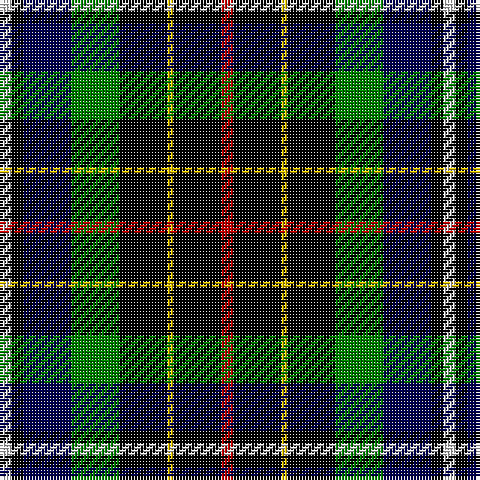

In pattern [RKYKGBKW](/patterns/rkykgbkw/).

This was sourced from weddslist.  It is a [8 stripes tartan](/stripes/stripes8/).

Original link http://www.weddslist.com/cgi-bin/tartans/pg.pl?source=sts

## Thread count
LN/4 K4 DB16 G16 K16 Y2 K16 R/4

## Palette
Each colour and its ΔE from the base-6 reference it is a variant of.

| Colour | Shade | Base | ΔE (OKLab) |
|---|---|---|---|
| DB | <code style="background-color:#000050;">#000050</code> `#000050` | B <code style="background-color:#2A418A;">#2A418A</code> | 0.21 |
| G | <code style="background-color:#008000;">#008000</code> `#008000` | G <code style="background-color:#006100;">#006100</code> | 0.10 |
| K | <code style="background-color:#000000;">#000000</code> `#000000` | K <code style="background-color:#000000;">#000000</code> | 0.00 |
| LN | <code style="background-color:#E0E0E0;">#E0E0E0</code> `#E0E0E0` | W <code style="background-color:#F7F7F7;">#F7F7F7</code> | 0.07 |
| R | <code style="background-color:#C00000;">#C00000</code> `#C00000` | R <code style="background-color:#CC0000;">#CC0000</code> | 0.03 |
| Y | <code style="background-color:#F0C000;">#F0C000</code> `#F0C000` | Y <code style="background-color:#F2BF00;">#F2BF00</code> | 0.00 |

# Sample pattern

## Nearest tartans

The nearest existing variants by ΔTartan distance.

1. [Brodie hunting](/setts/s7/r2b8g8k8y1k8r2x2~b304080-g008000-k000000-rc00000-yf0c000/) — ΔT 1.05
1. [Hislop Family Tartan Tartan Number: 2135. Earliest known date: 1992 Based on the Brodie tartan which Mr Hislop, who commissioned the design, remembered being worn by his grandfather. Other elements in the sett come from the tartans of the families in the district around Hawick which is associated with the Hislop name. The Hyslop spelling is known further west in Galloway and SW Scotland. See products available Copyright © Blair Urquhart, Comrie, 2015](/setts/s8/r2k8y1k8g8b8k2w2x2~b202060-g006818-k101010-rc80000-we0e0e0-ye8c000/) — ΔT 1.21
1. [Hislop hunting](/setts/s11/r2b8g9k2w3k1y1k7y2k8r2x2~b000050-g008000-k000000-rc00000-we0e0e0-yf0c000/) — ΔT 1.21
1. [Unidentified 13](/setts/s10/k14b2ba6g7r2k14ba6b2ba2b4x2~b5480b0-ba304080-g008000-k000000-rc00000/) — ΔT 1.25
1. [Vosko](/setts/s9/b25k12y4k9r6k9y4k12g25x2~b304080-g008000-k000000-rc00000-yf0c000/) — ΔT 1.27
1. [BlackRock (Asymmetrical)](/setts/s7/w8r4k8ka20kb6ka3kb5x2~k101010-ka001e00-kb000028-rdc0000-we0e0e0/) — ΔT 1.28
1. [Brodie Hunting](/setts/s7/r2b8g8k8y1g8r2~b00004c-g004c00-k000000-rc80000-yffc800/) — ΔT 1.30
1. [Veere](/setts/s11/w7k11wa3b9g19y3k22b9wa3k3b6x2~b2c2c80-g006818-k000000-wc8c8c8-wa82cffd-yc88c00/) — ΔT 1.32
1. [MacCallum, of Berwick](/setts/s9/b10r7b31k25g23k8b7k8y5x2~b304080-g008000-k000000-rc00000-yf0c000/) — ΔT 1.34
1. [Cornish Htg (District)](/setts/s7/w5k26y2g24b8k4r3x2~b00008c-g004c00-k000000-rc80000-we0e0e0-y9c9c00/) — ΔT 1.35

## Neighbour map

Every grey dot is one of 15726 variants placed by the first two principal components of the ΔTartan feature space (44% of its variance). Red is this tartan; blue dots are its nearest — click one to open its page.

<svg viewBox="0 0 640 380" role="img" style="max-width:100%;height:auto;border:1px solid #e0e0e0;border-radius:4px;display:block" xmlns="http://www.w3.org/2000/svg"><image href="/nn/cloud.v1.png" width="640" height="380"/><a href="/setts/s7/r2b8g8k8y1k8r2x2~b304080-g008000-k000000-rc00000-yf0c000/"><circle cx="135.0" cy="214.6" r="4" fill="#3465a4"><title>Brodie hunting</title></circle></a><a href="/setts/s8/r2k8y1k8g8b8k2w2x2~b202060-g006818-k101010-rc80000-we0e0e0-ye8c000/"><circle cx="153.2" cy="195.0" r="4" fill="#3465a4"><title>Hislop Family Tartan Tartan Number: 2135. Earliest known date: 1992 Based on the Brodie tartan which Mr Hislop, who commissioned the design, remembered being worn by his grandfather. Other elements in the sett come from the tartans of the families in the district around Hawick which is associated with the Hislop name. The Hyslop spelling is known further west in Galloway and SW Scotland. See products available Copyright © Blair Urquhart, Comrie, 2015</title></circle></a><a href="/setts/s11/r2b8g9k2w3k1y1k7y2k8r2x2~b000050-g008000-k000000-rc00000-we0e0e0-yf0c000/"><circle cx="89.1" cy="153.6" r="4" fill="#3465a4"><title>Hislop hunting</title></circle></a><a href="/setts/s10/k14b2ba6g7r2k14ba6b2ba2b4x2~b5480b0-ba304080-g008000-k000000-rc00000/"><circle cx="163.1" cy="193.6" r="4" fill="#3465a4"><title>Unidentified 13</title></circle></a><a href="/setts/s9/b25k12y4k9r6k9y4k12g25x2~b304080-g008000-k000000-rc00000-yf0c000/"><circle cx="101.9" cy="204.2" r="4" fill="#3465a4"><title>Vosko</title></circle></a><a href="/setts/s7/w8r4k8ka20kb6ka3kb5x2~k101010-ka001e00-kb000028-rdc0000-we0e0e0/"><circle cx="128.8" cy="209.8" r="4" fill="#3465a4"><title>BlackRock (Asymmetrical)</title></circle></a><a href="/setts/s7/r2b8g8k8y1g8r2~b00004c-g004c00-k000000-rc80000-yffc800/"><circle cx="150.7" cy="222.8" r="4" fill="#3465a4"><title>Brodie Hunting</title></circle></a><a href="/setts/s11/w7k11wa3b9g19y3k22b9wa3k3b6x2~b2c2c80-g006818-k000000-wc8c8c8-wa82cffd-yc88c00/"><circle cx="78.7" cy="165.5" r="4" fill="#3465a4"><title>Veere</title></circle></a><a href="/setts/s9/b10r7b31k25g23k8b7k8y5x2~b304080-g008000-k000000-rc00000-yf0c000/"><circle cx="116.4" cy="206.0" r="4" fill="#3465a4"><title>MacCallum, of Berwick</title></circle></a><a href="/setts/s7/w5k26y2g24b8k4r3x2~b00008c-g004c00-k000000-rc80000-we0e0e0-y9c9c00/"><circle cx="162.0" cy="155.2" r="4" fill="#3465a4"><title>Cornish Htg (District)</title></circle></a><circle cx="128.0" cy="190.3" r="5" fill="#c00000"/></svg>

ID: /setts/s8/r2k8y1k8g8b8k2w2x2~b000050-g008000-k000000-rc00000-we0e0e0-yf0c000/
