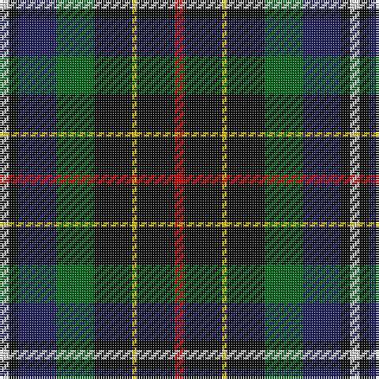

In pattern [RKYKGBKW](/patterns/rkykgbkw/).

This was sourced from house-of-tartan.  It is a [8 stripes tartan](/stripes/stripes8/).

Original link http://www.house-of-tartan.scotland.net/house/TartanViewjs.asp?colr=Def&tnam=2135

## Thread count
LN/4 K4 DB16 G16 K16 Y2 K16 R/4

## Palette
Each colour and its ΔE from the base-6 reference it is a variant of.

| Colour | Shade | Base | ΔE (OKLab) |
|---|---|---|---|
| DB | <code style="background-color:#202060;">#202060</code> `#202060` | B <code style="background-color:#2A418A;">#2A418A</code> | 0.11 |
| G | <code style="background-color:#006818;">#006818</code> `#006818` | G <code style="background-color:#006100;">#006100</code> | 0.02 |
| K | <code style="background-color:#101010;">#101010</code> `#101010` | K <code style="background-color:#000000;">#000000</code> | 0.17 |
| LN | <code style="background-color:#E0E0E0;">#E0E0E0</code> `#E0E0E0` | W <code style="background-color:#F7F7F7;">#F7F7F7</code> | 0.07 |
| R | <code style="background-color:#C80000;">#C80000</code> `#C80000` | R <code style="background-color:#CC0000;">#CC0000</code> | 0.01 |
| Y | <code style="background-color:#E8C000;">#E8C000</code> `#E8C000` | Y <code style="background-color:#F2BF00;">#F2BF00</code> | 0.02 |

# Sample pattern

## Nearest tartans

The nearest existing variants by ΔTartan distance.

1. [Quinn](/setts/s9/r1b8k4g1g4g1k4b8y1~b606080-g407050-k000000-r800000-yf0c000~x6/) — ΔT 0.94
1. [Hislop (Name)](/setts/s8/w4k2b18g18k18wa3k18r3~b5c8ca8-g006818-k101010-rc80000-we0e0e0-wae8e8b8~x2/) — ΔT 0.95
1. [MacLean, Donald Personal Tartan Tartan Number: 3440. Earliest known date: pre 2002 From Pendleton Woolen Mills of Oregon, owners of the only copy of Clans Originaux. EBW 8.11.02. This is the same as MacTaggart #408 and #409!!! See products available Copyright © Blair Urquhart, Comrie, 2015](/setts/s7/g16w3g3k10b12r2ka3~b1c0070-g006818-k101010-ka000000-r880000-wa8ace8~x2/) — ΔT 1.02
1. [Brodie Hunting Clan Tartan Tartan Number: 1334. Earliest known date: 1891 The Hunting Brodie first appears in Whyte's first edition of 1891, published by W. and A.K. Johnston, at which time it seems to have been a recent design. D.W. Stewart remarks in his book, 'Old And Rare..'(1893), "of late a green tartan has been sold as undress or hunting Brodie..." See products available Copyright © Blair Urquhart, Comrie, 2015](/setts/s7/r2b8g8k8y1k8r2~b2c2c80-g006818-k101010-rc80000-ye8c000~x2/) — ΔT 1.06
1. [Coulthard (Personal)](/setts/s7/r3g9ga15b10k2b18w3~b202060-g006818-ga5c6428-k101010-rc8002c-we0e0e0~x2/) — ΔT 1.07
1. [MacLeish](/setts/s8/k18b12k5g4r6g12k2y4~b1c0070-g006818-k101010-rc80000-ybc8c00~x2/) — ΔT 1.10
1. [Brodie Hunting](/setts/s7/r2b8g8k8y1k8r2~b5c8ca8-g006818-k101010-rc80000-yd09800~x4/) — ΔT 1.12
1. [Vosko Family Tartan Tartan Number: 373. Earliest known date: 1989 Designed for a wedding. See products available Copyright © Blair Urquhart, Comrie, 2015](/setts/s9/b25k12y4k9r6k9y4k12g25~b2c2c80-g006818-k101010-rc80000-ye8c000~x2/) — ΔT 1.13
1. [Yates (Personal)](/setts/s8/k29r3b24ba6k8w4ba8ra6~b003c64-ba5c5c5c-k101010-rc80000-ra888888-we0e0e0~x2/) — ΔT 1.13
1. [Brodie Hunting](/setts/s7/r2b8g8k8y1g8r2~b00004c-g004c00-k000000-rc80000-yffc800/) — ΔT 1.14

## Neighbour map

Every grey dot is one of 15726 variants placed by the first two principal components of the ΔTartan feature space (44% of its variance). Red is this tartan; blue dots are its nearest — click one to open its page.

<svg viewBox="0 0 640 380" role="img" style="max-width:100%;height:auto;border:1px solid #e0e0e0;border-radius:4px;display:block" xmlns="http://www.w3.org/2000/svg"><image href="/nn/cloud.v1.png" width="640" height="380"/><a href="/setts/s9/r1b8k4g1g4g1k4b8y1~b606080-g407050-k000000-r800000-yf0c000~x6/"><circle cx="177.5" cy="173.1" r="4" fill="#3465a4"><title>Quinn</title></circle></a><a href="/setts/s8/w4k2b18g18k18wa3k18r3~b5c8ca8-g006818-k101010-rc80000-we0e0e0-wae8e8b8~x2/"><circle cx="142.5" cy="174.8" r="4" fill="#3465a4"><title>Hislop (Name)</title></circle></a><a href="/setts/s7/g16w3g3k10b12r2ka3~b1c0070-g006818-k101010-ka000000-r880000-wa8ace8~x2/"><circle cx="126.1" cy="192.4" r="4" fill="#3465a4"><title>MacLean, Donald Personal Tartan Tartan Number: 3440. Earliest known date: pre 2002 From Pendleton Woolen Mills of Oregon, owners of the only copy of Clans Originaux. EBW 8.11.02. This is the same as MacTaggart #408 and #409!!! See products available Copyright © Blair Urquhart, Comrie, 2015</title></circle></a><a href="/setts/s7/r2b8g8k8y1k8r2~b2c2c80-g006818-k101010-rc80000-ye8c000~x2/"><circle cx="168.8" cy="224.8" r="4" fill="#3465a4"><title>Brodie Hunting Clan Tartan Tartan Number: 1334. Earliest known date: 1891 The Hunting Brodie first appears in Whyte's first edition of 1891, published by W. and A.K. Johnston, at which time it seems to have been a recent design. D.W. Stewart remarks in his book, 'Old And Rare..'(1893), &quot;of late a green tartan has been sold as undress or hunting Brodie...&quot; See products available Copyright © Blair Urquhart, Comrie, 2015</title></circle></a><a href="/setts/s7/r3g9ga15b10k2b18w3~b202060-g006818-ga5c6428-k101010-rc8002c-we0e0e0~x2/"><circle cx="183.6" cy="197.0" r="4" fill="#3465a4"><title>Coulthard (Personal)</title></circle></a><a href="/setts/s8/k18b12k5g4r6g12k2y4~b1c0070-g006818-k101010-rc80000-ybc8c00~x2/"><circle cx="153.4" cy="206.8" r="4" fill="#3465a4"><title>MacLeish</title></circle></a><a href="/setts/s7/r2b8g8k8y1k8r2~b5c8ca8-g006818-k101010-rc80000-yd09800~x4/"><circle cx="152.7" cy="217.0" r="4" fill="#3465a4"><title>Brodie Hunting</title></circle></a><a href="/setts/s9/b25k12y4k9r6k9y4k12g25~b2c2c80-g006818-k101010-rc80000-ye8c000~x2/"><circle cx="128.8" cy="212.2" r="4" fill="#3465a4"><title>Vosko Family Tartan Tartan Number: 373. Earliest known date: 1989 Designed for a wedding. See products available Copyright © Blair Urquhart, Comrie, 2015</title></circle></a><a href="/setts/s8/k29r3b24ba6k8w4ba8ra6~b003c64-ba5c5c5c-k101010-rc80000-ra888888-we0e0e0~x2/"><circle cx="171.6" cy="174.3" r="4" fill="#3465a4"><title>Yates (Personal)</title></circle></a><a href="/setts/s7/r2b8g8k8y1g8r2~b00004c-g004c00-k000000-rc80000-yffc800/"><circle cx="150.7" cy="222.8" r="4" fill="#3465a4"><title>Brodie Hunting</title></circle></a><circle cx="153.2" cy="195.0" r="5" fill="#c00000"/></svg>

ID: /setts/s8/r2k8y1k8g8b8k2w2~b202060-g006818-k101010-rc80000-we0e0e0-ye8c000~x2/
