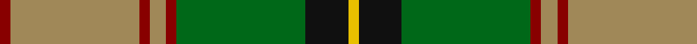

In pattern [RYRYRGKY](/stripes/ryryrgky/).

This was sourced from tartans-authority.  It is a [8 stripe tartan](/stripes/stripes8/).

Original link http://www.tartansauthority.com/tartan-ferret/display/8585/

## Thread count
DR/4 LT48 DR4 LT6 DR4 G48 K16 Y/4

## Palette
Each colour and its ΔE from the base-6 reference it is a variant of.

| Colour | Shade | Base | ΔE (OKLab) |
|---|---|---|---|
| DR | <code style="background-color:#880000;">#880000</code> `#880000` | R <code style="background-color:#CC0000;">#CC0000</code> | 0.15 |
| G | <code style="background-color:#006818;">#006818</code> `#006818` | G <code style="background-color:#006100;">#006100</code> | 0.02 |
| K | <code style="background-color:#101010;">#101010</code> `#101010` | K <code style="background-color:#000000;">#000000</code> | 0.17 |
| LT | <code style="background-color:#A08858;">#A08858</code> `#A08858` | Y <code style="background-color:#F2BF00;">#F2BF00</code> | 0.21 |
| Y | <code style="background-color:#E8C000;">#E8C000</code> `#E8C000` | Y <code style="background-color:#F2BF00;">#F2BF00</code> | 0.02 |

# Sample pattern

## Nearest tartans

The nearest existing variants by ΔTartan distance.

1. [Manitoba](/setts/s8/t2g1t1g12r2g1r6ly2~x2/) — ΔT 0.99
1. [Manitoba District Tartan Tartan Number: 146. Earliest known date: 1962 The tartan as it would appear with red in place of green, the 'G' of green having been interpreted as 'Gules'. The designer, Hugh Kirkwood Rankine, clearly intended a green stripe. This version can be found in the shops. See products available Copyright © Blair Urquhart, Comrie, 2015](/setts/s8/t2g1t1g12r2g1m6ly2~x2/) — ΔT 1.02
1. [Manitoba District Tartan Tartan Number: 144. Earliest known date: 1962 The official recording of the sett shows the letter G for the dark green stripe. In heraldic terms this means 'Gules' - red. The designer, Hugh Kirkwood Rankine, clearly intended dark green and this is reproduced here.It was given Royal Assent in 1962. See products available Copyright © Blair Urquhart, Comrie, 2015](/setts/s8/t2g1t1g12dg2g1r6ly2~x4/) — ΔT 1.07
1. [St. Lawrence #2 (Fashion)](/setts/s8/g2do13g11ly5do1lo21g2dy1~x2/) — ΔT 1.08
1. [Manitoba](/setts/s8/t2g1t1g12dg2g1m6ly2~x4/) — ΔT 1.11
1. [Dalwhinnie](/setts/s9/dg70ly6y28g56y5g11y5g11lo12/) — ΔT 1.13
1. [Dalwhinnie Trade Tartan Tartan Number: 1018. Earliest known date: 1982 Reconstructed and woven by Don Rankin from illustration. Sample in STS collection. See products available Copyright © Blair Urquhart, Comrie, 2015](/setts/s9/dg70ly6o28g56o5g11o5g11lo12/) — ΔT 1.18
1. [Dalwhinnie](/setts/s9/dg70ly6lr28g56lr5g11lr5g11r12/) — ΔT 1.19
1. [Manitoba Red](/setts/s8/t2dg1t1dg12r2dg1r6ly2~x2/) — ΔT 1.20
1. [New Mexico (Fashion)](/setts/s7/g10dp42r5g42g42ly5g6/) — ΔT 1.23

## Neighbour map

Every grey dot is one of 14299 variants placed by the first two principal components of the ΔTartan feature space (44% of its variance). Red is this tartan; blue dots are its nearest — click one to open its page.

<svg viewBox="0 0 640 380" role="img" style="max-width:100%;height:auto;border:1px solid #e0e0e0;border-radius:4px;display:block" xmlns="http://www.w3.org/2000/svg"><image href="/nn/cloud.v1.png" width="640" height="380"/><a href="/setts/s8/t2g1t1g12r2g1r6ly2~x2/"><circle cx="268.9" cy="161.7" r="4" fill="#3465a4"><title>Manitoba</title></circle></a><a href="/setts/s8/t2g1t1g12r2g1m6ly2~x2/"><circle cx="274.3" cy="163.3" r="4" fill="#3465a4"><title>Manitoba District Tartan Tartan Number: 146. Earliest known date: 1962 The tartan as it would appear with red in place of green, the 'G' of green having been interpreted as 'Gules'. The designer, Hugh Kirkwood Rankine, clearly intended a green stripe. This version can be found in the shops. See products available Copyright © Blair Urquhart, Comrie, 2015</title></circle></a><a href="/setts/s8/t2g1t1g12dg2g1r6ly2~x4/"><circle cx="280.6" cy="173.0" r="4" fill="#3465a4"><title>Manitoba District Tartan Tartan Number: 144. Earliest known date: 1962 The official recording of the sett shows the letter G for the dark green stripe. In heraldic terms this means 'Gules' - red. The designer, Hugh Kirkwood Rankine, clearly intended dark green and this is reproduced here.It was given Royal Assent in 1962. See products available Copyright © Blair Urquhart, Comrie, 2015</title></circle></a><a href="/setts/s8/g2do13g11ly5do1lo21g2dy1~x2/"><circle cx="210.7" cy="142.6" r="4" fill="#3465a4"><title>St. Lawrence #2 (Fashion)</title></circle></a><a href="/setts/s8/t2g1t1g12dg2g1m6ly2~x4/"><circle cx="267.4" cy="167.1" r="4" fill="#3465a4"><title>Manitoba</title></circle></a><a href="/setts/s9/dg70ly6y28g56y5g11y5g11lo12/"><circle cx="206.6" cy="164.3" r="4" fill="#3465a4"><title>Dalwhinnie</title></circle></a><a href="/setts/s9/dg70ly6o28g56o5g11o5g11lo12/"><circle cx="203.3" cy="161.5" r="4" fill="#3465a4"><title>Dalwhinnie Trade Tartan Tartan Number: 1018. Earliest known date: 1982 Reconstructed and woven by Don Rankin from illustration. Sample in STS collection. See products available Copyright © Blair Urquhart, Comrie, 2015</title></circle></a><a href="/setts/s9/dg70ly6lr28g56lr5g11lr5g11r12/"><circle cx="222.1" cy="170.4" r="4" fill="#3465a4"><title>Dalwhinnie</title></circle></a><a href="/setts/s8/t2dg1t1dg12r2dg1r6ly2~x2/"><circle cx="274.2" cy="164.0" r="4" fill="#3465a4"><title>Manitoba Red</title></circle></a><a href="/setts/s7/g10dp42r5g42g42ly5g6/"><circle cx="171.8" cy="197.9" r="4" fill="#3465a4"><title>New Mexico (Fashion)</title></circle></a><circle cx="226.9" cy="162.0" r="5" fill="#c00000"/></svg>

ID: /setts/s8/r2lo24r2lo3r2g24k8ly2~x2/
