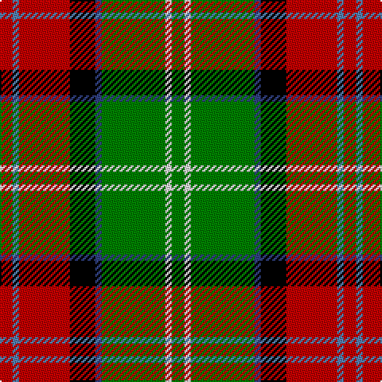

This page is one **sett** — a single exact thread-count. It belongs to the [tartan](/tartans/r2t1r8k4db1g10w1g2/)
(the same proportion at any scale), whose colour order is pattern [GWGBKRBR](/stripes/gwgbkrbr/).

Sourced from weddslist.  It is a [8 stripe tartan](/stripes/stripes8/).

Original link http://www.weddslist.com/cgi-bin/tartans/pg.pl?source=sts

2 attestations — the source records this cloth was collapsed from (oldest owns this page)

<ul>
<li>undated — Sawyer (weddslist, <a href="http://www.weddslist.com/cgi-bin/tartans/pg.pl?source=sts">record</a>)</li>
<li>undated — Sawyer Family Tartan Tartan Number: 2162. Earliest known date: 1994 Information from Dr. Phil Smith, Narvon, USA. See products available Copyright © Blair Urquhart, Comrie, 2015 (house-of-tartan, <a href="http://www.house-of-tartan.scotland.net/house/TartanViewjs.asp?colr=Def&tnam=2162">record</a>)</li>
</ul>

## Thread count
R/8 Ba4 R32 K16 B4 G40 LN4 G/8

## Palette

Palette: <strong>Tartan Register</strong> <small style="color:#888">(2 of 6 colours)</small>
<table><thead><tr><th>Colour</th><th>Threads</th><th>Shade</th><th>Base</th><th>OKLCh</th></tr></thead><tbody><tr><td>R/</td><td style="text-align:right;font-variant-numeric:tabular-nums">8</td><td><code style="background-color:#C00000;">#C00000</code> <small style="color:#888">#C00000</small></td><td>R <code style="background-color:#CC0000;">#CC0000</code></td><td><small style="color:#888">oklch(50.7% 0.208 29.2)</small></td></tr><tr><td>Ba</td><td style="text-align:right;font-variant-numeric:tabular-nums">4</td><td><code style="background-color:#5480B0;">#5480B0</code> <small style="color:#888">#5480B0</small></td><td>B <code style="background-color:#2A418A;">#2A418A</code></td><td><small style="color:#888">oklch(58.8% 0.089 251.5)</small></td></tr><tr><td>R</td><td style="text-align:right;font-variant-numeric:tabular-nums">32</td><td><code style="background-color:#C00000;">#C00000</code> <small style="color:#888">#C00000</small></td><td>R <code style="background-color:#CC0000;">#CC0000</code></td><td><small style="color:#888">oklch(50.7% 0.208 29.2)</small></td></tr><tr><td>K</td><td style="text-align:right;font-variant-numeric:tabular-nums">16</td><td><code style="background-color:#000000;">#000000</code> <small style="color:#888">#000000</small></td><td>K <code style="background-color:#000000;">#000000</code></td><td><small style="color:#888">oklch(0.0% 0.000 0.0)</small></td></tr><tr><td>B</td><td style="text-align:right;font-variant-numeric:tabular-nums">4</td><td><code style="background-color:#304080;">#304080</code> <small style="color:#888">#304080</small></td><td>B <code style="background-color:#2A418A;">#2A418A</code></td><td><small style="color:#888">oklch(39.4% 0.109 270.2)</small></td></tr><tr><td>G</td><td style="text-align:right;font-variant-numeric:tabular-nums">40</td><td><code style="background-color:#008000;">#008000</code> <small style="color:#888">#008000</small></td><td>G <code style="background-color:#006100;">#006100</code></td><td><small style="color:#888">oklch(52.0% 0.177 142.5)</small></td></tr><tr><td>LN</td><td style="text-align:right;font-variant-numeric:tabular-nums">4</td><td><code style="background-color:#E0E0E0;">#E0E0E0</code> <small style="color:#888">#E0E0E0</small></td><td>W <code style="background-color:#F7F7F7;">#F7F7F7</code></td><td><small style="color:#888">oklch(90.7% 0.000 89.9)</small></td></tr><tr><td>G/</td><td style="text-align:right;font-variant-numeric:tabular-nums">8</td><td><code style="background-color:#008000;">#008000</code> <small style="color:#888">#008000</small></td><td>G <code style="background-color:#006100;">#006100</code></td><td><small style="color:#888">oklch(52.0% 0.177 142.5)</small></td></tr></tbody></table>

# Sample pattern

## Nearest tartans

The nearest existing variants by ΔTartan distance, with this tartan at the top so the swatches line up against it.

ΔTartan

Tartan

Sett

—

<a href="/ttd/edit/#slug=r2t1r8k4db1g10w1g2~x4">Sawyer</a> <a class="nn-out" href="/setts/s8/r2t1r8k4db1g10w1g2~x4/" title="open its dictionary page">↗</a>

1.00

<a href="/ttd/edit/#slug=r1g4w1g4ly1ri8t1~x6">George Watson's College</a> <a class="nn-out" href="/setts/s7/r1g4w1g4ly1ri8t1~x6/" title="open its dictionary page">↗</a>

1.06

<a href="/ttd/edit/#slug=dg9w2dg9k2loi14lo4w2r2~x4">MacShane (Clan)</a> <a class="nn-out" href="/setts/s8/dg9w2dg9k2loi14lo4w2r2~x4/" title="open its dictionary page">↗</a>

1.09

<a href="/ttd/edit/#slug=r2lb1r8k4db1g10lr1g2~x4">Sawyer</a> <a class="nn-out" href="/setts/s8/r2lb1r8k4db1g10lr1g2~x4/" title="open its dictionary page">↗</a>

1.15

<a href="/ttd/edit/#slug=o4ly2o21dy11w2k20r3~x2">Barbour - Classic</a> <a class="nn-out" href="/setts/s7/o4ly2o21dy11w2k20r3~x2/" title="open its dictionary page">↗</a>

1.18

<a href="/ttd/edit/#slug=r3k20w2dy11o21ly2o2~x2">Barbour</a> <a class="nn-out" href="/setts/s7/r3k20w2dy11o21ly2o2~x2/" title="open its dictionary page">↗</a>

1.20

<a href="/ttd/edit/#slug=g8r11k3ly2p8g15r5w2~x2">Wilson's, No 109</a> <a class="nn-out" href="/setts/s8/g8r11k3ly2p8g15r5w2~x2/" title="open its dictionary page">↗</a>

1.20

<a href="/ttd/edit/#slug=g28t3g3k10r2k10r20ly4~x2">Garvock (2015)</a> <a class="nn-out" href="/setts/s8/g28t3g3k10r2k10r20ly4~x2/" title="open its dictionary page">↗</a>

1.20

<a href="/ttd/edit/#slug=w4dg20g10r25b2r2g2~x2">Caledonian Brewery</a> <a class="nn-out" href="/setts/s7/w4dg20g10r25b2r2g2~x2/" title="open its dictionary page">↗</a>

1.21

<a href="/ttd/edit/#slug=t4r3ly2r9t3g24t3r9k3r3w2~x2">Wilson's, No 128</a> <a class="nn-out" href="/setts/s11/t4r3ly2r9t3g24t3r9k3r3w2~x2/" title="open its dictionary page">↗</a>

1.23

<a href="/ttd/edit/#slug=lo4g2lo2g2lo2g24k2r16w9db3~x2">North West Territories</a> <a class="nn-out" href="/setts/s10/lo4g2lo2g2lo2g24k2r16w9db3~x2/" title="open its dictionary page">↗</a>

## Neighbour map

Every grey dot is one of 14359 variants placed by the first two principal components of the ΔTartan feature space (44% of its variance). Red is this tartan; blue dots are its nearest — click one to open its page.

<svg viewBox="0 0 640 380" role="img" style="max-width:100%;height:auto;border:1px solid #e0e0e0;border-radius:4px;display:block" xmlns="http://www.w3.org/2000/svg"><image href="/nn/cloud.v1.png" width="640" height="380"/><a href="/setts/s7/r1g4w1g4ly1ri8t1~x6/"><circle cx="177.2" cy="172.6" r="4" fill="#3465a4"><title>George Watson's College</title></circle></a><a href="/setts/s8/dg9w2dg9k2loi14lo4w2r2~x4/"><circle cx="127.4" cy="171.8" r="4" fill="#3465a4"><title>MacShane (Clan)</title></circle></a><a href="/setts/s8/r2lb1r8k4db1g10lr1g2~x4/"><circle cx="190.6" cy="163.8" r="4" fill="#3465a4"><title>Sawyer</title></circle></a><a href="/setts/s7/o4ly2o21dy11w2k20r3~x2/"><circle cx="172.0" cy="161.5" r="4" fill="#3465a4"><title>Barbour - Classic</title></circle></a><a href="/setts/s7/r3k20w2dy11o21ly2o2~x2/"><circle cx="166.7" cy="157.0" r="4" fill="#3465a4"><title>Barbour</title></circle></a><a href="/setts/s8/g8r11k3ly2p8g15r5w2~x2/"><circle cx="132.1" cy="179.4" r="4" fill="#3465a4"><title>Wilson's, No 109</title></circle></a><a href="/setts/s8/g28t3g3k10r2k10r20ly4~x2/"><circle cx="163.5" cy="149.8" r="4" fill="#3465a4"><title>Garvock (2015)</title></circle></a><a href="/setts/s7/w4dg20g10r25b2r2g2~x2/"><circle cx="206.6" cy="159.3" r="4" fill="#3465a4"><title>Caledonian Brewery</title></circle></a><a href="/setts/s11/t4r3ly2r9t3g24t3r9k3r3w2~x2/"><circle cx="165.7" cy="119.3" r="4" fill="#3465a4"><title>Wilson's, No 128</title></circle></a><a href="/setts/s10/lo4g2lo2g2lo2g24k2r16w9db3~x2/"><circle cx="171.3" cy="116.6" r="4" fill="#3465a4"><title>North West Territories</title></circle></a><circle cx="160.1" cy="147.0" r="5" fill="#c00000"/></svg>

ID: /setts/s8/r2t1r8k4db1g10w1g2~x4/
