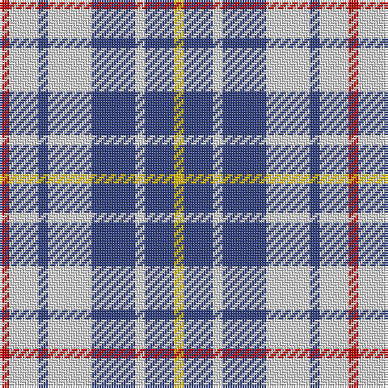

In pattern [RWBWBWBY](/patterns/rwbwbwby/).

This was sourced from weddslist.  It is a [8 stripes tartan](/stripes/stripes8/).

Original link http://www.weddslist.com/cgi-bin/tartans/pg.pl?source=sts

## Thread count
R/4 LN12 B4 LN18 B18 LN4 B12 Y/4

## Palette
Each colour and its ΔE from the base-6 reference it is a variant of.

| Colour | Shade | Base | ΔE (OKLab) |
|---|---|---|---|
| B | <code style="background-color:#304080;">#304080</code> `#304080` | B <code style="background-color:#2A418A;">#2A418A</code> | 0.02 |
| LN | <code style="background-color:#E0E0E0;">#E0E0E0</code> `#E0E0E0` | W <code style="background-color:#F7F7F7;">#F7F7F7</code> | 0.07 |
| R | <code style="background-color:#C00000;">#C00000</code> `#C00000` | R <code style="background-color:#CC0000;">#CC0000</code> | 0.03 |
| Y | <code style="background-color:#F0C000;">#F0C000</code> `#F0C000` | Y <code style="background-color:#F2BF00;">#F2BF00</code> | 0.00 |

# Sample pattern

## Nearest tartans

The nearest existing variants by ΔTartan distance.

1. [North Vancouver Island District Tartan Tartan Number: 1682. Earliest known date: 1985 Originally designed for the North Island Highlanders Pipe & Drum Band by Robert Fells of Port Hardy, B.C. See products available Copyright © Blair Urquhart, Comrie, 2015](/setts/s8/r2w6b2w9b9w2b6y2~b2c2c80-rc80000-we0e0e0-ye8c000~x2/) — ΔT 0.38
1. [North Vancouver Island (Corporate)](/setts/s8/r2w6b2w9b9w2b6y2~b2c2c80-rc80000-wfcfcfc-ye8c000~x4/) — ΔT 0.53
1. [North Vancouver Island](/setts/s8/r2w6b2w9b9w2b6y2~b2c2c80-rc80000-wffffff-ye8c000~x4/) — ΔT 0.56
1. [Henderson Dress (Dance)](/setts/s9/w1b3w3b1w5k1w2k3y1~b3850c8-k101010-wfcfcfc-yd09800~x4/) — ΔT 1.16
1. [Boswell Dress Check (Personal)](/setts/s5/b8w13r3w2k5~b3850c8-k101010-rc80000-wf8f8f8~x2/) — ΔT 1.42
1. [Boswell Dress (Personal)](/setts/s5/b8w13r3w2k5~b3850c8-k101010-rc80000-wffffff~x2/) — ΔT 1.45
1. [City of Pointe-Claire](/setts/s10/b4w1r1k2b4r2w1r1w1r1~b285e99-k000000-r866c5a-wffffff~x4/) — ΔT 1.48
1. [Investors Group](/setts/s10/w7k2wa2k2wa2k2w7b4k10wa2~b2888c4-k101010-wa8ace8-waf8f8f8~x4/) — ΔT 1.50
1. [MacPherson, Blue & White](/setts/s7/w5r3w26b21w3b8y3~b304080-rc00000-we0e0e0-yf0c000~x2/) — ΔT 1.52
1. [Ship Hector, The (Commemorative)](/setts/s8/k3b10y5b16g3w16g5w3~b2c2c80-g006818-k101010-wfcfcfc-yfccc00~x2/) — ΔT 1.52

## Neighbour map

Every grey dot is one of 15726 variants placed by the first two principal components of the ΔTartan feature space (44% of its variance). Red is this tartan; blue dots are its nearest — click one to open its page.

<svg viewBox="0 0 640 380" role="img" style="max-width:100%;height:auto;border:1px solid #e0e0e0;border-radius:4px;display:block" xmlns="http://www.w3.org/2000/svg"><image href="/nn/cloud.v1.png" width="640" height="380"/><a href="/setts/s8/r2w6b2w9b9w2b6y2~b2c2c80-rc80000-we0e0e0-ye8c000~x2/"><circle cx="163.3" cy="224.1" r="4" fill="#3465a4"><title>North Vancouver Island District Tartan Tartan Number: 1682. Earliest known date: 1985 Originally designed for the North Island Highlanders Pipe &amp; Drum Band by Robert Fells of Port Hardy, B.C. See products available Copyright © Blair Urquhart, Comrie, 2015</title></circle></a><a href="/setts/s8/r2w6b2w9b9w2b6y2~b2c2c80-rc80000-wfcfcfc-ye8c000~x4/"><circle cx="155.1" cy="219.5" r="4" fill="#3465a4"><title>North Vancouver Island (Corporate)</title></circle></a><a href="/setts/s8/r2w6b2w9b9w2b6y2~b2c2c80-rc80000-wffffff-ye8c000~x4/"><circle cx="154.4" cy="219.0" r="4" fill="#3465a4"><title>North Vancouver Island</title></circle></a><a href="/setts/s9/w1b3w3b1w5k1w2k3y1~b3850c8-k101010-wfcfcfc-yd09800~x4/"><circle cx="172.1" cy="211.0" r="4" fill="#3465a4"><title>Henderson Dress (Dance)</title></circle></a><a href="/setts/s5/b8w13r3w2k5~b3850c8-k101010-rc80000-wf8f8f8~x2/"><circle cx="164.6" cy="220.4" r="4" fill="#3465a4"><title>Boswell Dress Check (Personal)</title></circle></a><a href="/setts/s5/b8w13r3w2k5~b3850c8-k101010-rc80000-wffffff~x2/"><circle cx="163.0" cy="219.3" r="4" fill="#3465a4"><title>Boswell Dress (Personal)</title></circle></a><a href="/setts/s10/b4w1r1k2b4r2w1r1w1r1~b285e99-k000000-r866c5a-wffffff~x4/"><circle cx="127.6" cy="222.0" r="4" fill="#3465a4"><title>City of Pointe-Claire</title></circle></a><a href="/setts/s10/w7k2wa2k2wa2k2w7b4k10wa2~b2888c4-k101010-wa8ace8-waf8f8f8~x4/"><circle cx="116.1" cy="203.1" r="4" fill="#3465a4"><title>Investors Group</title></circle></a><a href="/setts/s7/w5r3w26b21w3b8y3~b304080-rc00000-we0e0e0-yf0c000~x2/"><circle cx="239.7" cy="182.6" r="4" fill="#3465a4"><title>MacPherson, Blue &amp; White</title></circle></a><a href="/setts/s8/k3b10y5b16g3w16g5w3~b2c2c80-g006818-k101010-wfcfcfc-yfccc00~x2/"><circle cx="106.7" cy="192.1" r="4" fill="#3465a4"><title>Ship Hector, The (Commemorative)</title></circle></a><circle cx="167.4" cy="225.4" r="5" fill="#c00000"/></svg>

ID: /setts/s8/r2w6b2w9b9w2b6y2~b304080-rc00000-we0e0e0-yf0c000~x2/
