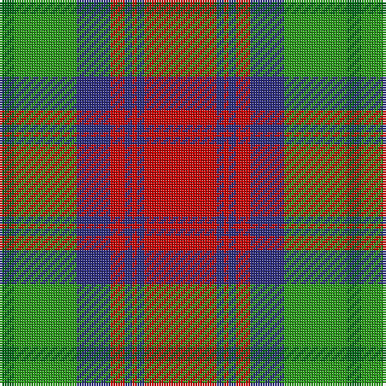

In pattern [GGBRBRBR](/patterns/ggbrbrbr/).

This was sourced from house-of-tartan.  It is a [8 stripes tartan](/stripes/stripes8/).

Original link http://www.house-of-tartan.scotland.net/house/TartanViewjs.asp?colr=Def&tnam=753

## Thread count
G/6 Ga26 DB14 R6 DB3 R2 DB3 R/30

## Palette
Each colour and its ΔE from the base-6 reference it is a variant of.

| Colour | Shade | Base | ΔE (OKLab) |
|---|---|---|---|
| DB | <code style="background-color:#2C2C80;">#2C2C80</code> `#2C2C80` | B <code style="background-color:#2A418A;">#2A418A</code> | 0.06 |
| G | <code style="background-color:#006818;">#006818</code> `#006818` | G <code style="background-color:#006100;">#006100</code> | 0.02 |
| Ga | <code style="background-color:#289C18;">#289C18</code> `#289C18` | G <code style="background-color:#006100;">#006100</code> | 0.19 |
| R | <code style="background-color:#C80000;">#C80000</code> `#C80000` | R <code style="background-color:#CC0000;">#CC0000</code> | 0.01 |

# Sample pattern

## Nearest tartans

The nearest existing variants by ΔTartan distance.

1. [Cranston Dress](/setts/s8/r30b4r2b4r6b14g26ga6-b2c2c80-g289c18-ga006818-rc80000/) — ΔT 0.17
1. [Logan, with Yellow](/setts/s7/b32r12y4r12g56r12y4-b800080-g008000-rc00000-yf0c000/) — ΔT 0.33
1. [Cranston, dress](/setts/s8/r30b3r2b3r6b14g26ga6-b304080-g30a010-ga008000-rc00000/) — ΔT 0.36
1. [Logan with Yellow](/setts/s7/b32r12y4r12g56r12y4-b780078-g006818-rc80000-ye8c000/) — ΔT 0.46
1. [Logan, Light](/setts/s7/b18r8b2r8g30ra8b2-b800080-g30a010-rd03030-rac00000/) — ΔT 0.62
1. [Logan #3](/setts/s7/b36y16b4y16g60r16b4-b440044-g00801c-rc8002c-ye08070/) — ΔT 0.63
1. [Logan Light](/setts/s7/b18r8b2r8g30ra8b2-b5a008c-g309c18-rc82828-radc0000/) — ΔT 0.67
1. [Logan - 1819 (with yellow)](/setts/s7/b32r12y4r12g56r12y4-b440044-g285800-rc80000-ye8c000/) — ΔT 0.72
1. [McCook/Cook (Name)](/setts/s7/g48b24g24r60k4r4k8-b2888c4-g006818-k101010-rc80000/) — ΔT 0.73
1. [MacKintosh, Geddes](/setts/s7/b4r20g72r16b36r40w4-b304080-g008000-rc00000-we0e0e0/) — ΔT 0.76

## Neighbour map

Every grey dot is one of 15726 variants placed by the first two principal components of the ΔTartan feature space (44% of its variance). Red is this tartan; blue dots are its nearest — click one to open its page.

<svg viewBox="0 0 640 380" role="img" style="max-width:100%;height:auto;border:1px solid #e0e0e0;border-radius:4px;display:block" xmlns="http://www.w3.org/2000/svg"><image href="/nn/cloud.v1.png" width="640" height="380"/><a href="/setts/s8/r30b4r2b4r6b14g26ga6-b2c2c80-g289c18-ga006818-rc80000/"><circle cx="227.3" cy="168.9" r="4" fill="#3465a4"><title>Cranston Dress</title></circle></a><a href="/setts/s7/b32r12y4r12g56r12y4-b800080-g008000-rc00000-yf0c000/"><circle cx="238.1" cy="173.8" r="4" fill="#3465a4"><title>Logan, with Yellow</title></circle></a><a href="/setts/s8/r30b3r2b3r6b14g26ga6-b304080-g30a010-ga008000-rc00000/"><circle cx="240.7" cy="169.1" r="4" fill="#3465a4"><title>Cranston, dress</title></circle></a><a href="/setts/s7/b32r12y4r12g56r12y4-b780078-g006818-rc80000-ye8c000/"><circle cx="245.6" cy="177.1" r="4" fill="#3465a4"><title>Logan with Yellow</title></circle></a><a href="/setts/s7/b18r8b2r8g30ra8b2-b800080-g30a010-rd03030-rac00000/"><circle cx="217.2" cy="173.5" r="4" fill="#3465a4"><title>Logan, Light</title></circle></a><a href="/setts/s7/b36y16b4y16g60r16b4-b440044-g00801c-rc8002c-ye08070/"><circle cx="208.8" cy="176.2" r="4" fill="#3465a4"><title>Logan #3</title></circle></a><a href="/setts/s7/b18r8b2r8g30ra8b2-b5a008c-g309c18-rc82828-radc0000/"><circle cx="208.6" cy="173.0" r="4" fill="#3465a4"><title>Logan Light</title></circle></a><a href="/setts/s7/b32r12y4r12g56r12y4-b440044-g285800-rc80000-ye8c000/"><circle cx="246.7" cy="179.3" r="4" fill="#3465a4"><title>Logan - 1819 (with yellow)</title></circle></a><a href="/setts/s7/g48b24g24r60k4r4k8-b2888c4-g006818-k101010-rc80000/"><circle cx="247.4" cy="187.4" r="4" fill="#3465a4"><title>McCook/Cook (Name)</title></circle></a><a href="/setts/s7/b4r20g72r16b36r40w4-b304080-g008000-rc00000-we0e0e0/"><circle cx="247.3" cy="180.9" r="4" fill="#3465a4"><title>MacKintosh, Geddes</title></circle></a><circle cx="235.0" cy="166.0" r="5" fill="#c00000"/></svg>

ID: /setts/s8/r30b3r2b3r6b14g26ga6-b2c2c80-g289c18-ga006818-rc80000/
