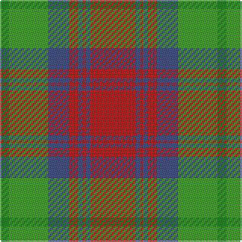

In pattern [GGBRBRBR](/patterns/ggbrbrbr/).

This was sourced from weddslist.  It is a [8 stripes tartan](/stripes/stripes8/).

Original link http://www.weddslist.com/cgi-bin/tartans/pg.pl?source=sts

## Thread count
Ga/6 G26 B14 R6 B3 R2 B3 R/30

## Palette
Each colour and its ΔE from the base-6 reference it is a variant of.

| Colour | Shade | Base | ΔE (OKLab) |
|---|---|---|---|
| B | <code style="background-color:#304080;">#304080</code> `#304080` | B <code style="background-color:#2A418A;">#2A418A</code> | 0.02 |
| G | <code style="background-color:#30A010;">#30A010</code> `#30A010` | G <code style="background-color:#006100;">#006100</code> | 0.20 |
| Ga | <code style="background-color:#008000;">#008000</code> `#008000` | G <code style="background-color:#006100;">#006100</code> | 0.10 |
| R | <code style="background-color:#C00000;">#C00000</code> `#C00000` | R <code style="background-color:#CC0000;">#CC0000</code> | 0.03 |

# Sample pattern

## Nearest tartans

The nearest existing variants by ΔTartan distance.

1. [Cranston Dress Family Tartan Tartan Number: 753. Earliest known date: pre 2003 Restricted See products available Copyright © Blair Urquhart, Comrie, 2015](/setts/s8/r30b3r2b3r6b14g26ga6~b2c2c80-g289c18-ga006818-rc80000/) — ΔT 0.36
1. [Logan, with Yellow](/setts/s7/b8r3y1r3g14r3y1~b800080-g008000-rc00000-yf0c000~x4/) — ΔT 0.38
1. [Cranston Dress](/setts/s8/r15b2r1b2r3b7g13ga3~b2c2c80-g289c18-ga006818-rc80000~x2/) — ΔT 0.44
1. [Logan with Yellow](/setts/s7/b8r3y1r3g14r3y1~b780078-g006818-rc80000-ye8c000~x4/) — ΔT 0.59
1. [McCook/Cook (Name)](/setts/s7/g12b6g6r15k1r1k2~b2888c4-g006818-k101010-rc80000~x4/) — ΔT 0.61
1. [MacKintosh, Geddes](/setts/s7/b1r5g18r4b9r10w1~b304080-g008000-rc00000-we0e0e0~x4/) — ΔT 0.65
1. [Logan, Light](/setts/s7/b9r4b1r4g15ra4b1~b800080-g30a010-rd03030-rac00000~x2/) — ΔT 0.75
1. [Logan #3](/setts/s7/b9y4b1y4g15r4b1~b440044-g00801c-rc8002c-ye08070~x4/) — ΔT 0.81
1. [Logan - 1819 (with yellow)](/setts/s7/b8r3y1r3g14r3y1~b440044-g285800-rc80000-ye8c000~x4/) — ΔT 0.83
1. [Buccleuch (Fashion)](/setts/s8/y15k1y2k1y2k10g14w2~g5c6428-k101010-we0e0e0-ya08858~x2/) — ΔT 0.85

## Neighbour map

Every grey dot is one of 15726 variants placed by the first two principal components of the ΔTartan feature space (44% of its variance). Red is this tartan; blue dots are its nearest — click one to open its page.

<svg viewBox="0 0 640 380" role="img" style="max-width:100%;height:auto;border:1px solid #e0e0e0;border-radius:4px;display:block" xmlns="http://www.w3.org/2000/svg"><image href="/nn/cloud.v1.png" width="640" height="380"/><a href="/setts/s8/r30b3r2b3r6b14g26ga6~b2c2c80-g289c18-ga006818-rc80000/"><circle cx="235.5" cy="167.0" r="4" fill="#3465a4"><title>Cranston Dress Family Tartan Tartan Number: 753. Earliest known date: pre 2003 Restricted See products available Copyright © Blair Urquhart, Comrie, 2015</title></circle></a><a href="/setts/s7/b8r3y1r3g14r3y1~b800080-g008000-rc00000-yf0c000~x4/"><circle cx="238.5" cy="174.8" r="4" fill="#3465a4"><title>Logan, with Yellow</title></circle></a><a href="/setts/s8/r15b2r1b2r3b7g13ga3~b2c2c80-g289c18-ga006818-rc80000~x2/"><circle cx="227.8" cy="169.8" r="4" fill="#3465a4"><title>Cranston Dress</title></circle></a><a href="/setts/s7/b8r3y1r3g14r3y1~b780078-g006818-rc80000-ye8c000~x4/"><circle cx="246.1" cy="178.0" r="4" fill="#3465a4"><title>Logan with Yellow</title></circle></a><a href="/setts/s7/g12b6g6r15k1r1k2~b2888c4-g006818-k101010-rc80000~x4/"><circle cx="247.8" cy="188.1" r="4" fill="#3465a4"><title>McCook/Cook (Name)</title></circle></a><a href="/setts/s7/b1r5g18r4b9r10w1~b304080-g008000-rc00000-we0e0e0~x4/"><circle cx="247.8" cy="181.6" r="4" fill="#3465a4"><title>MacKintosh, Geddes</title></circle></a><a href="/setts/s7/b9r4b1r4g15ra4b1~b800080-g30a010-rd03030-rac00000~x2/"><circle cx="217.6" cy="174.2" r="4" fill="#3465a4"><title>Logan, Light</title></circle></a><a href="/setts/s7/b9y4b1y4g15r4b1~b440044-g00801c-rc8002c-ye08070~x4/"><circle cx="209.1" cy="177.1" r="4" fill="#3465a4"><title>Logan #3</title></circle></a><a href="/setts/s7/b8r3y1r3g14r3y1~b440044-g285800-rc80000-ye8c000~x4/"><circle cx="247.2" cy="180.3" r="4" fill="#3465a4"><title>Logan - 1819 (with yellow)</title></circle></a><a href="/setts/s8/y15k1y2k1y2k10g14w2~g5c6428-k101010-we0e0e0-ya08858~x2/"><circle cx="228.1" cy="168.4" r="4" fill="#3465a4"><title>Buccleuch (Fashion)</title></circle></a><circle cx="241.4" cy="169.8" r="5" fill="#c00000"/></svg>

ID: /setts/s8/r30b3r2b3r6b14g26ga6~b304080-g30a010-ga008000-rc00000/
