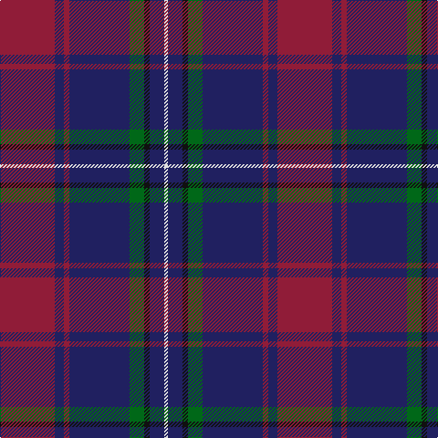

In pattern [RBRBGKBW](/patterns/rbrbgkbw/).

This was sourced from tartans-authority.  It is a [8 stripes tartan](/stripes/stripes8/).

Original link http://www.tartansauthority.com/tartan-ferret/display/10441/

## Thread count
DR/60 DB10 DR6 DB66 G16 K6 DB16 LN/4

## Palette
Each colour and its ΔE from the base-6 reference it is a variant of.

| Colour | Shade | Base | ΔE (OKLab) |
|---|---|---|---|
| DB | <code style="background-color:#202060;">#202060</code> `#202060` | B <code style="background-color:#2A418A;">#2A418A</code> | 0.11 |
| DR | <code style="background-color:#901C38;">#901C38</code> `#901C38` | R <code style="background-color:#CC0000;">#CC0000</code> | 0.13 |
| G | <code style="background-color:#006818;">#006818</code> `#006818` | G <code style="background-color:#006100;">#006100</code> | 0.02 |
| K | <code style="background-color:#101010;">#101010</code> `#101010` | K <code style="background-color:#000000;">#000000</code> | 0.17 |
| LN | <code style="background-color:#E0E0E0;">#E0E0E0</code> `#E0E0E0` | W <code style="background-color:#F7F7F7;">#F7F7F7</code> | 0.07 |

# Sample pattern

## Nearest tartans

The nearest existing variants by ΔTartan distance.

1. [Murdoch](/setts/s6/k2r1b17r17ba1y2~b304080-ba102040-k000000-r802040-yf0c000~x4/) — ΔT 0.84
1. [Murdoch (Geoffrey)](/setts/s6/k2b1ba17b17bb1y2~b680028-ba003c64-bb202060-k101010-ye8c000~x4/) — ΔT 0.95
1. [Scotland 2000](/setts/s8/r5y2r35g6r2g6b38w4~b304080-g008000-r802040-we0e0e0-yf0c000~x2/) — ΔT 1.12
1. [Widows Sons Scotland (MRA)](/setts/s6/r9k16g10k22b67y4~b780078-g003820-k101010-r888888-ye8c000/) — ΔT 1.20
1. [St. Leonards (Corporate)](/setts/s8/r16b2ra6r3k4ba2b40ba6~b2c2c80-ba2888c4-k101010-rc80000-ra888888~x2/) — ΔT 1.21
1. [Heather Mead (Personal)](/setts/s8/r13g16ga4b4ga4b34y1b1~b440044-g003820-ga005020-r9c68a4-ya08858~x2/) — ΔT 1.24
1. [Charleston Police Department](/setts/s7/b22y10b6ya18b50ba71k6~b440044-ba202060-k101010-ybc8c00-yaa0a0a0/) — ΔT 1.27
1. [Wcwm 1475-2](/setts/s9/r2b34k2w2k2ba30b3ba6r2~b1c0070-ba5c5c5c-k101010-r880000-wc0c0c0~x2/) — ΔT 1.33
1. [Singh](/setts/s8/b3r3b34g18y2g18w2r3~b6c0070-g006818-r880000-wc0c0c0-yd09800~x2/) — ΔT 1.33
1. [Dempster, Ross (Personal)](/setts/s7/b4g2r17ra9g10b30ba2~b1c1c50-ba5c5c5c-g285800-ra02c24-ra880000~x2/) — ΔT 1.36

## Neighbour map

Every grey dot is one of 15726 variants placed by the first two principal components of the ΔTartan feature space (44% of its variance). Red is this tartan; blue dots are its nearest — click one to open its page.

<svg viewBox="0 0 640 380" role="img" style="max-width:100%;height:auto;border:1px solid #e0e0e0;border-radius:4px;display:block" xmlns="http://www.w3.org/2000/svg"><image href="/nn/cloud.v1.png" width="640" height="380"/><a href="/setts/s6/k2r1b17r17ba1y2~b304080-ba102040-k000000-r802040-yf0c000~x4/"><circle cx="312.8" cy="168.5" r="4" fill="#3465a4"><title>Murdoch</title></circle></a><a href="/setts/s6/k2b1ba17b17bb1y2~b680028-ba003c64-bb202060-k101010-ye8c000~x4/"><circle cx="326.2" cy="178.1" r="4" fill="#3465a4"><title>Murdoch (Geoffrey)</title></circle></a><a href="/setts/s8/r5y2r35g6r2g6b38w4~b304080-g008000-r802040-we0e0e0-yf0c000~x2/"><circle cx="285.6" cy="144.5" r="4" fill="#3465a4"><title>Scotland 2000</title></circle></a><a href="/setts/s6/r9k16g10k22b67y4~b780078-g003820-k101010-r888888-ye8c000/"><circle cx="307.9" cy="168.3" r="4" fill="#3465a4"><title>Widows Sons Scotland (MRA)</title></circle></a><a href="/setts/s8/r16b2ra6r3k4ba2b40ba6~b2c2c80-ba2888c4-k101010-rc80000-ra888888~x2/"><circle cx="316.8" cy="134.7" r="4" fill="#3465a4"><title>St. Leonards (Corporate)</title></circle></a><a href="/setts/s8/r13g16ga4b4ga4b34y1b1~b440044-g003820-ga005020-r9c68a4-ya08858~x2/"><circle cx="340.9" cy="137.9" r="4" fill="#3465a4"><title>Heather Mead (Personal)</title></circle></a><a href="/setts/s7/b22y10b6ya18b50ba71k6~b440044-ba202060-k101010-ybc8c00-yaa0a0a0/"><circle cx="260.0" cy="194.6" r="4" fill="#3465a4"><title>Charleston Police Department</title></circle></a><a href="/setts/s9/r2b34k2w2k2ba30b3ba6r2~b1c0070-ba5c5c5c-k101010-r880000-wc0c0c0~x2/"><circle cx="315.1" cy="145.7" r="4" fill="#3465a4"><title>Wcwm 1475-2</title></circle></a><a href="/setts/s8/b3r3b34g18y2g18w2r3~b6c0070-g006818-r880000-wc0c0c0-yd09800~x2/"><circle cx="286.5" cy="152.7" r="4" fill="#3465a4"><title>Singh</title></circle></a><a href="/setts/s7/b4g2r17ra9g10b30ba2~b1c1c50-ba5c5c5c-g285800-ra02c24-ra880000~x2/"><circle cx="279.7" cy="188.5" r="4" fill="#3465a4"><title>Dempster, Ross (Personal)</title></circle></a><circle cx="320.1" cy="166.4" r="5" fill="#c00000"/></svg>

ID: /setts/s8/r30b5r3b33g8k3b8w2~b202060-g006818-k101010-r901c38-we0e0e0~x2/
