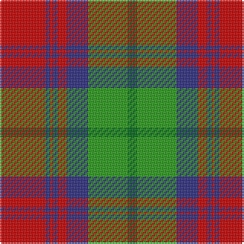

This page is one **sett** — a single exact thread-count. It belongs to the [tartan](/tartans/r30db3r2db3r6db14g26gi6/)
(the same proportion at any scale), whose colour order is pattern [GGBRBRBR](/stripes/ggbrbrbr/).

Sourced from house-of-tartan.  It is a [8 stripe tartan](/stripes/stripes8/).

Original link http://www.house-of-tartan.scotland.net/house/TartanViewjs.asp?colr=Def&tnam=753

## Thread count
R/30 DB3 R2 DB3 R6 DB14 Ga26 G/6

## Palette

Palette: <strong>Tartan Register</strong>
<table><thead><tr><th>Colour</th><th>Threads</th><th>Shade</th><th>Base</th><th>OKLCh</th></tr></thead><tbody><tr><td>R/</td><td style="text-align:right;font-variant-numeric:tabular-nums">30</td><td><code style="background-color:#C80000;">#C80000</code> <small style="color:#888">#C80000</small></td><td>R <code style="background-color:#CC0000;">#CC0000</code></td><td><small style="color:#888">oklch(52.3% 0.215 29.2)</small></td></tr><tr><td>DB</td><td style="text-align:right;font-variant-numeric:tabular-nums">3</td><td><code style="background-color:#2C2C80;">#2C2C80</code> <small style="color:#888">#2C2C80</small></td><td>B <code style="background-color:#2A418A;">#2A418A</code></td><td><small style="color:#888">oklch(35.0% 0.138 276.6)</small></td></tr><tr><td>R</td><td style="text-align:right;font-variant-numeric:tabular-nums">2</td><td><code style="background-color:#C80000;">#C80000</code> <small style="color:#888">#C80000</small></td><td>R <code style="background-color:#CC0000;">#CC0000</code></td><td><small style="color:#888">oklch(52.3% 0.215 29.2)</small></td></tr><tr><td>DB</td><td style="text-align:right;font-variant-numeric:tabular-nums">3</td><td><code style="background-color:#2C2C80;">#2C2C80</code> <small style="color:#888">#2C2C80</small></td><td>B <code style="background-color:#2A418A;">#2A418A</code></td><td><small style="color:#888">oklch(35.0% 0.138 276.6)</small></td></tr><tr><td>R</td><td style="text-align:right;font-variant-numeric:tabular-nums">6</td><td><code style="background-color:#C80000;">#C80000</code> <small style="color:#888">#C80000</small></td><td>R <code style="background-color:#CC0000;">#CC0000</code></td><td><small style="color:#888">oklch(52.3% 0.215 29.2)</small></td></tr><tr><td>DB</td><td style="text-align:right;font-variant-numeric:tabular-nums">14</td><td><code style="background-color:#2C2C80;">#2C2C80</code> <small style="color:#888">#2C2C80</small></td><td>B <code style="background-color:#2A418A;">#2A418A</code></td><td><small style="color:#888">oklch(35.0% 0.138 276.6)</small></td></tr><tr><td>Ga</td><td style="text-align:right;font-variant-numeric:tabular-nums">26</td><td><code style="background-color:#289C18;">#289C18</code> <small style="color:#888">#289C18</small></td><td>G <code style="background-color:#006100;">#006100</code></td><td><small style="color:#888">oklch(60.6% 0.191 141.6)</small></td></tr><tr><td>G/</td><td style="text-align:right;font-variant-numeric:tabular-nums">6</td><td><code style="background-color:#006818;">#006818</code> <small style="color:#888">#006818</small></td><td>G <code style="background-color:#006100;">#006100</code></td><td><small style="color:#888">oklch(45.0% 0.142 145.0)</small></td></tr></tbody></table>

# Sample pattern

## Nearest tartans

The nearest existing variants by ΔTartan distance, with this tartan at the top so the swatches line up against it.

ΔTartan

Tartan

Sett

—

<a href="/ttd/edit/#slug=r30db3r2db3r6db14g26gi6">Cranston Dress Family Tartan Tartan Number: 753. Earliest known date: pre 2003 Restricted See products available Copyright © Blair Urquhart, Comrie, 2015</a> <a class="nn-out" href="/setts/s8/r30db3r2db3r6db14g26gi6/" title="open its dictionary page">↗</a>

0.17

<a href="/ttd/edit/#slug=r15db2r1db2r3db7g13gi3~x2">Cranston Dress</a> <a class="nn-out" href="/setts/s8/r15db2r1db2r3db7g13gi3~x2/" title="open its dictionary page">↗</a>

0.33

<a href="/ttd/edit/#slug=p8r3ly1r3g14r3ly1~x4">Logan, with Yellow</a> <a class="nn-out" href="/setts/s7/p8r3ly1r3g14r3ly1~x4/" title="open its dictionary page">↗</a>

0.36

<a href="/ttd/edit/#slug=r30db3r2db3r6db14gi26g6">Cranston, dress</a> <a class="nn-out" href="/setts/s8/r30db3r2db3r6db14gi26g6/" title="open its dictionary page">↗</a>

0.46

<a href="/ttd/edit/#slug=dp8r3ly1r3g14r3ly1~x4">Logan with Yellow</a> <a class="nn-out" href="/setts/s7/dp8r3ly1r3g14r3ly1~x4/" title="open its dictionary page">↗</a>

0.62

<a href="/ttd/edit/#slug=p9r4p1r4g15ri4p1~x2">Logan, Light</a> <a class="nn-out" href="/setts/s7/p9r4p1r4g15ri4p1~x2/" title="open its dictionary page">↗</a>

0.63

<a href="/ttd/edit/#slug=dp9lr4dp1lr4g15r4dp1~x4">Logan #3</a> <a class="nn-out" href="/setts/s7/dp9lr4dp1lr4g15r4dp1~x4/" title="open its dictionary page">↗</a>

0.67

<a href="/ttd/edit/#slug=dp9ri4dp1ri4g15r4dp1~x2">Logan Light</a> <a class="nn-out" href="/setts/s7/dp9ri4dp1ri4g15r4dp1~x2/" title="open its dictionary page">↗</a>

0.73

<a href="/ttd/edit/#slug=dp8r3ly1r3dg14r3ly1~x4">Logan - 1819 (with yellow)</a> <a class="nn-out" href="/setts/s7/dp8r3ly1r3dg14r3ly1~x4/" title="open its dictionary page">↗</a>

0.73

<a href="/ttd/edit/#slug=g12t6g6r15k1r1k2~x4">McCook/Cook (Name)</a> <a class="nn-out" href="/setts/s7/g12t6g6r15k1r1k2~x4/" title="open its dictionary page">↗</a>

0.76

<a href="/ttd/edit/#slug=db1r5g18r4db9r10w1~x4">MacKintosh, Geddes</a> <a class="nn-out" href="/setts/s7/db1r5g18r4db9r10w1~x4/" title="open its dictionary page">↗</a>

## Neighbour map

Every grey dot is one of 14359 variants placed by the first two principal components of the ΔTartan feature space (44% of its variance). Red is this tartan; blue dots are its nearest — click one to open its page.

<svg viewBox="0 0 640 380" role="img" style="max-width:100%;height:auto;border:1px solid #e0e0e0;border-radius:4px;display:block" xmlns="http://www.w3.org/2000/svg"><image href="/nn/cloud.v1.png" width="640" height="380"/><a href="/setts/s8/r15db2r1db2r3db7g13gi3~x2/"><circle cx="228.6" cy="170.0" r="4" fill="#3465a4"><title>Cranston Dress</title></circle></a><a href="/setts/s7/p8r3ly1r3g14r3ly1~x4/"><circle cx="239.1" cy="174.8" r="4" fill="#3465a4"><title>Logan, with Yellow</title></circle></a><a href="/setts/s8/r30db3r2db3r6db14gi26g6/"><circle cx="242.0" cy="170.7" r="4" fill="#3465a4"><title>Cranston, dress</title></circle></a><a href="/setts/s7/dp8r3ly1r3g14r3ly1~x4/"><circle cx="246.7" cy="178.7" r="4" fill="#3465a4"><title>Logan with Yellow</title></circle></a><a href="/setts/s7/p9r4p1r4g15ri4p1~x2/"><circle cx="218.1" cy="174.4" r="4" fill="#3465a4"><title>Logan, Light</title></circle></a><a href="/setts/s7/dp9lr4dp1lr4g15r4dp1~x4/"><circle cx="210.4" cy="177.4" r="4" fill="#3465a4"><title>Logan #3</title></circle></a><a href="/setts/s7/dp9ri4dp1ri4g15r4dp1~x2/"><circle cx="210.0" cy="173.8" r="4" fill="#3465a4"><title>Logan Light</title></circle></a><a href="/setts/s7/dp8r3ly1r3dg14r3ly1~x4/"><circle cx="248.0" cy="181.0" r="4" fill="#3465a4"><title>Logan - 1819 (with yellow)</title></circle></a><a href="/setts/s7/g12t6g6r15k1r1k2~x4/"><circle cx="248.7" cy="189.5" r="4" fill="#3465a4"><title>McCook/Cook (Name)</title></circle></a><a href="/setts/s7/db1r5g18r4db9r10w1~x4/"><circle cx="248.6" cy="182.9" r="4" fill="#3465a4"><title>MacKintosh, Geddes</title></circle></a><circle cx="236.2" cy="167.1" r="5" fill="#c00000"/></svg>

ID: /setts/s8/r30db3r2db3r6db14g26gi6/
