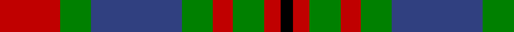
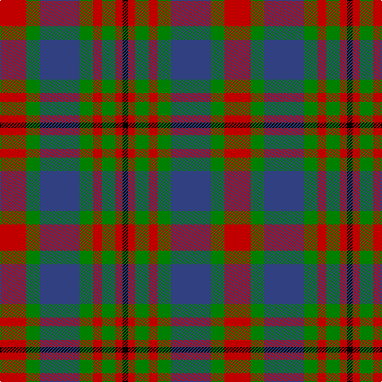

In pattern [KRGRGBGR](/stripes/krgrgbgr/).

This was sourced from weddslist.  It is a [8 stripe tartan](/stripes/stripes8/).

Original link http://www.weddslist.com/cgi-bin/tartans/pg.pl?source=sts

## Also known as

This cloth is also recorded under:

- Carnegie #3

## Thread count
R/33 G17 B50 G17 R11 G17 R9 K/7

## Palette
Each colour and the base-6 reference it is a variant of.

| Colour | Shade | Base |
|---|---|---|
| B | <code style="background-color:#304080;">#304080</code> `oklch(39.4% 0.109 270.2)` <small>#304080</small> | B <code style="background-color:#2A418A;">#2A418A</code> |
| G | <code style="background-color:#008000;">#008000</code> `oklch(52.0% 0.177 142.5)` <small>#008000</small> | G <code style="background-color:#006100;">#006100</code> |
| K | <code style="background-color:#000000;">#000000</code> `oklch(0.0% 0.000 0.0)` <small>#000000</small> | K <code style="background-color:#000000;">#000000</code> |
| R | <code style="background-color:#C00000;">#C00000</code> `oklch(50.7% 0.208 29.2)` <small>#C00000</small> | R <code style="background-color:#CC0000;">#CC0000</code> |

# Sample pattern

## Nearest tartans

The nearest existing variants by ΔTartan distance, with this tartan at the top so the swatches line up against it.

ΔTartan

Tartan

Sett

—

<a href="/ttd/edit/#slug=r33g17db50g17r11g17r9k7">Carnegie</a> <a class="nn-out" href="/setts/s8/r33g17db50g17r11g17r9k7/" title="open its dictionary page">↗</a>

0.70

<a href="/ttd/edit/#slug=r33dg17db50dg17r11dg17r9k7">Carnegie #3</a> <a class="nn-out" href="/setts/s8/r33dg17db50dg17r11dg17r9k7/" title="open its dictionary page">↗</a>

0.74

<a href="/ttd/edit/#slug=db9r3ly1r3dg9r3ly1~x2">Logan #2</a> <a class="nn-out" href="/setts/s7/db9r3ly1r3dg9r3ly1~x2/" title="open its dictionary page">↗</a>

0.74

<a href="/ttd/edit/#slug=db9r3ly1r3g9r3ly1~x2">Logan</a> <a class="nn-out" href="/setts/s7/db9r3ly1r3g9r3ly1~x2/" title="open its dictionary page">↗</a>

0.87

<a href="/ttd/edit/#slug=g12k2m12k3o12k16o12k3m6~x2">Borthwick Family Tartan Tartan Number: 816. Earliest known date: pre 2003 Borthwick is an ancient Scottish family of Celtic origin. William de Borthwick built Borthwick Castle in Midlothian in the 14th century. The present chief of the border family is Major John Henry Stuart Borthwick of Crookston, Midlothian. He was recognised by Lord Lyon as the 23rd Lord Borthwick in 1986. See products available Copyright © Blair Urquhart, Comrie, 2015</a> <a class="nn-out" href="/setts/s9/g12k2m12k3o12k16o12k3m6~x2/" title="open its dictionary page">↗</a>

0.88

<a href="/ttd/edit/#slug=dg12k2r12k3o12k16o12k3r6~x2">Borthwick</a> <a class="nn-out" href="/setts/s9/dg12k2r12k3o12k16o12k3r6~x2/" title="open its dictionary page">↗</a>

0.91

<a href="/setts/s8/g6k1r1t2r2~x4/">Wilson's No.193</a>

0.92

<a href="/ttd/edit/#slug=r2g4db8r9g9k2r2~x2">Stewart, Plaid</a> <a class="nn-out" href="/setts/s7/r2g4db8r9g9k2r2~x2/" title="open its dictionary page">↗</a>

0.93

<a href="/ttd/edit/#slug=r2g4db8r9g9k2r2~x4">Stewart (Artefact)</a> <a class="nn-out" href="/setts/s7/r2g4db8r9g9k2r2~x4/" title="open its dictionary page">↗</a>

1.04

<a href="/ttd/edit/#slug=r10k10r4g2r2k2r4g12dt12g3dt4~x2">Hueg (Personal)</a> <a class="nn-out" href="/setts/s11/r10k10r4g2r2k2r4g12dt12g3dt4~x2/" title="open its dictionary page">↗</a>

1.04

<a href="/ttd/edit/#slug=w2r3dg9r3db2r3db3w1~x6">Utah (US State)</a> <a class="nn-out" href="/setts/s8/w2r3dg9r3db2r3db3w1~x6/" title="open its dictionary page">↗</a>

## Neighbour map

Every grey dot is one of 14299 variants placed by the first two principal components of the ΔTartan feature space (44% of its variance). Red is this tartan; blue dots are its nearest — click one to open its page.

<svg viewBox="0 0 640 380" role="img" style="max-width:100%;height:auto;border:1px solid #e0e0e0;border-radius:4px;display:block" xmlns="http://www.w3.org/2000/svg"><image href="/nn/cloud.v1.png" width="640" height="380"/><a href="/setts/s8/r33dg17db50dg17r11dg17r9k7/"><circle cx="171.9" cy="226.0" r="4" fill="#3465a4"><title>Carnegie #3</title></circle></a><a href="/setts/s7/db9r3ly1r3dg9r3ly1~x2/"><circle cx="168.2" cy="206.1" r="4" fill="#3465a4"><title>Logan #2</title></circle></a><a href="/setts/s7/db9r3ly1r3g9r3ly1~x2/"><circle cx="166.9" cy="207.0" r="4" fill="#3465a4"><title>Logan</title></circle></a><a href="/setts/s9/g12k2m12k3o12k16o12k3m6~x2/"><circle cx="124.3" cy="222.6" r="4" fill="#3465a4"><title>Borthwick Family Tartan Tartan Number: 816. Earliest known date: pre 2003 Borthwick is an ancient Scottish family of Celtic origin. William de Borthwick built Borthwick Castle in Midlothian in the 14th century. The present chief of the border family is Major John Henry Stuart Borthwick of Crookston, Midlothian. He was recognised by Lord Lyon as the 23rd Lord Borthwick in 1986. See products available Copyright © Blair Urquhart, Comrie, 2015</title></circle></a><a href="/setts/s9/dg12k2r12k3o12k16o12k3r6~x2/"><circle cx="128.0" cy="225.1" r="4" fill="#3465a4"><title>Borthwick</title></circle></a><a href="/setts/s8/g6k1r1t2r2~x4/"><circle cx="164.3" cy="218.3" r="4" fill="#3465a4"><title>Wilson's No.193</title></circle></a><a href="/setts/s7/r2g4db8r9g9k2r2~x2/"><circle cx="146.0" cy="246.5" r="4" fill="#3465a4"><title>Stewart, Plaid</title></circle></a><a href="/setts/s7/r2g4db8r9g9k2r2~x4/"><circle cx="160.1" cy="252.5" r="4" fill="#3465a4"><title>Stewart (Artefact)</title></circle></a><a href="/setts/s11/r10k10r4g2r2k2r4g12dt12g3dt4~x2/"><circle cx="130.0" cy="220.0" r="4" fill="#3465a4"><title>Hueg (Personal)</title></circle></a><a href="/setts/s8/w2r3dg9r3db2r3db3w1~x6/"><circle cx="158.7" cy="206.3" r="4" fill="#3465a4"><title>Utah (US State)</title></circle></a><circle cx="158.1" cy="221.0" r="5" fill="#c00000"/></svg>

ID: /setts/s8/r33g17db50g17r11g17r9k7/
