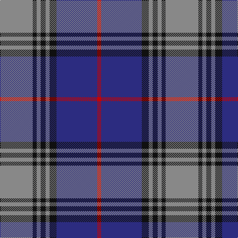

In pattern [RBKRKRKR](/patterns/rbkrkrkr/).

This was sourced from tartans-authority.  It is a [8 stripes tartan](/stripes/stripes8/).

Original link http://www.tartansauthority.com/tartan-ferret/display/2242/

## Thread count
N/66 K8 N8 K10 N8 K14 DB82 R/8

## Palette
Each colour and its ΔE from the base-6 reference it is a variant of.

| Colour | Shade | Base | ΔE (OKLab) |
|---|---|---|---|
| DB | <code style="background-color:#2C2C80;">#2C2C80</code> `#2C2C80` | B <code style="background-color:#2A418A;">#2A418A</code> | 0.06 |
| K | <code style="background-color:#101010;">#101010</code> `#101010` | K <code style="background-color:#000000;">#000000</code> | 0.17 |
| N | <code style="background-color:#888888;">#888888</code> `#888888` | R <code style="background-color:#CC0000;">#CC0000</code> | 0.24 |
| R | <code style="background-color:#C80000;">#C80000</code> `#C80000` | R <code style="background-color:#CC0000;">#CC0000</code> | 0.01 |

# Sample pattern

## Nearest tartans

The nearest existing variants by ΔTartan distance.

1. [MacPherson Hunting](/setts/s9/b11r1k8r1b1r1ra8r1b1~b1860a8-k101010-rc80000-ra888888~x4/) — ΔT 0.75
1. [Children 1st (Corporate)](/setts/s9/y7b32ba4b4ba8b4ba8g32y3~b202060-ba780078-g006818-ye8c000~x2/) — ΔT 1.03
1. [Philadelphia Police and Fire P&D](/setts/s12/b9y4b4ba41b4r4ba4r15ba4r4b41y4~b202060-ba5c8ca8-rc80000-ye8c000~x2/) — ΔT 1.05
1. [Elgin City Band](/setts/s9/y1b12k6ba1k1ba1k1ba6y1~b1870a4-ba2c2c80-k101010-ybc8c00~x4/) — ΔT 1.07
1. [Highlands School, (North Carolina)](/setts/s8/g12b2g2b30ba3b2ba13w4~b304080-ba000050-g908000-we0e0e0~x2/) — ΔT 1.15
1. [Brady 60th (Personal)](/setts/s10/r1ra1r7k3r1k1r1k1b9y1~b2c2c80-k101010-r888888-rae87878-yfccc00~x4/) — ΔT 1.20
1. [Rutherford](/setts/s8/k8r1k1r1k4b11y1b2~b6060c8-k101010-rc80000-ye8c000~x6/) — ΔT 1.21
1. [Scottish Knights Templar MTS (Corp)](/setts/s10/w4r2b20k6w5k4w3k2r2b2~b2c2c80-k101010-rc80000-wc0c0c0~x2/) — ΔT 1.22
1. [Central Newcastle School](/setts/s7/w10b9r59b9k59b9w5~b780078-k101010-r888888-wc49cd8/) — ΔT 1.23
1. [Donnolly](/setts/s6/b3g21b3r21b35w3~b2c2c80-g00643c-rc04c08-wfcfcfc~x2/) — ΔT 1.23

## Neighbour map

Every grey dot is one of 15726 variants placed by the first two principal components of the ΔTartan feature space (44% of its variance). Red is this tartan; blue dots are its nearest — click one to open its page.

<svg viewBox="0 0 640 380" role="img" style="max-width:100%;height:auto;border:1px solid #e0e0e0;border-radius:4px;display:block" xmlns="http://www.w3.org/2000/svg"><image href="/nn/cloud.v1.png" width="640" height="380"/><a href="/setts/s9/b11r1k8r1b1r1ra8r1b1~b1860a8-k101010-rc80000-ra888888~x4/"><circle cx="211.1" cy="171.9" r="4" fill="#3465a4"><title>MacPherson Hunting</title></circle></a><a href="/setts/s9/y7b32ba4b4ba8b4ba8g32y3~b202060-ba780078-g006818-ye8c000~x2/"><circle cx="204.9" cy="178.4" r="4" fill="#3465a4"><title>Children 1st (Corporate)</title></circle></a><a href="/setts/s12/b9y4b4ba41b4r4ba4r15ba4r4b41y4~b202060-ba5c8ca8-rc80000-ye8c000~x2/"><circle cx="229.3" cy="149.5" r="4" fill="#3465a4"><title>Philadelphia Police and Fire P&amp;D</title></circle></a><a href="/setts/s9/y1b12k6ba1k1ba1k1ba6y1~b1870a4-ba2c2c80-k101010-ybc8c00~x4/"><circle cx="238.0" cy="178.4" r="4" fill="#3465a4"><title>Elgin City Band</title></circle></a><a href="/setts/s8/g12b2g2b30ba3b2ba13w4~b304080-ba000050-g908000-we0e0e0~x2/"><circle cx="277.1" cy="169.5" r="4" fill="#3465a4"><title>Highlands School, (North Carolina)</title></circle></a><a href="/setts/s10/r1ra1r7k3r1k1r1k1b9y1~b2c2c80-k101010-r888888-rae87878-yfccc00~x4/"><circle cx="180.4" cy="152.8" r="4" fill="#3465a4"><title>Brady 60th (Personal)</title></circle></a><a href="/setts/s8/k8r1k1r1k4b11y1b2~b6060c8-k101010-rc80000-ye8c000~x6/"><circle cx="258.8" cy="181.6" r="4" fill="#3465a4"><title>Rutherford</title></circle></a><a href="/setts/s10/w4r2b20k6w5k4w3k2r2b2~b2c2c80-k101010-rc80000-wc0c0c0~x2/"><circle cx="205.8" cy="162.8" r="4" fill="#3465a4"><title>Scottish Knights Templar MTS (Corp)</title></circle></a><a href="/setts/s7/w10b9r59b9k59b9w5~b780078-k101010-r888888-wc49cd8/"><circle cx="201.8" cy="174.9" r="4" fill="#3465a4"><title>Central Newcastle School</title></circle></a><a href="/setts/s6/b3g21b3r21b35w3~b2c2c80-g00643c-rc04c08-wfcfcfc~x2/"><circle cx="262.7" cy="206.2" r="4" fill="#3465a4"><title>Donnolly</title></circle></a><circle cx="245.2" cy="179.9" r="5" fill="#c00000"/></svg>

ID: /setts/s8/r33k4r4k5r4k7b41ra4~b2c2c80-k101010-r888888-rac80000~x2/
