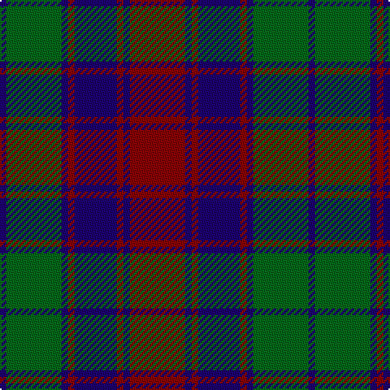

In pattern [BGBRBRBR](/patterns/bgbrbrbr/).

This was sourced from register-of-tartans.  It is a [8 stripes tartan](/stripes/stripes8/).

Original link https://www.tartanregister.gov.uk/tartanDetails.aspx?ref=3497

## Attestations

This cloth appears in 2 source records; the oldest owns this page.

- 01/07/1995 — Remony (Red) (register-of-tartans, [record](https://www.tartanregister.gov.uk/tartanDetails.aspx?ref=3497))
- Oct. 1995 — Red Remony (Fashion) (tartans-authority, [record](http://www.tartansauthority.com/tartan-ferret/display/2235/))

## Thread count
DB/4 G34 DB4 DR4 DB26 DR4 DB4 DR/34

## Palette
Each colour and its ΔE from the base-6 reference it is a variant of.

| Colour | Shade | Base | ΔE (OKLab) |
|---|---|---|---|
| DB | <code style="background-color:#1C0070;">#1C0070</code> `#1C0070` | B <code style="background-color:#2C4084;">#2C4084</code> | 0.14 |
| DR | <code style="background-color:#880000;">#880000</code> `#880000` | R <code style="background-color:#C80000;">#C80000</code> | 0.14 |
| G | <code style="background-color:#006818;">#006818</code> `#006818` | G <code style="background-color:#006400;">#006400</code> | 0.02 |

# Sample pattern

ID: /setts/s8/r34b4r4b26r4b4g34b4-b1c0070-g006818-r880000/
