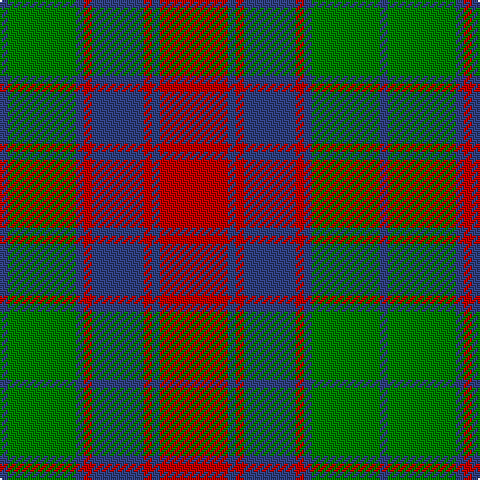

In pattern [BGBRBRBR](/patterns/bgbrbrbr/).

This was sourced from weddslist.  It is a [8 stripes tartan](/stripes/stripes8/).

Original link http://www.weddslist.com/cgi-bin/tartans/pg.pl?source=sts

## Thread count
B/4 G34 B4 R4 B26 R4 B4 R/34

## Palette
Each colour and its ΔE from the base-6 reference it is a variant of.

| Colour | Shade | Base | ΔE (OKLab) |
|---|---|---|---|
| B | <code style="background-color:#304080;">#304080</code> `#304080` | B <code style="background-color:#2C4084;">#2C4084</code> | 0.01 |
| G | <code style="background-color:#008000;">#008000</code> `#008000` | G <code style="background-color:#006400;">#006400</code> | 0.09 |
| R | <code style="background-color:#C00000;">#C00000</code> `#C00000` | R <code style="background-color:#C80000;">#C80000</code> | 0.02 |

# Sample pattern

## Nearest tartans

The nearest existing variants by ΔTartan distance.

1. [Red Remony Trade Tartan Tartan Number: 2235. Earliest known date: 1971 Red Remony See products available Copyright © Blair Urquhart, Comrie, 2015](/setts/s8/r34b4r4b26r4b4g34b4-b2c2c80-g006818-rc80000/) — ΔT 0.54
1. [Logan, or Skene](/setts/s7/b18r6b2r6g18r6b2-b304080-g008000-rc00000/) — ΔT 0.73
1. [Chindecella Gorse (Personal)](/setts/s8/y14b8y4b8y46ba38b38ba8-b1c1c50-ba5c5c5c-ybc8c00/) — ΔT 0.95
1. [Fraser, Stewart of Athol](/setts/s12/b56r6b6r6g40r60g8r60g40b44r6b6-b304080-g008000-rc00000/) — ΔT 1.05
1. [Logan](/setts/s7/b32r12b4r12g56r12b4-b2c4084-g005020-rdc0000/) — ΔT 1.07
1. [Tyneside Scottish Purple (Mil/Distr)](/setts/s13/b48g6b6g6b6g48ga48g6ga48g48b48g6b6-b780078-g604000-ga289c18/) — ΔT 1.09
1. [Fraser of Stratherrick](/setts/s12/b40r4b4r4g38r36g4r36g38b38r4b4-b2c2c80-g006818-rc80000/) — ΔT 1.11
1. [Remony (Red)](/setts/s8/r34b4r4b26r4b4g34b4-b1c0070-g006818-r880000/) — ΔT 1.14
1. [Inverness, Fencibles](/setts/s12/b20r2b2r2g20r26g4r26g20b20r2b2-b304080-g008000-rc00000/) — ΔT 1.14
1. [Robertson of Struan](/setts/s7/r12b4r4b42g40r8g8-b304080-g008000-rc00000/) — ΔT 1.15

## Neighbour map

Every grey dot is one of 15726 variants placed by the first two principal components of the ΔTartan feature space (44% of its variance). Red is this tartan; blue dots are its nearest — click one to open its page.

<svg viewBox="0 0 640 380" role="img" style="max-width:100%;height:auto;border:1px solid #e0e0e0;border-radius:4px;display:block" xmlns="http://www.w3.org/2000/svg"><image href="/nn/cloud.v1.png" width="640" height="380"/><a href="/setts/s8/r34b4r4b26r4b4g34b4-b2c2c80-g006818-rc80000/"><circle cx="239.0" cy="209.5" r="4" fill="#3465a4"><title>Red Remony Trade Tartan Tartan Number: 2235. Earliest known date: 1971 Red Remony See products available Copyright © Blair Urquhart, Comrie, 2015</title></circle></a><a href="/setts/s7/b18r6b2r6g18r6b2-b304080-g008000-rc00000/"><circle cx="234.1" cy="230.9" r="4" fill="#3465a4"><title>Logan, or Skene</title></circle></a><a href="/setts/s8/y14b8y4b8y46ba38b38ba8-b1c1c50-ba5c5c5c-ybc8c00/"><circle cx="230.2" cy="209.2" r="4" fill="#3465a4"><title>Chindecella Gorse (Personal)</title></circle></a><a href="/setts/s12/b56r6b6r6g40r60g8r60g40b44r6b6-b304080-g008000-rc00000/"><circle cx="245.6" cy="198.0" r="4" fill="#3465a4"><title>Fraser, Stewart of Athol</title></circle></a><a href="/setts/s7/b32r12b4r12g56r12b4-b2c4084-g005020-rdc0000/"><circle cx="286.7" cy="206.8" r="4" fill="#3465a4"><title>Logan</title></circle></a><a href="/setts/s13/b48g6b6g6b6g48ga48g6ga48g48b48g6b6-b780078-g604000-ga289c18/"><circle cx="214.5" cy="202.8" r="4" fill="#3465a4"><title>Tyneside Scottish Purple (Mil/Distr)</title></circle></a><a href="/setts/s12/b40r4b4r4g38r36g4r36g38b38r4b4-b2c2c80-g006818-rc80000/"><circle cx="216.8" cy="198.9" r="4" fill="#3465a4"><title>Fraser of Stratherrick</title></circle></a><a href="/setts/s8/r34b4r4b26r4b4g34b4-b1c0070-g006818-r880000/"><circle cx="245.5" cy="219.0" r="4" fill="#3465a4"><title>Remony (Red)</title></circle></a><a href="/setts/s12/b20r2b2r2g20r26g4r26g20b20r2b2-b304080-g008000-rc00000/"><circle cx="249.5" cy="187.1" r="4" fill="#3465a4"><title>Inverness, Fencibles</title></circle></a><a href="/setts/s7/r12b4r4b42g40r8g8-b304080-g008000-rc00000/"><circle cx="266.9" cy="218.5" r="4" fill="#3465a4"><title>Robertson of Struan</title></circle></a><circle cx="240.3" cy="210.7" r="5" fill="#c00000"/></svg>

ID: /setts/s8/r34b4r4b26r4b4g34b4-b304080-g008000-rc00000/
