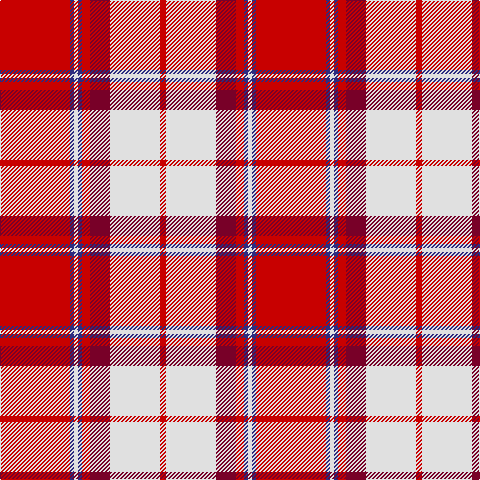

In pattern [RBWBRRWR](/patterns/rbwbrrwr/).

This was sourced from tartans-authority.  It is a [8 stripes tartan](/stripes/stripes8/).

Original link http://www.tartansauthority.com/tartan-ferret/display/8191/

## Thread count
R/70 DB4 LN4 DB4 R8 DR20 LN50 R/6

## Palette
Each colour and its ΔE from the base-6 reference it is a variant of.

| Colour | Shade | Base | ΔE (OKLab) |
|---|---|---|---|
| DB | <code style="background-color:#2C2C80;">#2C2C80</code> `#2C2C80` | B <code style="background-color:#2A418A;">#2A418A</code> | 0.06 |
| DR | <code style="background-color:#780028;">#780028</code> `#780028` | R <code style="background-color:#CC0000;">#CC0000</code> | 0.19 |
| LN | <code style="background-color:#E0E0E0;">#E0E0E0</code> `#E0E0E0` | W <code style="background-color:#F7F7F7;">#F7F7F7</code> | 0.07 |
| R | <code style="background-color:#C80000;">#C80000</code> `#C80000` | R <code style="background-color:#CC0000;">#CC0000</code> | 0.01 |

# Sample pattern

## Nearest tartans

The nearest existing variants by ΔTartan distance.

1. [Longniddry, dress Burgundy](/setts/s8/r42ra2w2ra2r5rb12w32r4~r900030-rad03030-rbc00000-we0e0e0~x2/) — ΔT 0.47
1. [Longniddry Burgundy (Dance)](/setts/s8/r42ra2w2ra2r5rb12w32r4~r880000-rae87878-rbc80000-we0e0e0~x2/) — ΔT 0.51
1. [Cameron, Hose for E](/setts/s8/r3k2r23ra3r3w23r3ra3~k000000-rc00000-rad00000-we0e0e0~x2/) — ΔT 0.74
1. [Cameron Hose #2](/setts/s8/r3ra3w23ra3r3ra23k2ra3~k101010-rc80050-radc0000-we0e0e0~x2/) — ΔT 0.87
1. [O'Meehan (Name)](/setts/s9/y27k4w4r64w4r4k4r4k12~k101010-rc80050-we0e0e0-ye8c000~x2/) — ΔT 0.93
1. [Hose #2](/setts/s8/r3ra3w23ra3r3ra23k2ra3~k101010-r880000-rac80000-wc0c0c0~x2/) — ΔT 0.94
1. [Torridon, Cherry (Dance)](/setts/s7/r3ra2b2ra30w30b2w3~b1c1c50-r880000-rab80000-wf0e0c8~x2/) — ΔT 0.96
1. [Cunningham Dress Clan Tartan Tartan Number: 563. Earliest known date: c.1980 One of a number of dress tartans produced by Hugh Macpherson, a kiltmaker in Edinburgh, intended for dancing and other informal occassions. The 'dress' version of clan tartan is usually created by substituting white for one of the 'ground' colours. See products available Copyright © Blair Urquhart, Comrie, 2015](/setts/s7/w5r2w34r34k2r2b4~b2c2c80-k101010-rc80000-we0e0e0~x2/) — ΔT 1.06
1. [Cunningham, dress](/setts/s7/w5r2w34r34k2r2b4~b304080-k000000-rc00000-we0e0e0~x2/) — ΔT 1.09
1. [Cunningham, Burgundy dress](/setts/s7/w5r2w34r34k2r2y4~k000000-rc00000-we0e0e0-yf0c000~x2/) — ΔT 1.15

## Neighbour map

Every grey dot is one of 15726 variants placed by the first two principal components of the ΔTartan feature space (44% of its variance). Red is this tartan; blue dots are its nearest — click one to open its page.

<svg viewBox="0 0 640 380" role="img" style="max-width:100%;height:auto;border:1px solid #e0e0e0;border-radius:4px;display:block" xmlns="http://www.w3.org/2000/svg"><image href="/nn/cloud.v1.png" width="640" height="380"/><a href="/setts/s8/r42ra2w2ra2r5rb12w32r4~r900030-rad03030-rbc00000-we0e0e0~x2/"><circle cx="305.8" cy="122.6" r="4" fill="#3465a4"><title>Longniddry, dress Burgundy</title></circle></a><a href="/setts/s8/r42ra2w2ra2r5rb12w32r4~r880000-rae87878-rbc80000-we0e0e0~x2/"><circle cx="301.6" cy="122.1" r="4" fill="#3465a4"><title>Longniddry Burgundy (Dance)</title></circle></a><a href="/setts/s8/r3k2r23ra3r3w23r3ra3~k000000-rc00000-rad00000-we0e0e0~x2/"><circle cx="285.7" cy="143.5" r="4" fill="#3465a4"><title>Cameron, Hose for E</title></circle></a><a href="/setts/s8/r3ra3w23ra3r3ra23k2ra3~k101010-rc80050-radc0000-we0e0e0~x2/"><circle cx="295.1" cy="143.8" r="4" fill="#3465a4"><title>Cameron Hose #2</title></circle></a><a href="/setts/s9/y27k4w4r64w4r4k4r4k12~k101010-rc80050-we0e0e0-ye8c000~x2/"><circle cx="327.2" cy="116.4" r="4" fill="#3465a4"><title>O'Meehan (Name)</title></circle></a><a href="/setts/s8/r3ra3w23ra3r3ra23k2ra3~k101010-r880000-rac80000-wc0c0c0~x2/"><circle cx="307.8" cy="153.9" r="4" fill="#3465a4"><title>Hose #2</title></circle></a><a href="/setts/s7/r3ra2b2ra30w30b2w3~b1c1c50-r880000-rab80000-wf0e0c8~x2/"><circle cx="284.5" cy="133.1" r="4" fill="#3465a4"><title>Torridon, Cherry (Dance)</title></circle></a><a href="/setts/s7/w5r2w34r34k2r2b4~b2c2c80-k101010-rc80000-we0e0e0~x2/"><circle cx="299.2" cy="131.4" r="4" fill="#3465a4"><title>Cunningham Dress Clan Tartan Tartan Number: 563. Earliest known date: c.1980 One of a number of dress tartans produced by Hugh Macpherson, a kiltmaker in Edinburgh, intended for dancing and other informal occassions. The 'dress' version of clan tartan is usually created by substituting white for one of the 'ground' colours. See products available Copyright © Blair Urquhart, Comrie, 2015</title></circle></a><a href="/setts/s7/w5r2w34r34k2r2b4~b304080-k000000-rc00000-we0e0e0~x2/"><circle cx="295.9" cy="131.2" r="4" fill="#3465a4"><title>Cunningham, dress</title></circle></a><a href="/setts/s7/w5r2w34r34k2r2y4~k000000-rc00000-we0e0e0-yf0c000~x2/"><circle cx="298.1" cy="130.6" r="4" fill="#3465a4"><title>Cunningham, Burgundy dress</title></circle></a><circle cx="298.0" cy="128.0" r="5" fill="#c00000"/></svg>

ID: /setts/s8/r35b2w2b2r4ra10w25r3~b2c2c80-rc80000-ra780028-we0e0e0~x2/
