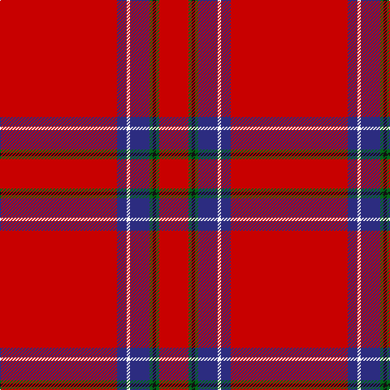

This page is one **sett** — a single exact thread-count. It belongs to the [tartan](/tartans/r36db3w1db6g1k1g1r9/)
(the same proportion at any scale), whose colour order is pattern [RBWBGKGR](/stripes/rbwbgkgr/).

Sourced from tartans-authority.  It is a [8 stripe tartan](/stripes/stripes8/).

Original link http://www.tartansauthority.com/tartan-ferret/display/1438/

## Thread count
R/144 DB12 W4 DB24 G4 K4 G4 R/36

## Palette

Palette: <strong>Tartan Register</strong>
<table><thead><tr><th>Colour</th><th>Threads</th><th>Shade</th><th>Base</th><th>OKLCh</th></tr></thead><tbody><tr><td>R/</td><td style="text-align:right;font-variant-numeric:tabular-nums">144</td><td><code style="background-color:#C80000;">#C80000</code> <small style="color:#888">#C80000</small></td><td>R <code style="background-color:#CC0000;">#CC0000</code></td><td><small style="color:#888">oklch(52.3% 0.215 29.2)</small></td></tr><tr><td>DB</td><td style="text-align:right;font-variant-numeric:tabular-nums">12</td><td><code style="background-color:#2C2C80;">#2C2C80</code> <small style="color:#888">#2C2C80</small></td><td>B <code style="background-color:#2A418A;">#2A418A</code></td><td><small style="color:#888">oklch(35.0% 0.138 276.6)</small></td></tr><tr><td>W</td><td style="text-align:right;font-variant-numeric:tabular-nums">4</td><td><code style="background-color:#FCFCFC;">#FCFCFC</code> <small style="color:#888">#FCFCFC</small></td><td>W <code style="background-color:#F7F7F7;">#F7F7F7</code></td><td><small style="color:#888">oklch(99.1% 0.000 89.9)</small></td></tr><tr><td>DB</td><td style="text-align:right;font-variant-numeric:tabular-nums">24</td><td><code style="background-color:#2C2C80;">#2C2C80</code> <small style="color:#888">#2C2C80</small></td><td>B <code style="background-color:#2A418A;">#2A418A</code></td><td><small style="color:#888">oklch(35.0% 0.138 276.6)</small></td></tr><tr><td>G</td><td style="text-align:right;font-variant-numeric:tabular-nums">4</td><td><code style="background-color:#006818;">#006818</code> <small style="color:#888">#006818</small></td><td>G <code style="background-color:#006100;">#006100</code></td><td><small style="color:#888">oklch(45.0% 0.142 145.0)</small></td></tr><tr><td>K</td><td style="text-align:right;font-variant-numeric:tabular-nums">4</td><td><code style="background-color:#101010;">#101010</code> <small style="color:#888">#101010</small></td><td>K <code style="background-color:#000000;">#000000</code></td><td><small style="color:#888">oklch(17.3% 0.000 89.9)</small></td></tr><tr><td>G</td><td style="text-align:right;font-variant-numeric:tabular-nums">4</td><td><code style="background-color:#006818;">#006818</code> <small style="color:#888">#006818</small></td><td>G <code style="background-color:#006100;">#006100</code></td><td><small style="color:#888">oklch(45.0% 0.142 145.0)</small></td></tr><tr><td>R/</td><td style="text-align:right;font-variant-numeric:tabular-nums">36</td><td><code style="background-color:#C80000;">#C80000</code> <small style="color:#888">#C80000</small></td><td>R <code style="background-color:#CC0000;">#CC0000</code></td><td><small style="color:#888">oklch(52.3% 0.215 29.2)</small></td></tr></tbody></table>

# Sample pattern

## Nearest tartans

The nearest existing variants by ΔTartan distance, with this tartan at the top so the swatches line up against it.

ΔTartan

Tartan

Sett

—

<a href="/ttd/edit/#slug=r36db3w1db6g1k1g1r9~x4">Inverness - 1829 (District)</a> <a class="nn-out" href="/setts/s8/r36db3w1db6g1k1g1r9~x4/" title="open its dictionary page">↗</a>

0.30

<a href="/ttd/edit/#slug=r36db3w1db6g1k1g1r9~x2">Inverness</a> <a class="nn-out" href="/setts/s8/r36db3w1db6g1k1g1r9~x2/" title="open its dictionary page">↗</a>

0.64

<a href="/ttd/edit/#slug=r114db10w3db16ly3k3ly3r28~x2">Inverness #2</a> <a class="nn-out" href="/setts/s8/r114db10w3db16ly3k3ly3r28~x2/" title="open its dictionary page">↗</a>

0.66

<a href="/ttd/edit/#slug=r72k6lb2k11ly2db2ly2r18~x2">Princess Elizabeth (Royal)</a> <a class="nn-out" href="/setts/s8/r72k6lb2k11ly2db2ly2r18~x2/" title="open its dictionary page">↗</a>

0.85

<a href="/ttd/edit/#slug=r72db6ly2db11t2db2t2r9k2~x2">Junor (Personal)</a> <a class="nn-out" href="/setts/s9/r72db6ly2db11t2db2t2r9k2~x2/" title="open its dictionary page">↗</a>

0.96

<a href="/ttd/edit/#slug=r51lr2k11lo3r11lo3r11g3~x2">Hackston (Green stripe) (Portrait)</a> <a class="nn-out" href="/setts/s8/r51lr2k11lo3r11lo3r11g3~x2/" title="open its dictionary page">↗</a>

1.06

<a href="/ttd/edit/#slug=r100db10w5db14ly4db8ly4r24">Earl of Inverness (Royal)</a> <a class="nn-out" href="/setts/s8/r100db10w5db14ly4db8ly4r24/" title="open its dictionary page">↗</a>

1.11

<a href="/ttd/edit/#slug=r42db4ly1db6dg1db1dg1r12~x2">Inverness Earl of</a> <a class="nn-out" href="/setts/s8/r42db4ly1db6dg1db1dg1r12~x2/" title="open its dictionary page">↗</a>

1.12

<a href="/ttd/edit/#slug=r68db26r5ly3r5g3r13o3~x2">De Nardi (Personal)</a> <a class="nn-out" href="/setts/s8/r68db26r5ly3r5g3r13o3~x2/" title="open its dictionary page">↗</a>

1.12

<a href="/ttd/edit/#slug=r45k3ly4k3r45k1dp2k1r2g8r2~x2">O'Malley (Name?)</a> <a class="nn-out" href="/setts/s11/r45k3ly4k3r45k1dp2k1r2g8r2~x2/" title="open its dictionary page">↗</a>

1.18

<a href="/ttd/edit/#slug=r48lr4db4k4r12db4r1ly4~x2">Brodie</a> <a class="nn-out" href="/setts/s8/r48lr4db4k4r12db4r1ly4~x2/" title="open its dictionary page">↗</a>

## Neighbour map

Every grey dot is one of 14299 variants placed by the first two principal components of the ΔTartan feature space (44% of its variance). Red is this tartan; blue dots are its nearest — click one to open its page.

<svg viewBox="0 0 640 380" role="img" style="max-width:100%;height:auto;border:1px solid #e0e0e0;border-radius:4px;display:block" xmlns="http://www.w3.org/2000/svg"><image href="/nn/cloud.v1.png" width="640" height="380"/><a href="/setts/s8/r36db3w1db6g1k1g1r9~x2/"><circle cx="563.0" cy="96.6" r="4" fill="#3465a4"><title>Inverness</title></circle></a><a href="/setts/s8/r114db10w3db16ly3k3ly3r28~x2/"><circle cx="571.3" cy="83.5" r="4" fill="#3465a4"><title>Inverness #2</title></circle></a><a href="/setts/s8/r72k6lb2k11ly2db2ly2r18~x2/"><circle cx="551.5" cy="84.7" r="4" fill="#3465a4"><title>Princess Elizabeth (Royal)</title></circle></a><a href="/setts/s9/r72db6ly2db11t2db2t2r9k2~x2/"><circle cx="528.2" cy="70.6" r="4" fill="#3465a4"><title>Junor (Personal)</title></circle></a><a href="/setts/s8/r51lr2k11lo3r11lo3r11g3~x2/"><circle cx="522.8" cy="115.3" r="4" fill="#3465a4"><title>Hackston (Green stripe) (Portrait)</title></circle></a><a href="/setts/s8/r100db10w5db14ly4db8ly4r24/"><circle cx="484.7" cy="99.6" r="4" fill="#3465a4"><title>Earl of Inverness (Royal)</title></circle></a><a href="/setts/s8/r42db4ly1db6dg1db1dg1r12~x2/"><circle cx="607.5" cy="103.0" r="4" fill="#3465a4"><title>Inverness Earl of</title></circle></a><a href="/setts/s8/r68db26r5ly3r5g3r13o3~x2/"><circle cx="489.9" cy="118.0" r="4" fill="#3465a4"><title>De Nardi (Personal)</title></circle></a><a href="/setts/s11/r45k3ly4k3r45k1dp2k1r2g8r2~x2/"><circle cx="593.5" cy="73.7" r="4" fill="#3465a4"><title>O'Malley (Name?)</title></circle></a><a href="/setts/s8/r48lr4db4k4r12db4r1ly4~x2/"><circle cx="517.7" cy="81.3" r="4" fill="#3465a4"><title>Brodie</title></circle></a><circle cx="557.0" cy="91.9" r="5" fill="#c00000"/></svg>

ID: /setts/s8/r36db3w1db6g1k1g1r9~x4/
