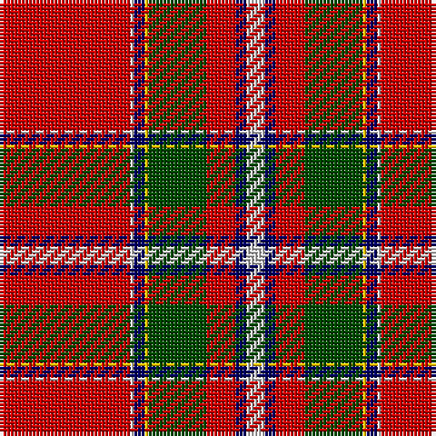

This page is one **sett** — a single exact thread-count. It belongs to the [tartan](/tartans/r36lb1db3ly1dg16r8db3lb5/)
(the same proportion at any scale), whose colour order is pattern [RWBYGRBW](/stripes/rwbygrbw/).

Sourced from weddslist.  It is a [8 stripe tartan](/stripes/stripes8/).

Original link http://www.weddslist.com/cgi-bin/tartans/pg.pl?source=rb

## Thread count
R/36 N1 DB3 Y1 G16 R8 DB3 N/5

## Palette

Palette: <strong>Tartan Register</strong> <small style="color:#888">(3 of 5 colours)</small>
<table><thead><tr><th>Colour</th><th>Threads</th><th>Shade</th><th>Base</th><th>OKLCh</th></tr></thead><tbody><tr><td>R/</td><td style="text-align:right;font-variant-numeric:tabular-nums">36</td><td><code style="background-color:#C80000;">#C80000</code> <small style="color:#888">#C80000</small></td><td>R <code style="background-color:#CC0000;">#CC0000</code></td><td><small style="color:#888">oklch(52.3% 0.215 29.2)</small></td></tr><tr><td>N</td><td style="text-align:right;font-variant-numeric:tabular-nums">1</td><td><code style="background-color:#D0D0D0;">#D0D0D0</code> <small style="color:#888">#D0D0D0</small></td><td>W <code style="background-color:#F7F7F7;">#F7F7F7</code></td><td><small style="color:#888">oklch(85.8% 0.000 89.9)</small></td></tr><tr><td>DB</td><td style="text-align:right;font-variant-numeric:tabular-nums">3</td><td><code style="background-color:#000064;">#000064</code> <small style="color:#888">#000064</small></td><td>B <code style="background-color:#2A418A;">#2A418A</code></td><td><small style="color:#888">oklch(22.7% 0.158 264.1)</small></td></tr><tr><td>Y</td><td style="text-align:right;font-variant-numeric:tabular-nums">1</td><td><code style="background-color:#FFC800;">#FFC800</code> <small style="color:#888">#FFC800</small></td><td>Y <code style="background-color:#F2BF00;">#F2BF00</code></td><td><small style="color:#888">oklch(85.7% 0.175 88.5)</small></td></tr><tr><td>G</td><td style="text-align:right;font-variant-numeric:tabular-nums">16</td><td><code style="background-color:#004C00;">#004C00</code> <small style="color:#888">#004C00</small></td><td>G <code style="background-color:#006100;">#006100</code></td><td><small style="color:#888">oklch(36.1% 0.123 142.5)</small></td></tr><tr><td>R</td><td style="text-align:right;font-variant-numeric:tabular-nums">8</td><td><code style="background-color:#C80000;">#C80000</code> <small style="color:#888">#C80000</small></td><td>R <code style="background-color:#CC0000;">#CC0000</code></td><td><small style="color:#888">oklch(52.3% 0.215 29.2)</small></td></tr><tr><td>DB</td><td style="text-align:right;font-variant-numeric:tabular-nums">3</td><td><code style="background-color:#000064;">#000064</code> <small style="color:#888">#000064</small></td><td>B <code style="background-color:#2A418A;">#2A418A</code></td><td><small style="color:#888">oklch(22.7% 0.158 264.1)</small></td></tr><tr><td>N/</td><td style="text-align:right;font-variant-numeric:tabular-nums">5</td><td><code style="background-color:#D0D0D0;">#D0D0D0</code> <small style="color:#888">#D0D0D0</small></td><td>W <code style="background-color:#F7F7F7;">#F7F7F7</code></td><td><small style="color:#888">oklch(85.8% 0.000 89.9)</small></td></tr></tbody></table>

# Sample pattern

## Nearest tartans

The nearest existing variants by ΔTartan distance, with this tartan at the top so the swatches line up against it.

ΔTartan

Tartan

Sett

—

<a href="/ttd/edit/#slug=r36lb1db3ly1dg16r8db3lb5">Drummond of Perth</a> <a class="nn-out" href="/setts/s8/r36lb1db3ly1dg16r8db3lb5/" title="open its dictionary page">↗</a>

0.56

<a href="/ttd/edit/#slug=r33w1k3w1g13r7k3p3w1~x2">Leach, Leech, Leitch, dress</a> <a class="nn-out" href="/setts/s9/r33w1k3w1g13r7k3p3w1~x2/" title="open its dictionary page">↗</a>

0.79

<a href="/ttd/edit/#slug=dg6lb1dg12r4db4r2k4r32dg1r2~x2">Seton</a> <a class="nn-out" href="/setts/s10/dg6lb1dg12r4db4r2k4r32dg1r2~x2/" title="open its dictionary page">↗</a>

0.81

<a href="/ttd/edit/#slug=g6w1g12r4db4r2k4r32g1r2~x2">Seton</a> <a class="nn-out" href="/setts/s10/g6w1g12r4db4r2k4r32g1r2~x2/" title="open its dictionary page">↗</a>

0.83

<a href="/ttd/edit/#slug=w8r100k42dg42r5k3r5t42r100w8">Unidentified Plaid #7</a> <a class="nn-out" href="/setts/s10/w8r100k42dg42r5k3r5t42r100w8/" title="open its dictionary page">↗</a>

0.87

<a href="/ttd/edit/#slug=r28dg4k4dg4k4t6ly1~x2">Livingstone MacLay MacLeay</a> <a class="nn-out" href="/setts/s7/r28dg4k4dg4k4t6ly1~x2/" title="open its dictionary page">↗</a>

0.92

<a href="/ttd/edit/#slug=w8r100k42g42r5k3r5t42r100w8">Unidentified Plaid 10</a> <a class="nn-out" href="/setts/s10/w8r100k42g42r5k3r5t42r100w8/" title="open its dictionary page">↗</a>

0.93

<a href="/ttd/edit/#slug=g2r26db4r2k4r2g8r4k1r1w2~x2">Stewart of Rothesay</a> <a class="nn-out" href="/setts/s11/g2r26db4r2k4r2g8r4k1r1w2~x2/" title="open its dictionary page">↗</a>

0.95

<a href="/ttd/edit/#slug=r40w1db7w1g12r8db6t2w1~x2">Spens (Lochcarron)</a> <a class="nn-out" href="/setts/s9/r40w1db7w1g12r8db6t2w1~x2/" title="open its dictionary page">↗</a>

0.97

<a href="/ttd/edit/#slug=r6w1r24db6dg2k1dg2k1dg12r1~x2">Chisholm #2</a> <a class="nn-out" href="/setts/s10/r6w1r24db6dg2k1dg2k1dg12r1~x2/" title="open its dictionary page">↗</a>

1.03

<a href="/ttd/edit/#slug=dg2r26db4r2k4r2dg8r4k1r1w2~x2">Stewart/Stuart of Rothesay (Sobieski)</a> <a class="nn-out" href="/setts/s11/dg2r26db4r2k4r2dg8r4k1r1w2~x2/" title="open its dictionary page">↗</a>

## Neighbour map

Every grey dot is one of 14299 variants placed by the first two principal components of the ΔTartan feature space (44% of its variance). Red is this tartan; blue dots are its nearest — click one to open its page.

<svg viewBox="0 0 640 380" role="img" style="max-width:100%;height:auto;border:1px solid #e0e0e0;border-radius:4px;display:block" xmlns="http://www.w3.org/2000/svg"><image href="/nn/cloud.v1.png" width="640" height="380"/><a href="/setts/s9/r33w1k3w1g13r7k3p3w1~x2/"><circle cx="375.1" cy="81.7" r="4" fill="#3465a4"><title>Leach, Leech, Leitch, dress</title></circle></a><a href="/setts/s10/dg6lb1dg12r4db4r2k4r32dg1r2~x2/"><circle cx="369.1" cy="88.6" r="4" fill="#3465a4"><title>Seton</title></circle></a><a href="/setts/s10/g6w1g12r4db4r2k4r32g1r2~x2/"><circle cx="368.6" cy="88.7" r="4" fill="#3465a4"><title>Seton</title></circle></a><a href="/setts/s10/w8r100k42dg42r5k3r5t42r100w8/"><circle cx="337.6" cy="96.5" r="4" fill="#3465a4"><title>Unidentified Plaid #7</title></circle></a><a href="/setts/s7/r28dg4k4dg4k4t6ly1~x2/"><circle cx="325.1" cy="110.2" r="4" fill="#3465a4"><title>Livingstone MacLay MacLeay</title></circle></a><a href="/setts/s10/w8r100k42g42r5k3r5t42r100w8/"><circle cx="325.6" cy="95.1" r="4" fill="#3465a4"><title>Unidentified Plaid 10</title></circle></a><a href="/setts/s11/g2r26db4r2k4r2g8r4k1r1w2~x2/"><circle cx="368.8" cy="84.2" r="4" fill="#3465a4"><title>Stewart of Rothesay</title></circle></a><a href="/setts/s9/r40w1db7w1g12r8db6t2w1~x2/"><circle cx="404.9" cy="84.8" r="4" fill="#3465a4"><title>Spens (Lochcarron)</title></circle></a><a href="/setts/s10/r6w1r24db6dg2k1dg2k1dg12r1~x2/"><circle cx="340.8" cy="103.0" r="4" fill="#3465a4"><title>Chisholm #2</title></circle></a><a href="/setts/s11/dg2r26db4r2k4r2dg8r4k1r1w2~x2/"><circle cx="379.6" cy="87.7" r="4" fill="#3465a4"><title>Stewart/Stuart of Rothesay (Sobieski)</title></circle></a><circle cx="373.1" cy="93.6" r="5" fill="#c00000"/></svg>

ID: /setts/s8/r36lb1db3ly1dg16r8db3lb5/
