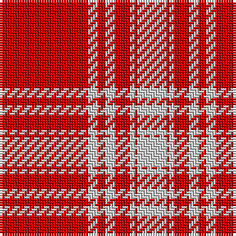

In pattern [RWRWRWRW](/stripes/rwrwrwrw/).

This was sourced from weddslist.  It is a [8 stripe tartan](/stripes/stripes8/).

Original link http://www.weddslist.com/cgi-bin/tartans/pg.pl?source=rb

## Register references

External register numbers recorded for this tartan.

- Scottish Register of Tartans: [1166](https://www.tartanregister.gov.uk/tartanDetails.aspx?ref=1166)
- Scottish Register of Tartans: [1758](https://www.tartanregister.gov.uk/tartanDetails.aspx?ref=1758)
- Scottish Register of Tartans: [2307](https://www.tartanregister.gov.uk/tartanDetails.aspx?ref=2307)
- Scottish Register of Tartans: [2540](https://www.tartanregister.gov.uk/tartanDetails.aspx?ref=2540)
- Scottish Register of Tartans: [2666](https://www.tartanregister.gov.uk/tartanDetails.aspx?ref=2666)
- Scottish Register of Tartans: [2862](https://www.tartanregister.gov.uk/tartanDetails.aspx?ref=2862)
- Scottish Register of Tartans: [3808](https://www.tartanregister.gov.uk/tartanDetails.aspx?ref=3808)
- Scottish Register of Tartans: [982](https://www.tartanregister.gov.uk/tartanDetails.aspx?ref=982)
- Scottish Tartans Authority (ITI): 218
- Scottish Tartans World Register: 1010
- Scottish Tartans World Register: 1042
- Scottish Tartans World Register: 127
- Scottish Tartans World Register: 1585
- Scottish Tartans World Register: 218
- Scottish Tartans World Register: 2218
- Scottish Tartans World Register: 737
- Scottish Tartans World Register: 897

## Thread count
R/36 N4 R3 N4 R6 N2 R1 N/12

## Palette
Each colour and its ΔE from the base-6 reference it is a variant of.

| Colour | Shade | Base | ΔE (OKLab) |
|---|---|---|---|
| N | <code style="background-color:#D0D0D0;">#D0D0D0</code> `#D0D0D0` | W <code style="background-color:#F7F7F7;">#F7F7F7</code> | 0.12 |
| R | <code style="background-color:#C80000;">#C80000</code> `#C80000` | R <code style="background-color:#CC0000;">#CC0000</code> | 0.01 |

# Sample pattern

## Nearest tartans

The nearest existing variants by ΔTartan distance.

1. [Menzies](/setts/s8/r36w4r3w4r6w2r1w12~x2/) — ΔT 0.47
1. [Menzies (1815)](/setts/s8/r36w4r3w4r6w2r1w12~x4/) — ΔT 0.94
1. [Masai Shuka 08 (Artefact)](/setts/s8/r55w20r8w2r8w2r8w2~x2/) — ΔT 1.02
1. [Menzies Dress](/setts/s8/r36lr4r3lr4r6lr2r1lr12~x2/) — ΔT 1.07
1. [Menzies Dress](/setts/s8/r36lr4r3lr4r6lr2r1lr12/) — ΔT 1.07
1. [Miyuki #2](/setts/s10/r40w1r1dt8r1w1r6w1r1dt8~x2/) — ΔT 1.77
1. [Virgin](/setts/s8/r51o2r6k10r2k4o3k3~x2/) — ΔT 1.77
1. [Oilmens (Corporate)](/setts/s8/ly4k1r30k15r24k2r4k1~x4/) — ΔT 1.87
1. [MacGregor - 2005 (Black - Personal)](/setts/s6/r41w19r7w8w1k3~x2/) — ΔT 1.88
1. [Kyle Green (Name)](/setts/s8/r54g6r5g6r10g3r2g18~x2/) — ΔT 1.89

## Neighbour map

Every grey dot is one of 14299 variants placed by the first two principal components of the ΔTartan feature space (44% of its variance). Red is this tartan; blue dots are its nearest — click one to open its page.

<svg viewBox="0 0 640 380" role="img" style="max-width:100%;height:auto;border:1px solid #e0e0e0;border-radius:4px;display:block" xmlns="http://www.w3.org/2000/svg"><image href="/nn/cloud.v1.png" width="640" height="380"/><a href="/setts/s8/r36w4r3w4r6w2r1w12~x2/"><circle cx="497.0" cy="125.6" r="4" fill="#3465a4"><title>Menzies</title></circle></a><a href="/setts/s8/r36w4r3w4r6w2r1w12~x4/"><circle cx="484.2" cy="117.1" r="4" fill="#3465a4"><title>Menzies (1815)</title></circle></a><a href="/setts/s8/r55w20r8w2r8w2r8w2~x2/"><circle cx="549.0" cy="140.3" r="4" fill="#3465a4"><title>Masai Shuka 08 (Artefact)</title></circle></a><a href="/setts/s8/r36lr4r3lr4r6lr2r1lr12~x2/"><circle cx="534.4" cy="150.0" r="4" fill="#3465a4"><title>Menzies Dress</title></circle></a><a href="/setts/s8/r36lr4r3lr4r6lr2r1lr12/"><circle cx="534.4" cy="150.0" r="4" fill="#3465a4"><title>Menzies Dress</title></circle></a><a href="/setts/s10/r40w1r1dt8r1w1r6w1r1dt8~x2/"><circle cx="546.6" cy="99.7" r="4" fill="#3465a4"><title>Miyuki #2</title></circle></a><a href="/setts/s8/r51o2r6k10r2k4o3k3~x2/"><circle cx="518.4" cy="117.1" r="4" fill="#3465a4"><title>Virgin</title></circle></a><a href="/setts/s8/ly4k1r30k15r24k2r4k1~x4/"><circle cx="493.6" cy="143.9" r="4" fill="#3465a4"><title>Oilmens (Corporate)</title></circle></a><a href="/setts/s6/r41w19r7w8w1k3~x2/"><circle cx="408.6" cy="120.3" r="4" fill="#3465a4"><title>MacGregor - 2005 (Black - Personal)</title></circle></a><a href="/setts/s8/r54g6r5g6r10g3r2g18~x2/"><circle cx="536.2" cy="171.9" r="4" fill="#3465a4"><title>Kyle Green (Name)</title></circle></a><circle cx="511.0" cy="131.7" r="5" fill="#c00000"/></svg>

ID: /setts/s8/r36lb4r3lb4r6lb2r1lb12/
