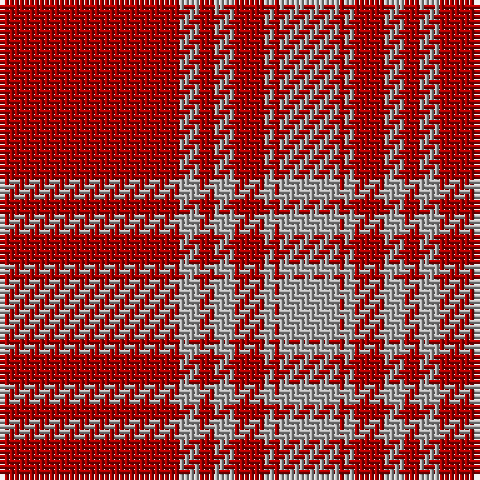

**Bands:** [RYRYRYRY](/stripes/ryryryry/) · **Stripes:** [R LR R LR R LR R LR](/stripes/stripes8/) R LR R LR R LR R LR

This was sourced from weddslist.  It is a [8 band tartan](/bands/bands8/).

Original link http://www.weddslist.com/cgi-bin/tartans/pg.pl?source=x

## Register references

External register numbers recorded for this tartan.

- Scottish Register of Tartans: [1166](https://www.tartanregister.gov.uk/tartanDetails.aspx?ref=1166)
- Scottish Register of Tartans: [1758](https://www.tartanregister.gov.uk/tartanDetails.aspx?ref=1758)
- Scottish Register of Tartans: [2307](https://www.tartanregister.gov.uk/tartanDetails.aspx?ref=2307)
- Scottish Register of Tartans: [2540](https://www.tartanregister.gov.uk/tartanDetails.aspx?ref=2540)
- Scottish Register of Tartans: [2625](https://www.tartanregister.gov.uk/tartanDetails.aspx?ref=2625)
- Scottish Register of Tartans: [2862](https://www.tartanregister.gov.uk/tartanDetails.aspx?ref=2862)
- Scottish Register of Tartans: [982](https://www.tartanregister.gov.uk/tartanDetails.aspx?ref=982)
- Scottish Tartans Authority (ITI): 1429
- Scottish Tartans Authority (ITI): 218
- Scottish Tartans World Register: 1042
- Scottish Tartans World Register: 127
- Scottish Tartans World Register: 1429
- Scottish Tartans World Register: 218
- Scottish Tartans World Register: 2218
- Scottish Tartans World Register: 737
- Scottish Tartans World Register: 897

## Variants

Other setts woven to the same stripe pattern.

- [Menzies Dress](/setts/s8/r36lr4r3lr4r6lr2r1lr12~x2/)

## Thread count
DR/36 N4 DR3 N4 DR6 N2 DR1 N/12

## Palette
Each colour and its ΔE from the base-6 reference it is a variant of.

| Colour | Shade | Base | ΔE (OKLab) |
|---|---|---|---|
| DR | <code style="background-color:#AA0000;">#AA0000</code> `#AA0000` | R <code style="background-color:#CC0000;">#CC0000</code> | 0.07 |
| N | <code style="background-color:#AAAAAA;">#AAAAAA</code> `#AAAAAA` | Y <code style="background-color:#F2BF00;">#F2BF00</code> | 0.19 |

# Sample pattern

## Nearest tartans

The nearest existing variants by ΔTartan distance.

1. [Menzies Dress](/setts/s8/r36lr4r3lr4r6lr2r1lr12~x2/) — ΔT 0.00
1. [Menzies Dress](/setts/s8/r36lb4r3lb4r6lb2r1lb12/) — ΔT 1.07
1. [Kyle Green (Name)](/setts/s8/r54g6r5g6r10g3r2g18~x2/) — ΔT 1.11
1. [Menzies](/setts/s8/r36w4r3w4r6w2r1w12~x2/) — ΔT 1.43
1. [Miyuki #2](/setts/s10/r40w1r1dt8r1w1r6w1r1dt8~x2/) — ΔT 1.46
1. [MacPherson-Grant](/setts/s11/r90k6r6k6r90g6r6g45r6k4r3/) — ΔT 1.56
1. [MacKintosh #3](/setts/s6/r48db2r3dg28r4db2~x2/) — ΔT 1.57
1. [Masai Shuka 08 (Artefact)](/setts/s8/r55w20r8w2r8w2r8w2~x2/) — ΔT 1.58
1. [Masai Shuka 27 (Artefact)](/setts/s10/r30db8r2k1r2k1~x2/) — ΔT 1.62
1. [Cameron Ancient](/setts/s7/r58ly3r6dg16r12dg16r6/) — ΔT 1.64

## Neighbour map

Every grey dot is one of 14299 variants placed by the first two principal components of the ΔTartan feature space (44% of its variance). Red is this tartan; blue dots are its nearest — click one to open its page.

<svg viewBox="0 0 640 380" role="img" style="max-width:100%;height:auto;border:1px solid #e0e0e0;border-radius:4px;display:block" xmlns="http://www.w3.org/2000/svg"><image href="/nn/cloud.v1.png" width="640" height="380"/><a href="/setts/s8/r36lr4r3lr4r6lr2r1lr12~x2/"><circle cx="534.4" cy="150.0" r="4" fill="#3465a4"><title>Menzies Dress</title></circle></a><a href="/setts/s8/r36lb4r3lb4r6lb2r1lb12/"><circle cx="511.0" cy="131.7" r="4" fill="#3465a4"><title>Menzies Dress</title></circle></a><a href="/setts/s8/r54g6r5g6r10g3r2g18~x2/"><circle cx="536.2" cy="171.9" r="4" fill="#3465a4"><title>Kyle Green (Name)</title></circle></a><a href="/setts/s8/r36w4r3w4r6w2r1w12~x2/"><circle cx="497.0" cy="125.6" r="4" fill="#3465a4"><title>Menzies</title></circle></a><a href="/setts/s10/r40w1r1dt8r1w1r6w1r1dt8~x2/"><circle cx="546.6" cy="99.7" r="4" fill="#3465a4"><title>Miyuki #2</title></circle></a><a href="/setts/s11/r90k6r6k6r90g6r6g45r6k4r3/"><circle cx="555.3" cy="129.6" r="4" fill="#3465a4"><title>MacPherson-Grant</title></circle></a><a href="/setts/s6/r48db2r3dg28r4db2~x2/"><circle cx="460.6" cy="162.7" r="4" fill="#3465a4"><title>MacKintosh #3</title></circle></a><a href="/setts/s8/r55w20r8w2r8w2r8w2~x2/"><circle cx="549.0" cy="140.3" r="4" fill="#3465a4"><title>Masai Shuka 08 (Artefact)</title></circle></a><a href="/setts/s10/r30db8r2k1r2k1~x2/"><circle cx="495.9" cy="120.8" r="4" fill="#3465a4"><title>Masai Shuka 27 (Artefact)</title></circle></a><a href="/setts/s7/r58ly3r6dg16r12dg16r6/"><circle cx="488.9" cy="173.0" r="4" fill="#3465a4"><title>Cameron Ancient</title></circle></a><circle cx="534.4" cy="150.0" r="5" fill="#c00000"/></svg>

ID: /setts/s8/r36lr4r3lr4r6lr2r1lr12/
