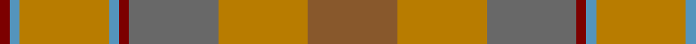
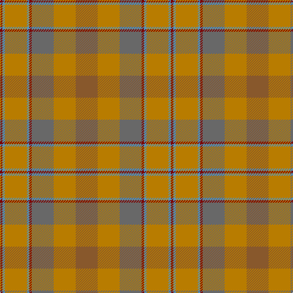

In pattern [RBRBRGRR](/patterns/rbrbrgrr/).

This was sourced from house-of-tartan.  It is a [8 stripes tartan](/stripes/stripes8/).

Original link http://www.house-of-tartan.scotland.net/house/TartanViewjs.asp?colr=Def&tnam=1432

## Thread count
DR/4 B4 DY36 B4 DR4 N36 DY36 LT/36

## Palette
Each colour and its ΔE from the base-6 reference it is a variant of.

| Colour | Shade | Base | ΔE (OKLab) |
|---|---|---|---|
| B | <code style="background-color:#5494BC;">#5494BC</code> `#5494BC` | B <code style="background-color:#2C4084;">#2C4084</code> | 0.25 |
| DR | <code style="background-color:#7C0000;">#7C0000</code> `#7C0000` | R <code style="background-color:#C80000;">#C80000</code> | 0.17 |
| DY | <code style="background-color:#B87C00;">#B87C00</code> `#B87C00` | R <code style="background-color:#C80000;">#C80000</code> | 0.19 |
| LT | <code style="background-color:#88582C;">#88582C</code> `#88582C` | R <code style="background-color:#C80000;">#C80000</code> | 0.15 |
| N | <code style="background-color:#686868;">#686868</code> `#686868` | G <code style="background-color:#006400;">#006400</code> | 0.17 |

# Sample pattern

## Nearest tartans

The nearest existing variants by ΔTartan distance.

1. [Lawrence's Seven Pillars of Khaki](/setts/s9/g6b24g20b12g16ga12g16r46ra6-b5f749c-g767e52-ga008b00-rbe7832-rac8002c/) — ΔT 1.31
1. [Annan (Fashion)](/setts/s10/g32r4g4ra4g4r4g4b12ba20g6-b441800-ba5c5c5c-g8c7038-r888888-rab84c00/) — ΔT 1.35
1. [Earle's Flame (Fashion)](/setts/s8/b20g48r6g6r48ga6g12b12-b3c3c3c-g845c00-ga285800-r880000/) — ΔT 1.57
1. [Golden Pheasant](/setts/s7/r24w8r6y36r6ya8g4-g289c18-re87878-we0e0e0-ya08858-yad8b000/) — ΔT 1.59
1. [Jardine](/setts/s8/b36r36g36ra4ga4r36ga4ra4-b5c5c5c-g787878-ga789484-ra46000-rac80000/) — ΔT 1.61
1. [Harmony 14](/setts/s11/g6ga32r22ga4gb22ga4gb22ga4r22ga32w6-g008000-ga808080-gb908000-r806050-we0e0e0/) — ΔT 1.73
1. [Jardine, of Castlemilk](/setts/s8/b36r36ba36ra4bb4r36bb4ra4-b401000-ba505050-bb304080-r806050-rac00000/) — ΔT 1.86
1. [Pubcrawlers (Corporate)](/setts/s7/g6ga8g4ga44b10r32y6-b5c5c5c-g006818-ga604000-r901c38-ye8c000/) — ΔT 1.88
1. [Clyde](/setts/s10/r10b6r44ra6b12ba34ra4ba8ra4ba8-b646464-ba5c5c5c-r8c8c8c-ra8c0000/) — ΔT 1.89
1. [Tricor](/setts/s12/g16w4g16ga24gb24r16g92r16gb24ga24g16w4-g8c7038-ga00643c-gb604000-r98481c-wc0c0c0/) — ΔT 1.94

## Neighbour map

Every grey dot is one of 15726 variants placed by the first two principal components of the ΔTartan feature space (44% of its variance). Red is this tartan; blue dots are its nearest — click one to open its page.

<svg viewBox="0 0 640 380" role="img" style="max-width:100%;height:auto;border:1px solid #e0e0e0;border-radius:4px;display:block" xmlns="http://www.w3.org/2000/svg"><image href="/nn/cloud.v1.png" width="640" height="380"/><a href="/setts/s9/g6b24g20b12g16ga12g16r46ra6-b5f749c-g767e52-ga008b00-rbe7832-rac8002c/"><circle cx="253.8" cy="250.1" r="4" fill="#3465a4"><title>Lawrence's Seven Pillars of Khaki</title></circle></a><a href="/setts/s10/g32r4g4ra4g4r4g4b12ba20g6-b441800-ba5c5c5c-g8c7038-r888888-rab84c00/"><circle cx="345.8" cy="213.0" r="4" fill="#3465a4"><title>Annan (Fashion)</title></circle></a><a href="/setts/s8/b20g48r6g6r48ga6g12b12-b3c3c3c-g845c00-ga285800-r880000/"><circle cx="340.0" cy="251.5" r="4" fill="#3465a4"><title>Earle's Flame (Fashion)</title></circle></a><a href="/setts/s7/r24w8r6y36r6ya8g4-g289c18-re87878-we0e0e0-ya08858-yad8b000/"><circle cx="282.1" cy="212.5" r="4" fill="#3465a4"><title>Golden Pheasant</title></circle></a><a href="/setts/s8/b36r36g36ra4ga4r36ga4ra4-b5c5c5c-g787878-ga789484-ra46000-rac80000/"><circle cx="354.7" cy="252.3" r="4" fill="#3465a4"><title>Jardine</title></circle></a><a href="/setts/s11/g6ga32r22ga4gb22ga4gb22ga4r22ga32w6-g008000-ga808080-gb908000-r806050-we0e0e0/"><circle cx="306.9" cy="250.4" r="4" fill="#3465a4"><title>Harmony 14</title></circle></a><a href="/setts/s8/b36r36ba36ra4bb4r36bb4ra4-b401000-ba505050-bb304080-r806050-rac00000/"><circle cx="289.1" cy="225.2" r="4" fill="#3465a4"><title>Jardine, of Castlemilk</title></circle></a><a href="/setts/s7/g6ga8g4ga44b10r32y6-b5c5c5c-g006818-ga604000-r901c38-ye8c000/"><circle cx="315.0" cy="208.1" r="4" fill="#3465a4"><title>Pubcrawlers (Corporate)</title></circle></a><a href="/setts/s10/r10b6r44ra6b12ba34ra4ba8ra4ba8-b646464-ba5c5c5c-r8c8c8c-ra8c0000/"><circle cx="334.6" cy="224.9" r="4" fill="#3465a4"><title>Clyde</title></circle></a><a href="/setts/s12/g16w4g16ga24gb24r16g92r16gb24ga24g16w4-g8c7038-ga00643c-gb604000-r98481c-wc0c0c0/"><circle cx="381.3" cy="178.7" r="4" fill="#3465a4"><title>Tricor</title></circle></a><circle cx="313.8" cy="231.2" r="5" fill="#c00000"/></svg>

ID: /setts/s8/r36ra36g36rb4b4ra36b4rb4-b5494bc-g686868-r88582c-rab87c00-rb7c0000/
