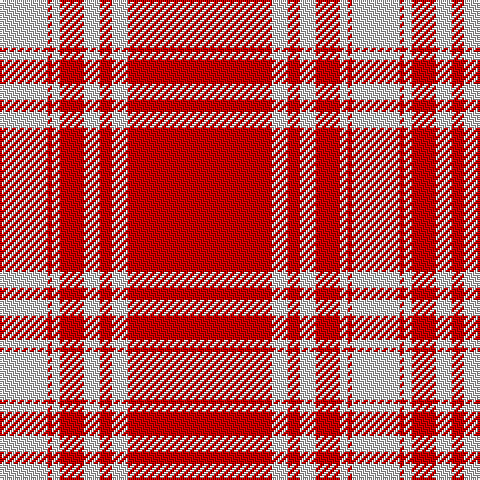

In pattern [RWRWRWRW](/patterns/rwrwrwrw/).

This was sourced from weddslist.  It is a [8 stripes tartan](/stripes/stripes8/).

Original link http://www.weddslist.com/cgi-bin/tartans/pg.pl?source=rb

## Thread count
N/24 R2 N4 R12 N8 R6 N8 R/72

## Palette
Each colour and its ΔE from the base-6 reference it is a variant of.

| Colour | Shade | Base | ΔE (OKLab) |
|---|---|---|---|
| N | <code style="background-color:#D0D0D0;">#D0D0D0</code> `#D0D0D0` | W <code style="background-color:#F7F7F7;">#F7F7F7</code> | 0.12 |
| R | <code style="background-color:#C80000;">#C80000</code> `#C80000` | R <code style="background-color:#CC0000;">#CC0000</code> | 0.01 |

# Sample pattern

## Nearest tartans

The nearest existing variants by ΔTartan distance.

1. [Menzies Red & White Clan Tartan Tartan Number: 1699. Earliest known date: 1810-15 The red and white Menzies tartan appears in the Cockburn Collection (c.1815) under the name, MacFarlane, but this is taken to be an error on the part of General Cockburn at a time when the establishment of clan names for tartan was in its infancy. The same sett was certified as Menzies, by the clan chief, in the collection of the Highland Society of London (c.1816). The tartan is woven in various colours, green, black, red and white to the same design. See products available Copyright © Blair Urquhart, Comrie, 2015](/setts/s8/r36w4r3w4r6w2r1w12~rc80000-we0e0e0~x2/) — ΔT 0.40
1. [Menzies](/setts/s8/r36w4r3w4r6w2r1w12~rc00000-we0e0e0~x2/) — ΔT 0.47
1. [Menzies (1815)](/setts/s8/r36w4r3w4r6w2r1w12~rc80000-wfcfcfc~x4/) — ΔT 0.94
1. [Masai Shuka 08 (Artefact)](/setts/s8/r55w20r8w2r8w2r8w2~rc80000-we0e0e0~x2/) — ΔT 1.02
1. [Menzies Dress](/setts/s8/r36y4r3y4r6y2r1y12~raa0000-yaaaaaa~x2/) — ΔT 1.07
1. [Menzies Dress](/setts/s8/r36y4r3y4r6y2r1y12~raa0000-yaaaaaa/) — ΔT 1.07
1. [Miyuki #2](/setts/s10/r40w1r1b8r1w1r6w1r1b8~b003c64-rc80000-we0e0e0~x2/) — ΔT 1.76
1. [Virgin](/setts/s8/r51ra2r6k10r2k4ra3k3~k101010-re80000-ra888888~x2/) — ΔT 1.76
1. [Oilmens (Corporate)](/setts/s8/y4k1r30k15r24k2r4k1~k101010-rc80000-ye8c000~x4/) — ΔT 1.86
1. [MacGregor - 2005 (Black - Personal)](/setts/s6/r41w19r7w8w1k3~k101010-rc80000-wfcfcfc~x2/) — ΔT 1.88

## Neighbour map

Every grey dot is one of 15726 variants placed by the first two principal components of the ΔTartan feature space (44% of its variance). Red is this tartan; blue dots are its nearest — click one to open its page.

<svg viewBox="0 0 640 380" role="img" style="max-width:100%;height:auto;border:1px solid #e0e0e0;border-radius:4px;display:block" xmlns="http://www.w3.org/2000/svg"><image href="/nn/cloud.v1.png" width="640" height="380"/><a href="/setts/s8/r36w4r3w4r6w2r1w12~rc80000-we0e0e0~x2/"><circle cx="501.0" cy="135.4" r="4" fill="#3465a4"><title>Menzies Red &amp; White Clan Tartan Tartan Number: 1699. Earliest known date: 1810-15 The red and white Menzies tartan appears in the Cockburn Collection (c.1815) under the name, MacFarlane, but this is taken to be an error on the part of General Cockburn at a time when the establishment of clan names for tartan was in its infancy. The same sett was certified as Menzies, by the clan chief, in the collection of the Highland Society of London (c.1816). The tartan is woven in various colours, green, black, red and white to the same design. See products available Copyright © Blair Urquhart, Comrie, 2015</title></circle></a><a href="/setts/s8/r36w4r3w4r6w2r1w12~rc00000-we0e0e0~x2/"><circle cx="498.3" cy="135.6" r="4" fill="#3465a4"><title>Menzies</title></circle></a><a href="/setts/s8/r36w4r3w4r6w2r1w12~rc80000-wfcfcfc~x4/"><circle cx="485.6" cy="128.6" r="4" fill="#3465a4"><title>Menzies (1815)</title></circle></a><a href="/setts/s8/r55w20r8w2r8w2r8w2~rc80000-we0e0e0~x2/"><circle cx="551.0" cy="151.0" r="4" fill="#3465a4"><title>Masai Shuka 08 (Artefact)</title></circle></a><a href="/setts/s8/r36y4r3y4r6y2r1y12~raa0000-yaaaaaa~x2/"><circle cx="535.8" cy="155.6" r="4" fill="#3465a4"><title>Menzies Dress</title></circle></a><a href="/setts/s8/r36y4r3y4r6y2r1y12~raa0000-yaaaaaa/"><circle cx="535.8" cy="155.6" r="4" fill="#3465a4"><title>Menzies Dress</title></circle></a><a href="/setts/s10/r40w1r1b8r1w1r6w1r1b8~b003c64-rc80000-we0e0e0~x2/"><circle cx="547.8" cy="106.0" r="4" fill="#3465a4"><title>Miyuki #2</title></circle></a><a href="/setts/s8/r51ra2r6k10r2k4ra3k3~k101010-re80000-ra888888~x2/"><circle cx="520.1" cy="126.6" r="4" fill="#3465a4"><title>Virgin</title></circle></a><a href="/setts/s8/y4k1r30k15r24k2r4k1~k101010-rc80000-ye8c000~x4/"><circle cx="495.0" cy="152.3" r="4" fill="#3465a4"><title>Oilmens (Corporate)</title></circle></a><a href="/setts/s6/r41w19r7w8w1k3~k101010-rc80000-wfcfcfc~x2/"><circle cx="409.5" cy="130.7" r="4" fill="#3465a4"><title>MacGregor - 2005 (Black - Personal)</title></circle></a><circle cx="512.6" cy="140.5" r="5" fill="#c00000"/></svg>

ID: /setts/s8/r36w4r3w4r6w2r1w12~rc80000-wd0d0d0~x2/
