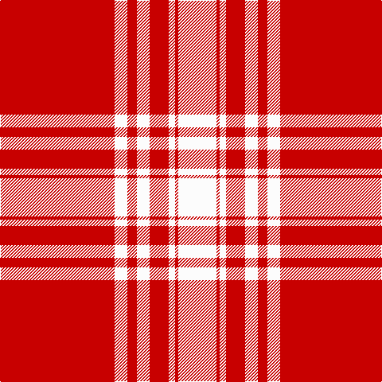

In pattern [RWRWRWRW](/stripes/rwrwrwrw/).

This was sourced from register-of-tartans.  It is a [8 stripe tartan](/stripes/stripes8/).

Original link https://www.tartanregister.gov.uk/tartanDetails.aspx?ref=2923

## Also known as

This cloth is also recorded under:

- Menzies 1815

## Attestations

This cloth appears in 2 source records; the oldest owns this page.

- 01/01/1815 — Menzies (1815) (register-of-tartans, [record](https://www.tartanregister.gov.uk/tartanDetails.aspx?ref=2923))
- pre 1815 — Menzies 1815 - Cockburn (tartans-authority, [record](http://www.tartansauthority.com/tartan-ferret/display/1699/))

## Register references

External register numbers recorded for this tartan.

- Scottish Register of Tartans: [2923](https://www.tartanregister.gov.uk/tartanDetails.aspx?ref=2923)
- Scottish Tartans Authority (ITI): 1699
- Scottish Tartans World Register: 1699

## Thread count
R/144 W16 R12 W16 R24 W8 R4 W/48

## Palette
Each colour and the base-6 reference it is a variant of.

| Colour | Shade | Base |
|---|---|---|
| R | <code style="background-color:#C80000;">#C80000</code> `oklch(52.3% 0.215 29.2)` <small>#C80000</small> | R <code style="background-color:#CC0000;">#CC0000</code> |
| W | <code style="background-color:#FCFCFC;">#FCFCFC</code> `oklch(99.1% 0.000 89.9)` <small>#FCFCFC</small> | W <code style="background-color:#F7F7F7;">#F7F7F7</code> |

# Sample pattern

## Nearest tartans

The nearest existing variants by ΔTartan distance.

1. [Menzies](/setts/s8/r36w4r3w4r6w2r1w12~x2/) — ΔT 0.53
1. [Menzies Dress](/setts/s8/r36lb4r3lb4r6lb2r1lb12/) — ΔT 0.94
1. [Masai Shuka 08 (Artefact)](/setts/s8/r55w20r8w2r8w2r8w2~x2/) — ΔT 1.34
1. [MacGregor - 2005 (Black - Personal)](/setts/s6/r41w19r7w8w1k3~x2/) — ΔT 1.50
1. [Valour](/setts/s12/r22k1r4w1r1k1w1r4w4r1w2k1~x4/) — ΔT 1.92
1. [Davet (2014)](/setts/s6/lg5k1w11k1r42k1~x2/) — ΔT 1.94
1. [Menzies Dress](/setts/s8/r36lr4r3lr4r6lr2r1lr12~x2/) — ΔT 1.95
1. [Menzies Dress](/setts/s8/r36lr4r3lr4r6lr2r1lr12/) — ΔT 1.95
1. [Davet (2014)](/setts/s6/t5k1w11k1r42k1~x2/) — ΔT 2.00
1. [Loughheed (Personal)](/setts/s8/dr3lo3dr4dr2lo18dr1lo2dr2~x4/) — ΔT 2.05

## Neighbour map

Every grey dot is one of 14299 variants placed by the first two principal components of the ΔTartan feature space (44% of its variance). Red is this tartan; blue dots are its nearest — click one to open its page.

<svg viewBox="0 0 640 380" role="img" style="max-width:100%;height:auto;border:1px solid #e0e0e0;border-radius:4px;display:block" xmlns="http://www.w3.org/2000/svg"><image href="/nn/cloud.v1.png" width="640" height="380"/><a href="/setts/s8/r36w4r3w4r6w2r1w12~x2/"><circle cx="497.0" cy="125.6" r="4" fill="#3465a4"><title>Menzies</title></circle></a><a href="/setts/s8/r36lb4r3lb4r6lb2r1lb12/"><circle cx="511.0" cy="131.7" r="4" fill="#3465a4"><title>Menzies Dress</title></circle></a><a href="/setts/s8/r55w20r8w2r8w2r8w2~x2/"><circle cx="549.0" cy="140.3" r="4" fill="#3465a4"><title>Masai Shuka 08 (Artefact)</title></circle></a><a href="/setts/s6/r41w19r7w8w1k3~x2/"><circle cx="408.6" cy="120.3" r="4" fill="#3465a4"><title>MacGregor - 2005 (Black - Personal)</title></circle></a><a href="/setts/s12/r22k1r4w1r1k1w1r4w4r1w2k1~x4/"><circle cx="500.1" cy="85.5" r="4" fill="#3465a4"><title>Valour</title></circle></a><a href="/setts/s6/lg5k1w11k1r42k1~x2/"><circle cx="457.5" cy="85.0" r="4" fill="#3465a4"><title>Davet (2014)</title></circle></a><a href="/setts/s8/r36lr4r3lr4r6lr2r1lr12~x2/"><circle cx="534.4" cy="150.0" r="4" fill="#3465a4"><title>Menzies Dress</title></circle></a><a href="/setts/s8/r36lr4r3lr4r6lr2r1lr12/"><circle cx="534.4" cy="150.0" r="4" fill="#3465a4"><title>Menzies Dress</title></circle></a><a href="/setts/s6/t5k1w11k1r42k1~x2/"><circle cx="464.5" cy="90.9" r="4" fill="#3465a4"><title>Davet (2014)</title></circle></a><a href="/setts/s8/dr3lo3dr4dr2lo18dr1lo2dr2~x4/"><circle cx="446.8" cy="162.3" r="4" fill="#3465a4"><title>Loughheed (Personal)</title></circle></a><circle cx="484.2" cy="117.1" r="5" fill="#c00000"/></svg>

ID: /setts/s8/r36w4r3w4r6w2r1w12~x4/
