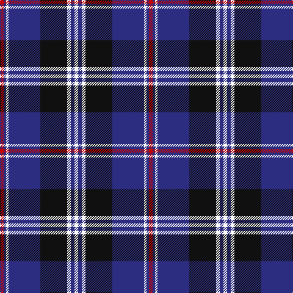

In pattern [RBWBKWBW](/patterns/rbwbkwbw/).

This was sourced from tartans-authority.  It is a [8 stripes tartan](/stripes/stripes8/).

Original link http://www.tartansauthority.com/tartan-ferret/display/11132/

## Thread count
R/6 DB4 W4 DB52 K44 W6 DB6 W/6

## Palette
Each colour and its ΔE from the base-6 reference it is a variant of.

| Colour | Shade | Base | ΔE (OKLab) |
|---|---|---|---|
| DB | <code style="background-color:#2C2C80;">#2C2C80</code> `#2C2C80` | B <code style="background-color:#2A418A;">#2A418A</code> | 0.06 |
| K | <code style="background-color:#101010;">#101010</code> `#101010` | K <code style="background-color:#000000;">#000000</code> | 0.17 |
| R | <code style="background-color:#C80000;">#C80000</code> `#C80000` | R <code style="background-color:#CC0000;">#CC0000</code> | 0.01 |
| W | <code style="background-color:#FCFCFC;">#FCFCFC</code> `#FCFCFC` | W <code style="background-color:#F7F7F7;">#F7F7F7</code> | 0.01 |

# Sample pattern

## Nearest tartans

The nearest existing variants by ΔTartan distance.

1. [Highlands School (North Carolina)](/setts/s8/y12b2y2b30ba2b2ba13w4~b1c0070-ba14283c-wc0c0c0-yd09800~x2/) — ΔT 0.48
1. [DeCloud-McMasters (Personal)](/setts/s8/r3b2w2b26k22w3b3w3~b00008c-k101010-rc80000-wffffff~x2/) — ΔT 0.79
1. [Rutherford](/setts/s8/k8r1k1r1k4b11y1b2~b6060c8-k101010-rc80000-ye8c000~x6/) — ΔT 0.83
1. [Highlands School (N. Carolina) Corporate Tartan Tartan Number: 2109. Earliest known date: 1990 Highlands in North Carolina is the home of the Scottish Tartans Society's Museum Extension. The school tartan was designed by Bob Martin who is a 'Fellow of the Society'. Blue and Gold are the school colours. See products available Copyright © Blair Urquhart, Comrie, 2015](/setts/s8/y12b2y2b30ba3b2ba13w4~b2c2c80-ba202060-we0e0e0-ye8c000~x2/) — ΔT 0.86
1. [Knights Templar International Corporate Tartan Tartan Number: 560. Earliest known date: 1989 Alternative sett (International Branch). Stuart Davidson was a founder member of the Scottish Tartans Society. See products available Copyright © Blair Urquhart, Comrie, 2015](/setts/s9/r3b20k6w5k4w3k2r1b2~b2c2c80-k101010-rc80000-we0e0e0~x2/) — ΔT 0.89
1. [Rhys (Welsh Name)](/setts/s10/y6b3y3b15ba7y7ba5y17ba46y4~b202060-ba000048-ya08858/) — ΔT 0.90
1. [Scottish Knights Templar Int. (Corp)](/setts/s9/r3b20k6w5k4w3k2r1b2~b2c2c80-k101010-rc80000-wc0c0c0~x2/) — ΔT 0.92
1. [Hydro-Electric](/setts/s6/k3b30k8w8k2r3~b304080-k000000-rc00000-we0e0e0~x2/) — ΔT 0.95
1. [Scottish Knights Templar, of M.T.S. International](/setts/s9/r3b20k6w5k4w3k2r1b2~b304080-k000000-rc00000-we0e0e0~x2/) — ΔT 0.97
1. [Scottish Knights Templar MTS (Corp)](/setts/s10/w4r2b20k6w5k4w3k2r2b2~b2c2c80-k101010-rc80000-wc0c0c0~x2/) — ΔT 1.07

## Neighbour map

Every grey dot is one of 15726 variants placed by the first two principal components of the ΔTartan feature space (44% of its variance). Red is this tartan; blue dots are its nearest — click one to open its page.

<svg viewBox="0 0 640 380" role="img" style="max-width:100%;height:auto;border:1px solid #e0e0e0;border-radius:4px;display:block" xmlns="http://www.w3.org/2000/svg"><image href="/nn/cloud.v1.png" width="640" height="380"/><a href="/setts/s8/y12b2y2b30ba2b2ba13w4~b1c0070-ba14283c-wc0c0c0-yd09800~x2/"><circle cx="270.0" cy="161.4" r="4" fill="#3465a4"><title>Highlands School (North Carolina)</title></circle></a><a href="/setts/s8/r3b2w2b26k22w3b3w3~b00008c-k101010-rc80000-wffffff~x2/"><circle cx="252.7" cy="162.9" r="4" fill="#3465a4"><title>DeCloud-McMasters (Personal)</title></circle></a><a href="/setts/s8/k8r1k1r1k4b11y1b2~b6060c8-k101010-rc80000-ye8c000~x6/"><circle cx="258.8" cy="181.6" r="4" fill="#3465a4"><title>Rutherford</title></circle></a><a href="/setts/s8/y12b2y2b30ba3b2ba13w4~b2c2c80-ba202060-we0e0e0-ye8c000~x2/"><circle cx="257.4" cy="157.3" r="4" fill="#3465a4"><title>Highlands School (N. Carolina) Corporate Tartan Tartan Number: 2109. Earliest known date: 1990 Highlands in North Carolina is the home of the Scottish Tartans Society's Museum Extension. The school tartan was designed by Bob Martin who is a 'Fellow of the Society'. Blue and Gold are the school colours. See products available Copyright © Blair Urquhart, Comrie, 2015</title></circle></a><a href="/setts/s9/r3b20k6w5k4w3k2r1b2~b2c2c80-k101010-rc80000-we0e0e0~x2/"><circle cx="251.8" cy="141.2" r="4" fill="#3465a4"><title>Knights Templar International Corporate Tartan Tartan Number: 560. Earliest known date: 1989 Alternative sett (International Branch). Stuart Davidson was a founder member of the Scottish Tartans Society. See products available Copyright © Blair Urquhart, Comrie, 2015</title></circle></a><a href="/setts/s10/y6b3y3b15ba7y7ba5y17ba46y4~b202060-ba000048-ya08858/"><circle cx="282.1" cy="158.6" r="4" fill="#3465a4"><title>Rhys (Welsh Name)</title></circle></a><a href="/setts/s9/r3b20k6w5k4w3k2r1b2~b2c2c80-k101010-rc80000-wc0c0c0~x2/"><circle cx="263.3" cy="146.4" r="4" fill="#3465a4"><title>Scottish Knights Templar Int. (Corp)</title></circle></a><a href="/setts/s6/k3b30k8w8k2r3~b304080-k000000-rc00000-we0e0e0~x2/"><circle cx="288.6" cy="171.7" r="4" fill="#3465a4"><title>Hydro-Electric</title></circle></a><a href="/setts/s9/r3b20k6w5k4w3k2r1b2~b304080-k000000-rc00000-we0e0e0~x2/"><circle cx="241.3" cy="138.9" r="4" fill="#3465a4"><title>Scottish Knights Templar, of M.T.S. International</title></circle></a><a href="/setts/s10/w4r2b20k6w5k4w3k2r2b2~b2c2c80-k101010-rc80000-wc0c0c0~x2/"><circle cx="205.8" cy="162.8" r="4" fill="#3465a4"><title>Scottish Knights Templar MTS (Corp)</title></circle></a><circle cx="260.3" cy="160.6" r="5" fill="#c00000"/></svg>

ID: /setts/s8/r3b2w2b26k22w3b3w3~b2c2c80-k101010-rc80000-wfcfcfc~x2/
