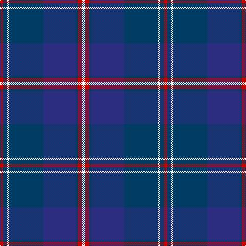

In pattern [RBWBBBRW](/patterns/rbwbbbrw/).

This was sourced from tartans-authority.  It is a [8 stripes tartan](/stripes/stripes8/).

Original link http://www.tartansauthority.com/tartan-ferret/display/6826/

## Thread count
R/6 DB8 W4 DB66 DBa64 DB4 R8 W/6

## Palette
Each colour and its ΔE from the base-6 reference it is a variant of.

| Colour | Shade | Base | ΔE (OKLab) |
|---|---|---|---|
| DB | <code style="background-color:#003C64;">#003C64</code> `#003C64` | B <code style="background-color:#2A418A;">#2A418A</code> | 0.08 |
| DBa | <code style="background-color:#2C2C80;">#2C2C80</code> `#2C2C80` | B <code style="background-color:#2A418A;">#2A418A</code> | 0.06 |
| R | <code style="background-color:#C80000;">#C80000</code> `#C80000` | R <code style="background-color:#CC0000;">#CC0000</code> | 0.01 |
| W | <code style="background-color:#F8F8F8;">#F8F8F8</code> `#F8F8F8` | W <code style="background-color:#F7F7F7;">#F7F7F7</code> | 0.00 |

# Sample pattern

## Nearest tartans

The nearest existing variants by ΔTartan distance.

1. [BABC](/setts/s8/r3b4w2b33ba32b2r4w3~b003c64-ba2c2c80-rc80000-wf8f8f8/) — ΔT 0.00
1. [Dawson-Nunes (Personal)](/setts/s11/b32k3b4k3b4k11ba4k2w3k2ba11~b2c2c80-ba222c3f-k101010-we0e0e0~x2/) — ΔT 1.27
1. [Wcwm 1475-2](/setts/s9/r2b34k2w2k2ba30b3ba6r2~b1c0070-ba5c5c5c-k101010-r880000-wc0c0c0~x2/) — ΔT 1.31
1. [Auckland (Fashion)](/setts/s8/g3k3b2k16b2k2b24w2~b2c2c80-g003820-k101010-wc0c0c0~x2/) — ΔT 1.41
1. [Elgin City Band](/setts/s9/y1b12k6ba1k1ba1k1ba6y1~b1870a4-ba2c2c80-k101010-ybc8c00~x4/) — ΔT 1.45
1. [Moray Council](/setts/s8/b8r2b33ba15g12y2g2r2~b1c0070-ba14283c-g006818-r880000-yd09800~x2/) — ΔT 1.46
1. [Slanj Dress (Corporate)](/setts/s8/k4b36k4b4k34ba3k3w4~b202060-ba3850c8-k101010-we0e0e0~x2/) — ΔT 1.50
1. [Royal Scottish Corporation](/setts/s9/w2r3b12ba3b3ba28r3ba3y2~b1c1c50-ba2c2c80-rc80000-we0e0e0-ye8c000~x2/) — ΔT 1.51
1. [Royal Highland Yacht Club (Corporate](/setts/s11/b26ba3b1r2b1ba3b3ba12g14b2w2~b1c1c50-ba2c2c80-g006818-ra800a8-we0e0e0~x2/) — ΔT 1.51
1. [Federal Bureau of Investigation](/setts/s7/b6w2b2w3b16ba26r2~b1c0070-ba1870a4-r880000-wc0c0c0~x2/) — ΔT 1.52

## Neighbour map

Every grey dot is one of 15726 variants placed by the first two principal components of the ΔTartan feature space (44% of its variance). Red is this tartan; blue dots are its nearest — click one to open its page.

<svg viewBox="0 0 640 380" role="img" style="max-width:100%;height:auto;border:1px solid #e0e0e0;border-radius:4px;display:block" xmlns="http://www.w3.org/2000/svg"><image href="/nn/cloud.v1.png" width="640" height="380"/><a href="/setts/s8/r3b4w2b33ba32b2r4w3~b003c64-ba2c2c80-rc80000-wf8f8f8/"><circle cx="322.9" cy="172.4" r="4" fill="#3465a4"><title>BABC</title></circle></a><a href="/setts/s11/b32k3b4k3b4k11ba4k2w3k2ba11~b2c2c80-ba222c3f-k101010-we0e0e0~x2/"><circle cx="342.7" cy="175.7" r="4" fill="#3465a4"><title>Dawson-Nunes (Personal)</title></circle></a><a href="/setts/s9/r2b34k2w2k2ba30b3ba6r2~b1c0070-ba5c5c5c-k101010-r880000-wc0c0c0~x2/"><circle cx="315.1" cy="145.7" r="4" fill="#3465a4"><title>Wcwm 1475-2</title></circle></a><a href="/setts/s8/g3k3b2k16b2k2b24w2~b2c2c80-g003820-k101010-wc0c0c0~x2/"><circle cx="359.4" cy="199.3" r="4" fill="#3465a4"><title>Auckland (Fashion)</title></circle></a><a href="/setts/s9/y1b12k6ba1k1ba1k1ba6y1~b1870a4-ba2c2c80-k101010-ybc8c00~x4/"><circle cx="238.0" cy="178.4" r="4" fill="#3465a4"><title>Elgin City Band</title></circle></a><a href="/setts/s8/b8r2b33ba15g12y2g2r2~b1c0070-ba14283c-g006818-r880000-yd09800~x2/"><circle cx="324.0" cy="174.3" r="4" fill="#3465a4"><title>Moray Council</title></circle></a><a href="/setts/s8/k4b36k4b4k34ba3k3w4~b202060-ba3850c8-k101010-we0e0e0~x2/"><circle cx="345.5" cy="197.4" r="4" fill="#3465a4"><title>Slanj Dress (Corporate)</title></circle></a><a href="/setts/s9/w2r3b12ba3b3ba28r3ba3y2~b1c1c50-ba2c2c80-rc80000-we0e0e0-ye8c000~x2/"><circle cx="339.2" cy="152.9" r="4" fill="#3465a4"><title>Royal Scottish Corporation</title></circle></a><a href="/setts/s11/b26ba3b1r2b1ba3b3ba12g14b2w2~b1c1c50-ba2c2c80-g006818-ra800a8-we0e0e0~x2/"><circle cx="312.8" cy="134.1" r="4" fill="#3465a4"><title>Royal Highland Yacht Club (Corporate</title></circle></a><a href="/setts/s7/b6w2b2w3b16ba26r2~b1c0070-ba1870a4-r880000-wc0c0c0~x2/"><circle cx="284.9" cy="188.2" r="4" fill="#3465a4"><title>Federal Bureau of Investigation</title></circle></a><circle cx="322.9" cy="172.4" r="5" fill="#c00000"/></svg>

ID: /setts/s8/r3b4w2b33ba32b2r4w3~b003c64-ba2c2c80-rc80000-wf8f8f8~x2/
