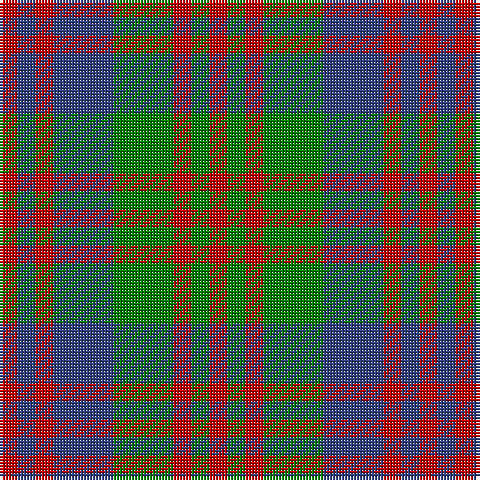

In pattern [RBRBGRGR](/stripes/rbrbgrgr/).

This was sourced from weddslist.  It is a [8 stripe tartan](/stripes/stripes8/).

Original link http://www.weddslist.com/cgi-bin/tartans/pg.pl?source=sts

## Also known as

This cloth is also recorded under:

- Flora, MacDonald

## Thread count
R/6 G6 R6 G20 B20 R6 B6 R/6

## Palette
Each colour and the base-6 reference it is a variant of.

| Colour | Shade | Base |
|---|---|---|
| B | <code style="background-color:#304080;">#304080</code> `oklch(39.4% 0.109 270.2)` <small>#304080</small> | B <code style="background-color:#2A418A;">#2A418A</code> |
| G | <code style="background-color:#008000;">#008000</code> `oklch(52.0% 0.177 142.5)` <small>#008000</small> | G <code style="background-color:#006100;">#006100</code> |
| R | <code style="background-color:#C00000;">#C00000</code> `oklch(50.7% 0.208 29.2)` <small>#C00000</small> | R <code style="background-color:#CC0000;">#CC0000</code> |

# Sample pattern

## Nearest tartans

The nearest existing variants by ΔTartan distance, with this tartan at the top so the swatches line up against it.

ΔTartan

Tartan

Sett

—

<a href="/ttd/edit/#slug=r3db3r3db10g10r3g3r3~x2">Flora, MacDonald</a> <a class="nn-out" href="/setts/s8/r3db3r3db10g10r3g3r3~x2/" title="open its dictionary page">↗</a>

0.66

<a href="/ttd/edit/#slug=r3dg3r3dg10db10r3db3r3~x2">Flora MacDonald</a> <a class="nn-out" href="/setts/s8/r3dg3r3dg10db10r3db3r3~x2/" title="open its dictionary page">↗</a>

0.95

<a href="/ttd/edit/#slug=o10g14o3db14o10g14o3db4~x2">Glasgow District Tartan Tartan Number: 534. Earliest known date: pre 1992 Originally from the Sindex cards and now woven by House of Edgar in their Old and Rare collection. Need to check if it actually appears in the Old and Rare book. See products available Copyright © Blair Urquhart, Comrie, 2015</a> <a class="nn-out" href="/setts/s8/o10g14o3db14o10g14o3db4~x2/" title="open its dictionary page">↗</a>

1.01

<a href="/ttd/edit/#slug=lr10dt3lr3dt3lr3dt11dy11o3~x2">Holden Monaro Corporate Tartan Tartan Number: 8700. Earliest known date: 1831 Holden Monaro GTS 1978 car seats. Reproduction colours. Warp 162 threads Weft 202 threads. Last weaving went through with slight difference. Sett size = 4 3/8th - 4 3/4 inch (112mm - 120mm) See products available Copyright © Blair Urquhart, Comrie, 2015</a> <a class="nn-out" href="/setts/s8/lr10dt3lr3dt3lr3dt11dy11o3~x2/" title="open its dictionary page">↗</a>

1.18

<a href="/ttd/edit/#slug=r2g4db8r9g9k2r2~x4">Stewart (Artefact)</a> <a class="nn-out" href="/setts/s7/r2g4db8r9g9k2r2~x4/" title="open its dictionary page">↗</a>

1.28

<a href="/setts/s8/g4r3t1k1t3~x4/">Wilson's No.214</a>

1.28

<a href="/ttd/edit/#slug=r2g4db8r9g9k2r2~x2">Stewart, Plaid</a> <a class="nn-out" href="/setts/s7/r2g4db8r9g9k2r2~x2/" title="open its dictionary page">↗</a>

1.44

<a href="/ttd/edit/#slug=g4db9r9g9k2r2k2g9r9db8g4r2~x4">Stewart/Stuart C18th - Cf 1314 &amp; 4454</a> <a class="nn-out" href="/setts/s12/g4db9r9g9k2r2k2g9r9db8g4r2~x4/" title="open its dictionary page">↗</a>

1.49

<a href="/ttd/edit/#slug=o6k1o1k1o2k4dy6k1o2k2~x4">Tyndrum District Tartan Tartan Number: 1128. Earliest known date: 1983 Tyndrum is a village in northwest Perthshire on the rail line between Glasgow and Fort William. Specimen seen in Mairi MacIntyre's shop, Fort William 1983. See products available Copyright © Blair Urquhart, Comrie, 2015</a> <a class="nn-out" href="/setts/s10/o6k1o1k1o2k4dy6k1o2k2~x4/" title="open its dictionary page">↗</a>

1.52

<a href="/ttd/edit/#slug=g16r12db16r6db4r6db7r20db8g8db12~x2">Fiddes</a> <a class="nn-out" href="/setts/s11/g16r12db16r6db4r6db7r20db8g8db12~x2/" title="open its dictionary page">↗</a>

1.55

<a href="/ttd/edit/#slug=r33g17db50g17r11g17r9k7">Carnegie</a> <a class="nn-out" href="/setts/s8/r33g17db50g17r11g17r9k7/" title="open its dictionary page">↗</a>

## Neighbour map

Every grey dot is one of 14299 variants placed by the first two principal components of the ΔTartan feature space (44% of its variance). Red is this tartan; blue dots are its nearest — click one to open its page.

<svg viewBox="0 0 640 380" role="img" style="max-width:100%;height:auto;border:1px solid #e0e0e0;border-radius:4px;display:block" xmlns="http://www.w3.org/2000/svg"><image href="/nn/cloud.v1.png" width="640" height="380"/><a href="/setts/s8/r3dg3r3dg10db10r3db3r3~x2/"><circle cx="175.3" cy="275.0" r="4" fill="#3465a4"><title>Flora MacDonald</title></circle></a><a href="/setts/s8/o10g14o3db14o10g14o3db4~x2/"><circle cx="180.5" cy="273.0" r="4" fill="#3465a4"><title>Glasgow District Tartan Tartan Number: 534. Earliest known date: pre 1992 Originally from the Sindex cards and now woven by House of Edgar in their Old and Rare collection. Need to check if it actually appears in the Old and Rare book. See products available Copyright © Blair Urquhart, Comrie, 2015</title></circle></a><a href="/setts/s8/lr10dt3lr3dt3lr3dt11dy11o3~x2/"><circle cx="141.5" cy="250.1" r="4" fill="#3465a4"><title>Holden Monaro Corporate Tartan Tartan Number: 8700. Earliest known date: 1831 Holden Monaro GTS 1978 car seats. Reproduction colours. Warp 162 threads Weft 202 threads. Last weaving went through with slight difference. Sett size = 4 3/8th - 4 3/4 inch (112mm - 120mm) See products available Copyright © Blair Urquhart, Comrie, 2015</title></circle></a><a href="/setts/s7/r2g4db8r9g9k2r2~x4/"><circle cx="160.1" cy="252.5" r="4" fill="#3465a4"><title>Stewart (Artefact)</title></circle></a><a href="/setts/s8/g4r3t1k1t3~x4/"><circle cx="117.4" cy="249.9" r="4" fill="#3465a4"><title>Wilson's No.214</title></circle></a><a href="/setts/s7/r2g4db8r9g9k2r2~x2/"><circle cx="146.0" cy="246.5" r="4" fill="#3465a4"><title>Stewart, Plaid</title></circle></a><a href="/setts/s12/g4db9r9g9k2r2k2g9r9db8g4r2~x4/"><circle cx="145.0" cy="238.7" r="4" fill="#3465a4"><title>Stewart/Stuart C18th - Cf 1314 &amp; 4454</title></circle></a><a href="/setts/s10/o6k1o1k1o2k4dy6k1o2k2~x4/"><circle cx="213.7" cy="231.5" r="4" fill="#3465a4"><title>Tyndrum District Tartan Tartan Number: 1128. Earliest known date: 1983 Tyndrum is a village in northwest Perthshire on the rail line between Glasgow and Fort William. Specimen seen in Mairi MacIntyre's shop, Fort William 1983. See products available Copyright © Blair Urquhart, Comrie, 2015</title></circle></a><a href="/setts/s11/g16r12db16r6db4r6db7r20db8g8db12~x2/"><circle cx="195.3" cy="265.8" r="4" fill="#3465a4"><title>Fiddes</title></circle></a><a href="/setts/s8/r33g17db50g17r11g17r9k7/"><circle cx="158.1" cy="221.0" r="4" fill="#3465a4"><title>Carnegie</title></circle></a><circle cx="170.3" cy="274.1" r="5" fill="#c00000"/></svg>

ID: /setts/s8/r3db3r3db10g10r3g3r3~x2/
