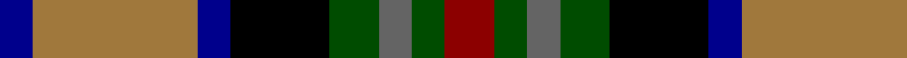

**Bands:** [BRBKGBGR](/stripes/brbkgbgr/) · **Stripes:** [DB O DB K DG N DG R](/stripes/stripes8/) DB O DB K DG N DG R

This was sourced from register-of-tartans.  It is a [8 band tartan](/bands/bands8/).

Original link https://www.tartanregister.gov.uk/tartanDetails.aspx?ref=4936

## Attestations

This cloth appears in 2 source records; the oldest owns this page.

- 01/01/1982 — Burnfoot Check (register-of-tartans, [record](https://www.tartanregister.gov.uk/tartanDetails.aspx?ref=4936))
- 1982 — Burnfoot Check (Fashion) (tartans-authority, [record](http://www.tartansauthority.com/tartan-ferret/display/3773/))

## Register references

External register numbers recorded for this tartan.

- Scottish Register of Tartans: [4936](https://www.tartanregister.gov.uk/tartanDetails.aspx?ref=4936)
- Scottish Tartans Authority (ITI): 3773

## Thread count
DB/4 LT20 DB4 K12 G6 N4 G4 DR/6

## Palette
Each colour and its ΔE from the base-6 reference it is a variant of.

| Colour | Shade | Base | ΔE (OKLab) |
|---|---|---|---|
| DB | <code style="background-color:#00008C;">#00008C</code> `#00008C` | B <code style="background-color:#2A418A;">#2A418A</code> | 0.13 |
| DR | <code style="background-color:#8C0000;">#8C0000</code> `#8C0000` | R <code style="background-color:#CC0000;">#CC0000</code> | 0.14 |
| G | <code style="background-color:#004C00;">#004C00</code> `#004C00` | G <code style="background-color:#006100;">#006100</code> | 0.07 |
| K | <code style="background-color:#000000;">#000000</code> `#000000` | K <code style="background-color:#000000;">#000000</code> | 0.00 |
| LT | <code style="background-color:#A0783C;">#A0783C</code> `#A0783C` | R <code style="background-color:#CC0000;">#CC0000</code> | 0.18 |
| N | <code style="background-color:#646464;">#646464</code> `#646464` | B <code style="background-color:#2A418A;">#2A418A</code> | 0.16 |

# Sample pattern

## Nearest tartans

The nearest existing variants by ΔTartan distance.

1. [Caledonian Labrador Retrievers](/setts/s8/m21db4dr5db4m5k21g21ly5~x2/) — ΔT 0.67
1. [Eichelberger Family, Jörg (Personal)](/setts/s7/k10r3lo4dt12dg4r4w2~x4/) — ΔT 0.83
1. [Caledonian Labrador Retrievers](/setts/s8/m21lg4do5lg4m5k21g21lo5~x2/) — ΔT 0.92
1. [Bro-Menez Are (Corporate)](/setts/s7/b8k25g13m5lo5r5m8~x2/) — ΔT 0.92
1. [South Africa 1994 (Fashion)](/setts/s7/k20ly4db13w4g30w4r13~x2/) — ΔT 0.95
1. [Huntly Gordon](/setts/s6/ly2dg11k11n12dt3r2~x2/) — ΔT 1.05
1. [Labrador Club of Scotland (Corporate](/setts/s8/o21ly4dy5ly4o5k21g21lo5~x2/) — ΔT 1.06
1. [Gordonstoun](/setts/s12/ly4g20r3db11t3r11g11r3k20r3k3t3~x2/) — ΔT 1.11
1. [Logan, or MacLennan](/setts/s10/db1r1db1r1db4k4g4r1g1ly1~x4/) — ΔT 1.13
1. [Bowie (white lines) (Name)](/setts/s13/db8r2db3r4db13w2y13w2dg13r4dg4lo2dg8~x2/) — ΔT 1.13

## Neighbour map

Every grey dot is one of 14313 variants placed by the first two principal components of the ΔTartan feature space (44% of its variance). Red is this tartan; blue dots are its nearest — click one to open its page.

<svg viewBox="0 0 640 380" role="img" style="max-width:100%;height:auto;border:1px solid #e0e0e0;border-radius:4px;display:block" xmlns="http://www.w3.org/2000/svg"><image href="/nn/cloud.v1.png" width="640" height="380"/><a href="/setts/s8/m21db4dr5db4m5k21g21ly5~x2/"><circle cx="62.7" cy="189.6" r="4" fill="#3465a4"><title>Caledonian Labrador Retrievers</title></circle></a><a href="/setts/s7/k10r3lo4dt12dg4r4w2~x4/"><circle cx="66.8" cy="204.1" r="4" fill="#3465a4"><title>Eichelberger Family, Jörg (Personal)</title></circle></a><a href="/setts/s8/m21lg4do5lg4m5k21g21lo5~x2/"><circle cx="64.5" cy="188.7" r="4" fill="#3465a4"><title>Caledonian Labrador Retrievers</title></circle></a><a href="/setts/s7/b8k25g13m5lo5r5m8~x2/"><circle cx="98.1" cy="212.5" r="4" fill="#3465a4"><title>Bro-Menez Are (Corporate)</title></circle></a><a href="/setts/s7/k20ly4db13w4g30w4r13~x2/"><circle cx="79.7" cy="179.2" r="4" fill="#3465a4"><title>South Africa 1994 (Fashion)</title></circle></a><a href="/setts/s6/ly2dg11k11n12dt3r2~x2/"><circle cx="65.7" cy="209.6" r="4" fill="#3465a4"><title>Huntly Gordon</title></circle></a><a href="/setts/s8/o21ly4dy5ly4o5k21g21lo5~x2/"><circle cx="70.6" cy="192.1" r="4" fill="#3465a4"><title>Labrador Club of Scotland (Corporate</title></circle></a><a href="/setts/s12/ly4g20r3db11t3r11g11r3k20r3k3t3~x2/"><circle cx="65.4" cy="155.7" r="4" fill="#3465a4"><title>Gordonstoun</title></circle></a><a href="/setts/s10/db1r1db1r1db4k4g4r1g1ly1~x4/"><circle cx="62.6" cy="203.3" r="4" fill="#3465a4"><title>Logan, or MacLennan</title></circle></a><a href="/setts/s13/db8r2db3r4db13w2y13w2dg13r4dg4lo2dg8~x2/"><circle cx="69.5" cy="163.9" r="4" fill="#3465a4"><title>Bowie (white lines) (Name)</title></circle></a><circle cx="60.7" cy="192.2" r="5" fill="#c00000"/></svg>

ID: /setts/s8/r3dg2n2dg3k6db2o10db2~x2/
