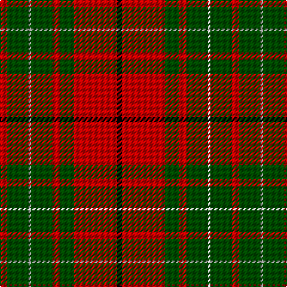

This page is one **sett** — a single exact thread-count. It belongs to the [tartan](/tartans/r3g9n1g9r3g6r18k2/)
(the same proportion at any scale), whose colour order is pattern [KRGRGWGR](/stripes/krgrgwgr/).

Sourced from weddslist.  It is a [8 stripe tartan](/stripes/stripes8/).

Original link http://www.weddslist.com/cgi-bin/tartans/pg.pl?source=rb

## Thread count
R/6 G18 N2 G18 R6 G12 R36 K/4

## Palette
Each colour and the base-6 reference it is a variant of.

| Colour | Shade | Base |
|---|---|---|
| G | <code style="background-color:#004C00;">#004C00</code> `oklch(36.1% 0.123 142.5)` <small>#004C00</small> | G <code style="background-color:#006100;">#006100</code> |
| K | <code style="background-color:#000000;">#000000</code> `oklch(0.0% 0.000 0.0)` <small>#000000</small> | K <code style="background-color:#000000;">#000000</code> |
| N | <code style="background-color:#D0D0D0;">#D0D0D0</code> `oklch(85.8% 0.000 89.9)` <small>#D0D0D0</small> | W <code style="background-color:#F7F7F7;">#F7F7F7</code> |
| R | <code style="background-color:#C80000;">#C80000</code> `oklch(52.3% 0.215 29.2)` <small>#C80000</small> | R <code style="background-color:#CC0000;">#CC0000</code> |

# Sample pattern

## Nearest tartans

The nearest existing variants by ΔTartan distance, with this tartan at the top so the swatches line up against it.

ΔTartan

Tartan

Sett

—

<a href="/ttd/edit/#slug=r3dg9lb1dg9r3dg6r18k2~x2">Cumming SM</a> <a class="nn-out" href="/setts/s8/r3dg9lb1dg9r3dg6r18k2~x2/" title="open its dictionary page">↗</a>

0.55

<a href="/ttd/edit/#slug=r3g9w1g9r3g6r18k2~x2">Cumming #2</a> <a class="nn-out" href="/setts/s8/r3g9w1g9r3g6r18k2~x2/" title="open its dictionary page">↗</a>

0.86

<a href="/ttd/edit/#slug=r3dg9lr1dg9r3dg6r18k2~x2">Cumming SM</a> <a class="nn-out" href="/setts/s8/r3dg9lr1dg9r3dg6r18k2~x2/" title="open its dictionary page">↗</a>

0.89

<a href="/ttd/edit/#slug=k2r16dg6r3dg8lb1">MacAulay</a> <a class="nn-out" href="/setts/s6/k2r16dg6r3dg8lb1/" title="open its dictionary page">↗</a>

0.95

<a href="/ttd/edit/#slug=k2r16g6r3g8w1~x4">MacAulay (Clan)</a> <a class="nn-out" href="/setts/s6/k2r16g6r3g8w1~x4/" title="open its dictionary page">↗</a>

0.98

<a href="/ttd/edit/#slug=k2r16g6r3g8lb1~x2">MacAulay</a> <a class="nn-out" href="/setts/s6/k2r16g6r3g8lb1~x2/" title="open its dictionary page">↗</a>

0.99

<a href="/ttd/edit/#slug=k2r16g6r3g8w1~x2">MacAulay</a> <a class="nn-out" href="/setts/s6/k2r16g6r3g8w1~x2/" title="open its dictionary page">↗</a>

1.01

<a href="/ttd/edit/#slug=g9r2g9r14k1w2~x2">MacGregor of Balquidder (Logan)</a> <a class="nn-out" href="/setts/s6/g9r2g9r14k1w2~x2/" title="open its dictionary page">↗</a>

1.04

<a href="/ttd/edit/#slug=k2r16dg6r3dg8lr1~x2">MacAulay</a> <a class="nn-out" href="/setts/s6/k2r16dg6r3dg8lr1~x2/" title="open its dictionary page">↗</a>

1.04

<a href="/ttd/edit/#slug=k2r16dg6r3dg8lr1">MacAulay</a> <a class="nn-out" href="/setts/s6/k2r16dg6r3dg8lr1/" title="open its dictionary page">↗</a>

1.07

<a href="/ttd/edit/#slug=k1g6k1g6r16db1~x2">Denny, hunting</a> <a class="nn-out" href="/setts/s6/k1g6k1g6r16db1~x2/" title="open its dictionary page">↗</a>

## Neighbour map

Every grey dot is one of 14299 variants placed by the first two principal components of the ΔTartan feature space (44% of its variance). Red is this tartan; blue dots are its nearest — click one to open its page.

<svg viewBox="0 0 640 380" role="img" style="max-width:100%;height:auto;border:1px solid #e0e0e0;border-radius:4px;display:block" xmlns="http://www.w3.org/2000/svg"><image href="/nn/cloud.v1.png" width="640" height="380"/><a href="/setts/s8/r3g9w1g9r3g6r18k2~x2/"><circle cx="313.4" cy="177.3" r="4" fill="#3465a4"><title>Cumming #2</title></circle></a><a href="/setts/s8/r3dg9lr1dg9r3dg6r18k2~x2/"><circle cx="331.4" cy="189.9" r="4" fill="#3465a4"><title>Cumming SM</title></circle></a><a href="/setts/s6/k2r16dg6r3dg8lb1/"><circle cx="322.2" cy="183.6" r="4" fill="#3465a4"><title>MacAulay</title></circle></a><a href="/setts/s6/k2r16g6r3g8w1~x4/"><circle cx="331.6" cy="187.7" r="4" fill="#3465a4"><title>MacAulay (Clan)</title></circle></a><a href="/setts/s6/k2r16g6r3g8lb1~x2/"><circle cx="335.7" cy="189.8" r="4" fill="#3465a4"><title>MacAulay</title></circle></a><a href="/setts/s6/k2r16g6r3g8w1~x2/"><circle cx="315.2" cy="181.0" r="4" fill="#3465a4"><title>MacAulay</title></circle></a><a href="/setts/s6/g9r2g9r14k1w2~x2/"><circle cx="298.1" cy="198.9" r="4" fill="#3465a4"><title>MacGregor of Balquidder (Logan)</title></circle></a><a href="/setts/s6/k2r16dg6r3dg8lr1~x2/"><circle cx="343.1" cy="197.6" r="4" fill="#3465a4"><title>MacAulay</title></circle></a><a href="/setts/s6/k2r16dg6r3dg8lr1/"><circle cx="343.1" cy="197.6" r="4" fill="#3465a4"><title>MacAulay</title></circle></a><a href="/setts/s6/k1g6k1g6r16db1~x2/"><circle cx="323.7" cy="169.3" r="4" fill="#3465a4"><title>Denny, hunting</title></circle></a><circle cx="308.5" cy="175.5" r="5" fill="#c00000"/></svg>

ID: /setts/s8/r3dg9lb1dg9r3dg6r18k2~x2/
