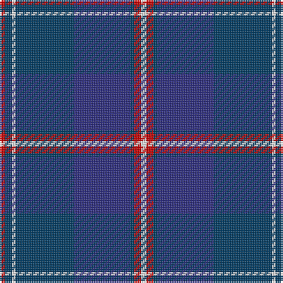

In pattern [RBWBBBRW](/stripes/rbwbbbrw/).

This was sourced from register-of-tartans.  It is a [8 stripe tartan](/stripes/stripes8/).

Original link https://www.tartanregister.gov.uk/tartanDetails.aspx?ref=157

## Also known as

This cloth is also recorded under:

- B.A.B.C.

## Register references

External register numbers recorded for this tartan.

- Scottish Register of Tartans: [157](https://www.tartanregister.gov.uk/tartanDetails.aspx?ref=157)
- Scottish Tartans Authority (ITI): 6826

## Thread count
R/3 DB4 W2 DB33 DBa32 DB2 R4 W/3

## Palette
Each colour and its ΔE from the base-6 reference it is a variant of.

| Colour | Shade | Base | ΔE (OKLab) |
|---|---|---|---|
| DB | <code style="background-color:#003C64;">#003C64</code> `#003C64` | B <code style="background-color:#2A418A;">#2A418A</code> | 0.08 |
| DBa | <code style="background-color:#2C2C80;">#2C2C80</code> `#2C2C80` | B <code style="background-color:#2A418A;">#2A418A</code> | 0.06 |
| R | <code style="background-color:#C80000;">#C80000</code> `#C80000` | R <code style="background-color:#CC0000;">#CC0000</code> | 0.01 |
| W | <code style="background-color:#F8F8F8;">#F8F8F8</code> `#F8F8F8` | W <code style="background-color:#F7F7F7;">#F7F7F7</code> | 0.00 |

# Sample pattern

## Nearest tartans

The nearest existing variants by ΔTartan distance.

1. [B.A.B.C. (Corporate)](/setts/s8/r3dt4w2dt33db32dt2r4w3~x2/) — ΔT 0.00
1. [Dawson-Nunes (Personal)](/setts/s11/db32k3db4k3db4k11dt4k2w3k2dt11~x2/) — ΔT 1.27
1. [Wcwm 1475-2](/setts/s9/r2db34k2lb2k2n30db3n6r2~x2/) — ΔT 1.31
1. [Auckland (Fashion)](/setts/s8/dg3k3db2k16db2k2db24lb2~x2/) — ΔT 1.41
1. [Elgin City Band](/setts/s9/lo1b12k6db1k1db1k1db6lo1~x4/) — ΔT 1.45
1. [Moray Council](/setts/s8/db8r2db33dt15g12lo2g2r2~x2/) — ΔT 1.46
1. [Slanj Dress (Corporate)](/setts/s8/k4db36k4db4k34b3k3w4~x2/) — ΔT 1.50
1. [Royal Scottish Corporation](/setts/s9/w2r3db12db3db3db28r3db3ly2~x2/) — ΔT 1.51
1. [Royal Highland Yacht Club (Corporate](/setts/s11/db26db3db1m2db1db3db3db12g14db2w2~x2/) — ΔT 1.51
1. [Federal Bureau of Investigation](/setts/s7/db6lb2db2lb3db16b26r2~x2/) — ΔT 1.51

## Neighbour map

Every grey dot is one of 14299 variants placed by the first two principal components of the ΔTartan feature space (44% of its variance). Red is this tartan; blue dots are its nearest — click one to open its page.

<svg viewBox="0 0 640 380" role="img" style="max-width:100%;height:auto;border:1px solid #e0e0e0;border-radius:4px;display:block" xmlns="http://www.w3.org/2000/svg"><image href="/nn/cloud.v1.png" width="640" height="380"/><a href="/setts/s8/r3dt4w2dt33db32dt2r4w3~x2/"><circle cx="325.8" cy="177.6" r="4" fill="#3465a4"><title>B.A.B.C. (Corporate)</title></circle></a><a href="/setts/s11/db32k3db4k3db4k11dt4k2w3k2dt11~x2/"><circle cx="345.3" cy="183.9" r="4" fill="#3465a4"><title>Dawson-Nunes (Personal)</title></circle></a><a href="/setts/s9/r2db34k2lb2k2n30db3n6r2~x2/"><circle cx="317.9" cy="151.2" r="4" fill="#3465a4"><title>Wcwm 1475-2</title></circle></a><a href="/setts/s8/dg3k3db2k16db2k2db24lb2~x2/"><circle cx="362.1" cy="205.0" r="4" fill="#3465a4"><title>Auckland (Fashion)</title></circle></a><a href="/setts/s9/lo1b12k6db1k1db1k1db6lo1~x4/"><circle cx="241.5" cy="183.3" r="4" fill="#3465a4"><title>Elgin City Band</title></circle></a><a href="/setts/s8/db8r2db33dt15g12lo2g2r2~x2/"><circle cx="326.9" cy="180.8" r="4" fill="#3465a4"><title>Moray Council</title></circle></a><a href="/setts/s8/k4db36k4db4k34b3k3w4~x2/"><circle cx="348.3" cy="202.5" r="4" fill="#3465a4"><title>Slanj Dress (Corporate)</title></circle></a><a href="/setts/s9/w2r3db12db3db3db28r3db3ly2~x2/"><circle cx="341.6" cy="156.1" r="4" fill="#3465a4"><title>Royal Scottish Corporation</title></circle></a><a href="/setts/s11/db26db3db1m2db1db3db3db12g14db2w2~x2/"><circle cx="315.7" cy="142.0" r="4" fill="#3465a4"><title>Royal Highland Yacht Club (Corporate</title></circle></a><a href="/setts/s7/db6lb2db2lb3db16b26r2~x2/"><circle cx="288.5" cy="190.6" r="4" fill="#3465a4"><title>Federal Bureau of Investigation</title></circle></a><circle cx="325.8" cy="177.6" r="5" fill="#c00000"/></svg>

ID: /setts/s8/r3dt4w2dt33db32dt2r4w3/
