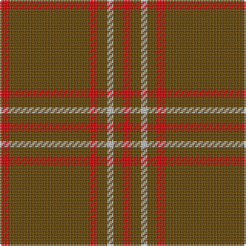

In pattern [RGGRGWGR](/stripes/rggrgwgr/).

This was sourced from tartans-authority.  It is a [8 stripe tartan](/stripes/stripes8/).

Original link http://www.tartansauthority.com/tartan-ferret/display/8838/

## Thread count
R/6 T32 T20 R6 T6 N4 T6 R/6

## Palette
Each colour and its ΔE from the base-6 reference it is a variant of.

| Colour | Shade | Base | ΔE (OKLab) |
|---|---|---|---|
| N | <code style="background-color:#C0C0C0;">#C0C0C0</code> `#C0C0C0` | W <code style="background-color:#F7F7F7;">#F7F7F7</code> | 0.17 |
| R | <code style="background-color:#C80000;">#C80000</code> `#C80000` | R <code style="background-color:#CC0000;">#CC0000</code> | 0.01 |
| T | <code style="background-color:#604000;">#604000</code> `#604000` | G <code style="background-color:#006100;">#006100</code> | 0.14 |

# Sample pattern

## Nearest tartans

The nearest existing variants by ΔTartan distance.

1. [Waverley Care Aids Trust (Corporate)](/setts/s6/r8g2r2k1r1g2~x10/) — ΔT 1.16
1. [Oman, Sultanate of / Oliver dress](/setts/s10/dy9t3dy6t3dy20ly2~x2/) — ΔT 1.64
1. [Waverley Care Aids Trust](/setts/s10/r8g2r2k1r1g2~x10/) — ΔT 1.65
1. [Oman RAF, Sultanate of (Military)](/setts/s6/dy9t3dy6t3dy20ly2~x2/) — ΔT 1.72
1. [Dunbar, John Telfer (Personal)](/setts/s7/o5k2o28k10o26k4o4~x2/) — ΔT 1.77
1. [Welsh National #2](/setts/s12/k4dy2r2dy2k2dy15lo2~x4/) — ΔT 1.85
1. [MacAn of Lurgyvallan (Hose)](/setts/s6/r9k1r5g6r4k2~x4/) — ΔT 1.87
1. [Scottish Piping Society of London](/setts/s12/y21r3y21db5y3r30y3db5y21r3y21db2~x2/) — ΔT 1.91
1. [Wolfe (Name)](/setts/s7/g4o4g13o13g4o36lo4~x2/) — ΔT 1.99
1. [MacDonell of Keppoch #3](/setts/s15/r12g2r1g1r1g1r6g12r1k1r12k1r1k1r3~x4/) — ΔT 2.01

## Neighbour map

Every grey dot is one of 14299 variants placed by the first two principal components of the ΔTartan feature space (44% of its variance). Red is this tartan; blue dots are its nearest — click one to open its page.

<svg viewBox="0 0 640 380" role="img" style="max-width:100%;height:auto;border:1px solid #e0e0e0;border-radius:4px;display:block" xmlns="http://www.w3.org/2000/svg"><image href="/nn/cloud.v1.png" width="640" height="380"/><a href="/setts/s6/r8g2r2k1r1g2~x10/"><circle cx="471.5" cy="253.9" r="4" fill="#3465a4"><title>Waverley Care Aids Trust (Corporate)</title></circle></a><a href="/setts/s10/dy9t3dy6t3dy20ly2~x2/"><circle cx="561.4" cy="240.3" r="4" fill="#3465a4"><title>Oman, Sultanate of / Oliver dress</title></circle></a><a href="/setts/s10/r8g2r2k1r1g2~x10/"><circle cx="416.5" cy="229.5" r="4" fill="#3465a4"><title>Waverley Care Aids Trust</title></circle></a><a href="/setts/s6/dy9t3dy6t3dy20ly2~x2/"><circle cx="559.0" cy="256.1" r="4" fill="#3465a4"><title>Oman RAF, Sultanate of (Military)</title></circle></a><a href="/setts/s7/o5k2o28k10o26k4o4~x2/"><circle cx="602.2" cy="250.8" r="4" fill="#3465a4"><title>Dunbar, John Telfer (Personal)</title></circle></a><a href="/setts/s12/k4dy2r2dy2k2dy15lo2~x4/"><circle cx="456.0" cy="197.7" r="4" fill="#3465a4"><title>Welsh National #2</title></circle></a><a href="/setts/s6/r9k1r5g6r4k2~x4/"><circle cx="421.7" cy="277.1" r="4" fill="#3465a4"><title>MacAn of Lurgyvallan (Hose)</title></circle></a><a href="/setts/s12/y21r3y21db5y3r30y3db5y21r3y21db2~x2/"><circle cx="443.9" cy="207.8" r="4" fill="#3465a4"><title>Scottish Piping Society of London</title></circle></a><a href="/setts/s7/g4o4g13o13g4o36lo4~x2/"><circle cx="448.2" cy="214.9" r="4" fill="#3465a4"><title>Wolfe (Name)</title></circle></a><a href="/setts/s15/r12g2r1g1r1g1r6g12r1k1r12k1r1k1r3~x4/"><circle cx="466.1" cy="183.9" r="4" fill="#3465a4"><title>MacDonell of Keppoch #3</title></circle></a><circle cx="511.7" cy="252.2" r="5" fill="#c00000"/></svg>

ID: /setts/s8/r3dy16dy10r3dy3lb2dy3r3~x2/
