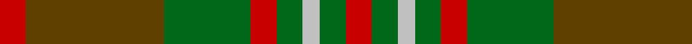

In pattern [RGGRGWGR](/stripes/rggrgwgr/).

This was sourced from tartans-authority.  It is a [8 stripe tartan](/stripes/stripes8/).

Original link http://www.tartansauthority.com/tartan-ferret/display/1546/

## Thread count
R/6 T32 G20 R6 G6 N4 G6 R/6

## Palette
Each colour and its ΔE from the base-6 reference it is a variant of.

| Colour | Shade | Base | ΔE (OKLab) |
|---|---|---|---|
| G | <code style="background-color:#006818;">#006818</code> `#006818` | G <code style="background-color:#006100;">#006100</code> | 0.02 |
| N | <code style="background-color:#C0C0C0;">#C0C0C0</code> `#C0C0C0` | W <code style="background-color:#F7F7F7;">#F7F7F7</code> | 0.17 |
| R | <code style="background-color:#C80000;">#C80000</code> `#C80000` | R <code style="background-color:#CC0000;">#CC0000</code> | 0.01 |
| T | <code style="background-color:#604000;">#604000</code> `#604000` | G <code style="background-color:#006100;">#006100</code> | 0.14 |

# Sample pattern

## Nearest tartans

The nearest existing variants by ΔTartan distance.

1. [Ballantrae (Dalgety)](/setts/s7/dy5r3dy31dg20dy3g22r5~x2/) — ΔT 1.05
1. [Loch Rannoch Trade Tartan Tartan Number: 1735. Earliest known date: 1975 Nothing See products available Copyright © Blair Urquhart, Comrie, 2015](/setts/s8/do24g2do5lo14g2lo5dy17do2~x2/) — ΔT 1.13
1. [Moncton, City of](/setts/s9/g4r1db2r1g10y5r3y10ly1~x4/) — ΔT 1.13
1. [Glen Esk (1993)](/setts/s7/dg2r1dg8r5y5r1y2~x4/) — ΔT 1.16
1. [Ballintrae Trade Tartan Tartan Number: 1541. Earliest known date: 1982 Many new designs have been given district names to promote their Scottish connections. However, these names should not be confused with the District tartans which have earned their title through 'use and wont' and not a little history. See products available Copyright © Blair Urquhart, Comrie, 2015](/setts/s7/dy10r5dy62dg40dy5g44r10/) — ΔT 1.18
1. [Monaghan](/setts/s9/lo3dr2o14g17dr14lo8o14dr2lo3~x2/) — ΔT 1.22
1. [Monaghan, County (District)](/setts/s9/lo3do2o14lo8do14dg16o13do2lo3~x2/) — ΔT 1.23
1. [Scott Hunting](/setts/s14/dy16g10r3g3lb2g3r3g3lb2g3r3g10dy16r3~x2/) — ΔT 1.23
1. [Loch Rannoch](/setts/s8/dr24g2dr5o14g2o5o17dr2~x2/) — ΔT 1.28
1. [MacAart Family Tartan Tartan Number: 1477. Earliest known date: pre 2003 Restricted See products available Copyright © Blair Urquhart, Comrie, 2015](/setts/s10/dy9k2dy2r2g6k1ly1k1g6r3~x2/) — ΔT 1.29

## Neighbour map

Every grey dot is one of 14299 variants placed by the first two principal components of the ΔTartan feature space (44% of its variance). Red is this tartan; blue dots are its nearest — click one to open its page.

<svg viewBox="0 0 640 380" role="img" style="max-width:100%;height:auto;border:1px solid #e0e0e0;border-radius:4px;display:block" xmlns="http://www.w3.org/2000/svg"><image href="/nn/cloud.v1.png" width="640" height="380"/><a href="/setts/s7/dy5r3dy31dg20dy3g22r5~x2/"><circle cx="261.7" cy="225.8" r="4" fill="#3465a4"><title>Ballantrae (Dalgety)</title></circle></a><a href="/setts/s8/do24g2do5lo14g2lo5dy17do2~x2/"><circle cx="277.6" cy="206.2" r="4" fill="#3465a4"><title>Loch Rannoch Trade Tartan Tartan Number: 1735. Earliest known date: 1975 Nothing See products available Copyright © Blair Urquhart, Comrie, 2015</title></circle></a><a href="/setts/s9/g4r1db2r1g10y5r3y10ly1~x4/"><circle cx="257.0" cy="208.6" r="4" fill="#3465a4"><title>Moncton, City of</title></circle></a><a href="/setts/s7/dg2r1dg8r5y5r1y2~x4/"><circle cx="271.1" cy="257.8" r="4" fill="#3465a4"><title>Glen Esk (1993)</title></circle></a><a href="/setts/s7/dy10r5dy62dg40dy5g44r10/"><circle cx="270.3" cy="218.1" r="4" fill="#3465a4"><title>Ballintrae Trade Tartan Tartan Number: 1541. Earliest known date: 1982 Many new designs have been given district names to promote their Scottish connections. However, these names should not be confused with the District tartans which have earned their title through 'use and wont' and not a little history. See products available Copyright © Blair Urquhart, Comrie, 2015</title></circle></a><a href="/setts/s9/lo3dr2o14g17dr14lo8o14dr2lo3~x2/"><circle cx="185.6" cy="220.6" r="4" fill="#3465a4"><title>Monaghan</title></circle></a><a href="/setts/s9/lo3do2o14lo8do14dg16o13do2lo3~x2/"><circle cx="201.9" cy="231.3" r="4" fill="#3465a4"><title>Monaghan, County (District)</title></circle></a><a href="/setts/s14/dy16g10r3g3lb2g3r3g3lb2g3r3g10dy16r3~x2/"><circle cx="257.6" cy="210.7" r="4" fill="#3465a4"><title>Scott Hunting</title></circle></a><a href="/setts/s8/dr24g2dr5o14g2o5o17dr2~x2/"><circle cx="292.5" cy="212.4" r="4" fill="#3465a4"><title>Loch Rannoch</title></circle></a><a href="/setts/s10/dy9k2dy2r2g6k1ly1k1g6r3~x2/"><circle cx="190.5" cy="198.7" r="4" fill="#3465a4"><title>MacAart Family Tartan Tartan Number: 1477. Earliest known date: pre 2003 Restricted See products available Copyright © Blair Urquhart, Comrie, 2015</title></circle></a><circle cx="247.9" cy="226.7" r="5" fill="#c00000"/></svg>

ID: /setts/s8/r3dy16g10r3g3lb2g3r3~x2/
