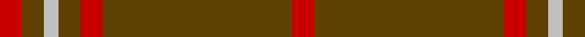

In pattern [RGGRGWGR](/patterns/rggrgwgr/).

This was sourced from tartans-authority.  It is a [8 stripes tartan](/stripes/stripes8/).

Original link http://www.tartansauthority.com/tartan-ferret/display/8838/

## Thread count
R/6 T6 N4 T6 R6 T20 T32 R/6

## Palette
Each colour and its ΔE from the base-6 reference it is a variant of.

| Colour | Shade | Base | ΔE (OKLab) |
|---|---|---|---|
| N | <code style="background-color:#C0C0C0;">#C0C0C0</code> `#C0C0C0` | W <code style="background-color:#F7F7F7;">#F7F7F7</code> | 0.17 |
| R | <code style="background-color:#C80000;">#C80000</code> `#C80000` | R <code style="background-color:#CC0000;">#CC0000</code> | 0.01 |
| T | <code style="background-color:#604000;">#604000</code> `#604000` | G <code style="background-color:#006100;">#006100</code> | 0.14 |

# Sample pattern

## Nearest tartans

The nearest existing variants by ΔTartan distance.

1. [Waverley Care Aids Trust (Corporate)](/setts/s6/r8g2r2k1r1g2x10~g006818-k101010-r880000/) — ΔT 1.16
1. [Oman, Sultanate of / Oliver dress](/setts/s10/g9b3g6b3g20y2g20b3g6b3x2~b5c8ca8-g604000-ye8c000/) — ΔT 1.63
1. [Waverley Care Aids Trust](/setts/s10/r8g2r2k1r1g2r1k1r2g2x10~g006818-k101010-r880000/) — ΔT 1.65
1. [Oman, Sultanate of..](/setts/s6/g9b3g6b3g20y2x2~b5480b0-g604000-yf0c000/) — ΔT 1.70
1. [Oman RAF, Sultanate of (Military)](/setts/s6/g9b3g6b3g20y2x2~b5c8ca8-g604000-ye8c000/) — ΔT 1.72
1. [Dunbar, John Telfer (Personal)](/setts/s7/r5k2r28k10r26k4r4x2~k101010-r883000/) — ΔT 1.77
1. [Welsh National #2](/setts/s12/k4g2r2g2k2g15y2g15k2g2r2g2x4~g604000-k101010-re87878-ybc8c00/) — ΔT 1.84
1. [MacAn of Lurgyvallan (Hose)](/setts/s6/r9k1r5g6r4k2x4~g006818-k101010-r880000/) — ΔT 1.87
1. [Scottish Piping Society of London](/setts/s12/g21r3g21b5g3r30g3b5g21r3g21b2x2~b202060-g5c6428-rc8002c/) — ΔT 1.91
1. [Wolfe (Name)](/setts/s7/g4r4g13r13g4r36y4x2~g00643c-re86000-ydc943c/) — ΔT 1.99

## Neighbour map

Every grey dot is one of 15726 variants placed by the first two principal components of the ΔTartan feature space (44% of its variance). Red is this tartan; blue dots are its nearest — click one to open its page.

<svg viewBox="0 0 640 380" role="img" style="max-width:100%;height:auto;border:1px solid #e0e0e0;border-radius:4px;display:block" xmlns="http://www.w3.org/2000/svg"><image href="/nn/cloud.v1.png" width="640" height="380"/><a href="/setts/s6/r8g2r2k1r1g2x10~g006818-k101010-r880000/"><circle cx="472.1" cy="253.9" r="4" fill="#3465a4"><title>Waverley Care Aids Trust (Corporate)</title></circle></a><a href="/setts/s10/g9b3g6b3g20y2g20b3g6b3x2~b5c8ca8-g604000-ye8c000/"><circle cx="561.7" cy="240.1" r="4" fill="#3465a4"><title>Oman, Sultanate of / Oliver dress</title></circle></a><a href="/setts/s10/r8g2r2k1r1g2r1k1r2g2x10~g006818-k101010-r880000/"><circle cx="416.6" cy="228.4" r="4" fill="#3465a4"><title>Waverley Care Aids Trust</title></circle></a><a href="/setts/s6/g9b3g6b3g20y2x2~b5480b0-g604000-yf0c000/"><circle cx="559.7" cy="258.2" r="4" fill="#3465a4"><title>Oman, Sultanate of..</title></circle></a><a href="/setts/s6/g9b3g6b3g20y2x2~b5c8ca8-g604000-ye8c000/"><circle cx="559.2" cy="257.9" r="4" fill="#3465a4"><title>Oman RAF, Sultanate of (Military)</title></circle></a><a href="/setts/s7/r5k2r28k10r26k4r4x2~k101010-r883000/"><circle cx="603.5" cy="252.9" r="4" fill="#3465a4"><title>Dunbar, John Telfer (Personal)</title></circle></a><a href="/setts/s12/k4g2r2g2k2g15y2g15k2g2r2g2x4~g604000-k101010-re87878-ybc8c00/"><circle cx="455.7" cy="197.1" r="4" fill="#3465a4"><title>Welsh National #2</title></circle></a><a href="/setts/s6/r9k1r5g6r4k2x4~g006818-k101010-r880000/"><circle cx="422.3" cy="277.1" r="4" fill="#3465a4"><title>MacAn of Lurgyvallan (Hose)</title></circle></a><a href="/setts/s12/g21r3g21b5g3r30g3b5g21r3g21b2x2~b202060-g5c6428-rc8002c/"><circle cx="443.9" cy="205.1" r="4" fill="#3465a4"><title>Scottish Piping Society of London</title></circle></a><a href="/setts/s7/g4r4g13r13g4r36y4x2~g00643c-re86000-ydc943c/"><circle cx="449.5" cy="218.0" r="4" fill="#3465a4"><title>Wolfe (Name)</title></circle></a><circle cx="512.7" cy="251.3" r="5" fill="#c00000"/></svg>

ID: /setts/s8/r3g16g10r3g3w2g3r3x2~g604000-rc80000-wc0c0c0/
