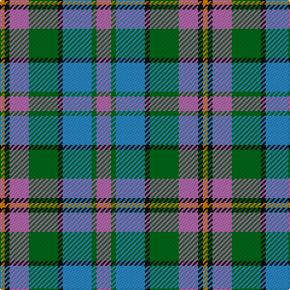

In pattern [RGBKGRKY](/patterns/rgbkgrky/).

This was sourced from house-of-tartan.  It is a [8 stripes tartan](/stripes/stripes8/).

Original link http://www.house-of-tartan.scotland.net/house/TartanViewjs.asp?colr=Def&tnam=2301

## Thread count
O/4 K4 P16 G24 K4 B24 G4 P/12

## Palette
Each colour and its ΔE from the base-6 reference it is a variant of.

| Colour | Shade | Base | ΔE (OKLab) |
|---|---|---|---|
| B | <code style="background-color:#2888C4;">#2888C4</code> `#2888C4` | B <code style="background-color:#2A418A;">#2A418A</code> | 0.21 |
| G | <code style="background-color:#006818;">#006818</code> `#006818` | G <code style="background-color:#006100;">#006100</code> | 0.02 |
| K | <code style="background-color:#101010;">#101010</code> `#101010` | K <code style="background-color:#000000;">#000000</code> | 0.17 |
| O | <code style="background-color:#D87C00;">#D87C00</code> `#D87C00` | Y <code style="background-color:#F2BF00;">#F2BF00</code> | 0.17 |
| P | <code style="background-color:#B468AC;">#B468AC</code> `#B468AC` | R <code style="background-color:#CC0000;">#CC0000</code> | 0.21 |

# Sample pattern

## Nearest tartans

The nearest existing variants by ΔTartan distance.

1. [Caitriot](/setts/s9/w3b2ba14r8b14bb16ba13b2w3~b5c8ca8-ba5c5c5c-bb202060-r888888-wfcfcfc~x2/) — ΔT 0.88
1. [Orkney (District?)](/setts/s8/r9g3b19k3g19r13k3y3~b1870a4-g408060-k101010-r901c38-ybc8c00~x2/) — ΔT 1.11
1. [Caitriot](/setts/s9/w3b2ba14y8b14bb16ba13b2w3~b5f749c-ba505050-bb000048-wffffff-ya0a0a0~x2/) — ΔT 1.23
1. [Unidentified #47](/setts/s10/b10ba5y2ba2w2ba5r4ba2r4w2~b000064-ba788cb4-ra0783c-wc8c8c8-yc48800~x4/) — ΔT 1.24
1. [Cooke Family Tartan Tartan Number: 2131. Earliest known date: 1993 Designed for Mr Bob Cooke and his family. Cookes were seafarers from the West Coast of Scotland and Ireland. Some including the designer, can trace forebears to Liverpool and the North West coast of England. The colours of the tartan reflect the seas, the skys and the heart of the sailor. See products available Copyright © Blair Urquhart, Comrie, 2015](/setts/s7/k6b2ba12g8r5k2g3~b2888c4-ba2c2c80-g408060-k101010-rc8002c~x4/) — ΔT 1.25
1. [Cercle de Fermières Varennes](/setts/s6/b30r3w10g14r3ra30~b1870a4-g005448-rc8002c-rab07430-wffffff~x2/) — ΔT 1.26
1. [McLion](/setts/s9/w1b6g1b1g1b1ga4r5y1~b304080-g008000-ga30a010-r802040-we0e0e0-yff8500~x4/) — ΔT 1.30
1. [Idaho, Centennial](/setts/s8/b12r2b2r2b2g10w12ra3~b304080-g008000-rc00000-ra806050-we0e0e0~x2/) — ΔT 1.30
1. [Newmill Corporate Tartan Tartan Number: 2053. Earliest known date: March 1992 Designed to be used in the refurbishing of Johnstons of Elgin new mill shop and based on the colours of the mill shop house style. The lighter square is represented here as green from the 'Antique' colour range, a speciality of Johnstons of Elgin. See products available Copyright © Blair Urquhart, Comrie, 2015](/setts/s7/r5ra20b13ba42b13ra20y5~b003c64-ba2c2c80-rc8002c-raa07c58-ydc943c/) — ΔT 1.31
1. [MacCaughan or MacEachain Clan Tartan Tartan Number: 169. Earliest known date: 1972 Nothing See products available Copyright © Blair Urquhart, Comrie, 2015](/setts/s6/r2g6k2b6k1ra2~b2c2c80-g006818-k101010-rb468ac-rac80000~x4/) — ΔT 1.32

## Neighbour map

Every grey dot is one of 15726 variants placed by the first two principal components of the ΔTartan feature space (44% of its variance). Red is this tartan; blue dots are its nearest — click one to open its page.

<svg viewBox="0 0 640 380" role="img" style="max-width:100%;height:auto;border:1px solid #e0e0e0;border-radius:4px;display:block" xmlns="http://www.w3.org/2000/svg"><image href="/nn/cloud.v1.png" width="640" height="380"/><a href="/setts/s9/w3b2ba14r8b14bb16ba13b2w3~b5c8ca8-ba5c5c5c-bb202060-r888888-wfcfcfc~x2/"><circle cx="133.2" cy="198.9" r="4" fill="#3465a4"><title>Caitriot</title></circle></a><a href="/setts/s8/r9g3b19k3g19r13k3y3~b1870a4-g408060-k101010-r901c38-ybc8c00~x2/"><circle cx="149.3" cy="214.4" r="4" fill="#3465a4"><title>Orkney (District?)</title></circle></a><a href="/setts/s9/w3b2ba14y8b14bb16ba13b2w3~b5f749c-ba505050-bb000048-wffffff-ya0a0a0~x2/"><circle cx="110.7" cy="191.2" r="4" fill="#3465a4"><title>Caitriot</title></circle></a><a href="/setts/s10/b10ba5y2ba2w2ba5r4ba2r4w2~b000064-ba788cb4-ra0783c-wc8c8c8-yc48800~x4/"><circle cx="93.5" cy="203.7" r="4" fill="#3465a4"><title>Unidentified #47</title></circle></a><a href="/setts/s7/k6b2ba12g8r5k2g3~b2888c4-ba2c2c80-g408060-k101010-rc8002c~x4/"><circle cx="108.2" cy="227.0" r="4" fill="#3465a4"><title>Cooke Family Tartan Tartan Number: 2131. Earliest known date: 1993 Designed for Mr Bob Cooke and his family. Cookes were seafarers from the West Coast of Scotland and Ireland. Some including the designer, can trace forebears to Liverpool and the North West coast of England. The colours of the tartan reflect the seas, the skys and the heart of the sailor. See products available Copyright © Blair Urquhart, Comrie, 2015</title></circle></a><a href="/setts/s6/b30r3w10g14r3ra30~b1870a4-g005448-rc8002c-rab07430-wffffff~x2/"><circle cx="144.7" cy="191.8" r="4" fill="#3465a4"><title>Cercle de Fermières Varennes</title></circle></a><a href="/setts/s9/w1b6g1b1g1b1ga4r5y1~b304080-g008000-ga30a010-r802040-we0e0e0-yff8500~x4/"><circle cx="117.9" cy="173.6" r="4" fill="#3465a4"><title>McLion</title></circle></a><a href="/setts/s8/b12r2b2r2b2g10w12ra3~b304080-g008000-rc00000-ra806050-we0e0e0~x2/"><circle cx="103.1" cy="185.2" r="4" fill="#3465a4"><title>Idaho, Centennial</title></circle></a><a href="/setts/s7/r5ra20b13ba42b13ra20y5~b003c64-ba2c2c80-rc8002c-raa07c58-ydc943c/"><circle cx="174.8" cy="213.1" r="4" fill="#3465a4"><title>Newmill Corporate Tartan Tartan Number: 2053. Earliest known date: March 1992 Designed to be used in the refurbishing of Johnstons of Elgin new mill shop and based on the colours of the mill shop house style. The lighter square is represented here as green from the 'Antique' colour range, a speciality of Johnstons of Elgin. See products available Copyright © Blair Urquhart, Comrie, 2015</title></circle></a><a href="/setts/s6/r2g6k2b6k1ra2~b2c2c80-g006818-k101010-rb468ac-rac80000~x4/"><circle cx="113.6" cy="231.9" r="4" fill="#3465a4"><title>MacCaughan or MacEachain Clan Tartan Tartan Number: 169. Earliest known date: 1972 Nothing See products available Copyright © Blair Urquhart, Comrie, 2015</title></circle></a><circle cx="114.9" cy="207.4" r="5" fill="#c00000"/></svg>

ID: /setts/s8/r3g1b6k1g6r4k1y1~b2888c4-g006818-k101010-rb468ac-yd87c00~x4/
