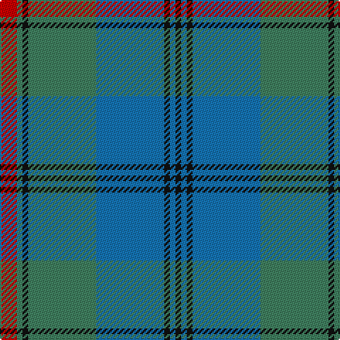

In pattern [KBKBGKGR](/stripes/kbkbgkgr/).

This was sourced from register-of-tartans.  It is a [8 stripe tartan](/stripes/stripes8/).

Original link https://www.tartanregister.gov.uk/tartanDetails.aspx?ref=3328

## Attestations

This cloth appears in 2 source records; the oldest owns this page.

- 01/01/1988 — Peter of Lee (Personal) (register-of-tartans, [record](https://www.tartanregister.gov.uk/tartanDetails.aspx?ref=3328))
- pre 1988 — Peter of Lee (Personal) (tartans-authority, [record](http://www.tartansauthority.com/tartan-ferret/display/1055/))

## Register references

External register numbers recorded for this tartan.

- Scottish Register of Tartans: [3328](https://www.tartanregister.gov.uk/tartanDetails.aspx?ref=3328)
- Scottish Tartans Authority (ITI): 1055
- Scottish Tartans World Register: 1055

## Thread count
R/12 G4 K4 G48 B48 K4 B4 K/4

## Palette
Each colour and its ΔE from the base-6 reference it is a variant of.

| Colour | Shade | Base | ΔE (OKLab) |
|---|---|---|---|
| B | <code style="background-color:#1474B4;">#1474B4</code> `#1474B4` | B <code style="background-color:#2A418A;">#2A418A</code> | 0.15 |
| G | <code style="background-color:#408060;">#408060</code> `#408060` | G <code style="background-color:#006100;">#006100</code> | 0.14 |
| K | <code style="background-color:#101010;">#101010</code> `#101010` | K <code style="background-color:#000000;">#000000</code> | 0.17 |
| R | <code style="background-color:#C80000;">#C80000</code> `#C80000` | R <code style="background-color:#CC0000;">#CC0000</code> | 0.01 |

# Sample pattern

## Nearest tartans

The nearest existing variants by ΔTartan distance.

1. [Speyside Blue (Fashion)](/setts/s8/n32k3n3k3b5k8o21k4~x2/) — ΔT 1.16
1. [Ben Lomond (Fashion)](/setts/s8/k2t2k2t15g15k2g2w2~x4/) — ΔT 1.21
1. [Manx Centenary District Tartan Tartan Number: 129. Earliest known date: pre 1992 Sample presented by Dr. D.G. Teall See products available Copyright © Blair Urquhart, Comrie, 2015](/setts/s9/db22g3db3g3db3g9o28g3o6~x2/) — ΔT 1.23
1. [Stuart/Stewart of Appin #2](/setts/s10/dg11r4dg4r7dg41db11t4db41r4db8/) — ΔT 1.23
1. [Graeme Heckenberg Hunting](/setts/s7/db3g13lr1o3lr1db10lo1~x2/) — ΔT 1.24
1. [Manx Centenary](/setts/s9/db22g3db3g3db3g9y28g3y6~x2/) — ΔT 1.24
1. [Gammell (Personal)](/setts/s8/t32r3t3r3t3r10g24r3~x2/) — ΔT 1.25
1. [Maine, Original State of (Fashion)](/setts/s11/dg2db2t23db2t2db6t2db2dg33r2t2~x2/) — ΔT 1.26
1. [Stewart of Appin 2](/setts/s10/g11r4g4r7g41db11t4db41r4db8/) — ΔT 1.26
1. [Stuart/Stewart of Appin](/setts/s10/dg8r3dg3r5dg26db7t3db28r3db6~x2/) — ΔT 1.29

## Neighbour map

Every grey dot is one of 14299 variants placed by the first two principal components of the ΔTartan feature space (44% of its variance). Red is this tartan; blue dots are its nearest — click one to open its page.

<svg viewBox="0 0 640 380" role="img" style="max-width:100%;height:auto;border:1px solid #e0e0e0;border-radius:4px;display:block" xmlns="http://www.w3.org/2000/svg"><image href="/nn/cloud.v1.png" width="640" height="380"/><a href="/setts/s8/n32k3n3k3b5k8o21k4~x2/"><circle cx="267.1" cy="197.7" r="4" fill="#3465a4"><title>Speyside Blue (Fashion)</title></circle></a><a href="/setts/s8/k2t2k2t15g15k2g2w2~x4/"><circle cx="233.1" cy="203.8" r="4" fill="#3465a4"><title>Ben Lomond (Fashion)</title></circle></a><a href="/setts/s9/db22g3db3g3db3g9o28g3o6~x2/"><circle cx="278.8" cy="215.1" r="4" fill="#3465a4"><title>Manx Centenary District Tartan Tartan Number: 129. Earliest known date: pre 1992 Sample presented by Dr. D.G. Teall See products available Copyright © Blair Urquhart, Comrie, 2015</title></circle></a><a href="/setts/s10/dg11r4dg4r7dg41db11t4db41r4db8/"><circle cx="305.6" cy="206.3" r="4" fill="#3465a4"><title>Stuart/Stewart of Appin #2</title></circle></a><a href="/setts/s7/db3g13lr1o3lr1db10lo1~x2/"><circle cx="261.7" cy="190.9" r="4" fill="#3465a4"><title>Graeme Heckenberg Hunting</title></circle></a><a href="/setts/s9/db22g3db3g3db3g9y28g3y6~x2/"><circle cx="303.7" cy="229.3" r="4" fill="#3465a4"><title>Manx Centenary</title></circle></a><a href="/setts/s8/t32r3t3r3t3r10g24r3~x2/"><circle cx="303.8" cy="201.7" r="4" fill="#3465a4"><title>Gammell (Personal)</title></circle></a><a href="/setts/s11/dg2db2t23db2t2db6t2db2dg33r2t2~x2/"><circle cx="321.4" cy="155.2" r="4" fill="#3465a4"><title>Maine, Original State of (Fashion)</title></circle></a><a href="/setts/s10/g11r4g4r7g41db11t4db41r4db8/"><circle cx="278.1" cy="191.4" r="4" fill="#3465a4"><title>Stewart of Appin 2</title></circle></a><a href="/setts/s10/dg8r3dg3r5dg26db7t3db28r3db6~x2/"><circle cx="294.0" cy="210.9" r="4" fill="#3465a4"><title>Stuart/Stewart of Appin</title></circle></a><circle cx="282.3" cy="192.5" r="5" fill="#c00000"/></svg>

ID: /setts/s8/r3g1k1g12b12k1b1k1~x4/
