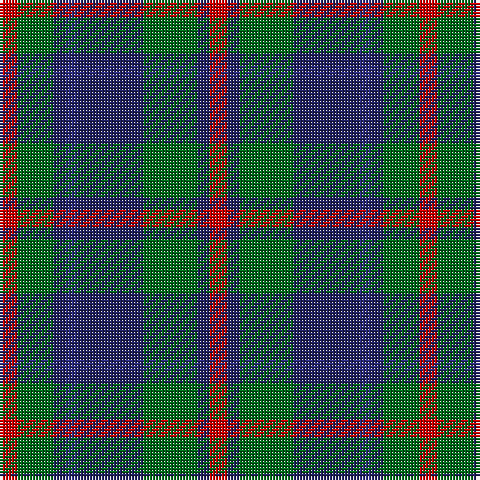

This page is one **sett** — a single exact thread-count. It belongs to the [tartan](/tartans/r3g6db2dbi2db11g9db2r3/)
(the same proportion at any scale), whose colour order is pattern [RBGBBBGR](/stripes/rbgbbbgr/).

Sourced from register-of-tartans.  It is a [8 stripe tartan](/stripes/stripes8/).

Original link https://www.tartanregister.gov.uk/tartanDetails.aspx?ref=873

## Register references

External register numbers recorded for this tartan.

- Scottish Register of Tartans: [873](https://www.tartanregister.gov.uk/tartanDetails.aspx?ref=873)
- Scottish Tartans Authority (ITI): 1329
- Scottish Tartans World Register: 1329

## Thread count
R/6 G12 DBa4 DB4 DBa22 G18 DBa4 R/6

## Palette

Palette: <strong>Tartan Register</strong>
<table><thead><tr><th>Colour</th><th>Threads</th><th>Shade</th><th>Base</th><th>OKLCh</th></tr></thead><tbody><tr><td>R/</td><td style="text-align:right;font-variant-numeric:tabular-nums">6</td><td><code style="background-color:#C80000;">#C80000</code> <small style="color:#888">#C80000</small></td><td>R <code style="background-color:#CC0000;">#CC0000</code></td><td><small style="color:#888">oklch(52.3% 0.215 29.2)</small></td></tr><tr><td>G</td><td style="text-align:right;font-variant-numeric:tabular-nums">12</td><td><code style="background-color:#006818;">#006818</code> <small style="color:#888">#006818</small></td><td>G <code style="background-color:#006100;">#006100</code></td><td><small style="color:#888">oklch(45.0% 0.142 145.0)</small></td></tr><tr><td>DBa</td><td style="text-align:right;font-variant-numeric:tabular-nums">4</td><td><code style="background-color:#202060;">#202060</code> <small style="color:#888">#202060</small></td><td>B <code style="background-color:#2A418A;">#2A418A</code></td><td><small style="color:#888">oklch(28.9% 0.111 276.9)</small></td></tr><tr><td>DB</td><td style="text-align:right;font-variant-numeric:tabular-nums">4</td><td><code style="background-color:#2C2C80;">#2C2C80</code> <small style="color:#888">#2C2C80</small></td><td>B <code style="background-color:#2A418A;">#2A418A</code></td><td><small style="color:#888">oklch(35.0% 0.138 276.6)</small></td></tr><tr><td>DBa</td><td style="text-align:right;font-variant-numeric:tabular-nums">22</td><td><code style="background-color:#202060;">#202060</code> <small style="color:#888">#202060</small></td><td>B <code style="background-color:#2A418A;">#2A418A</code></td><td><small style="color:#888">oklch(28.9% 0.111 276.9)</small></td></tr><tr><td>G</td><td style="text-align:right;font-variant-numeric:tabular-nums">18</td><td><code style="background-color:#006818;">#006818</code> <small style="color:#888">#006818</small></td><td>G <code style="background-color:#006100;">#006100</code></td><td><small style="color:#888">oklch(45.0% 0.142 145.0)</small></td></tr><tr><td>DBa</td><td style="text-align:right;font-variant-numeric:tabular-nums">4</td><td><code style="background-color:#202060;">#202060</code> <small style="color:#888">#202060</small></td><td>B <code style="background-color:#2A418A;">#2A418A</code></td><td><small style="color:#888">oklch(28.9% 0.111 276.9)</small></td></tr><tr><td>R/</td><td style="text-align:right;font-variant-numeric:tabular-nums">6</td><td><code style="background-color:#C80000;">#C80000</code> <small style="color:#888">#C80000</small></td><td>R <code style="background-color:#CC0000;">#CC0000</code></td><td><small style="color:#888">oklch(52.3% 0.215 29.2)</small></td></tr></tbody></table>

# Sample pattern

## Nearest tartans

The nearest existing variants by ΔTartan distance, with this tartan at the top so the swatches line up against it.

ΔTartan

Tartan

Sett

—

<a href="/ttd/edit/#slug=r3g6db2dbi2db11g9db2r3~x2">Daks (Navy)</a> <a class="nn-out" href="/setts/s8/r3g6db2dbi2db11g9db2r3~x2/" title="open its dictionary page">↗</a>

0.72

<a href="/ttd/edit/#slug=db7r3g7r1g7r3db7t1~x2">Hebrides #8</a> <a class="nn-out" href="/setts/s8/db7r3g7r1g7r3db7t1~x2/" title="open its dictionary page">↗</a>

0.84

<a href="/ttd/edit/#slug=db4k3db16k14g14r3g3~x2">Inneryne (Personal)</a> <a class="nn-out" href="/setts/s7/db4k3db16k14g14r3g3~x2/" title="open its dictionary page">↗</a>

0.86

<a href="/ttd/edit/#slug=g14db2g2k8dp9k2~x2">MacArthur of Milton Hunting Clan Tartan Tartan Number: 700. Earliest known date: 1823 This is the older of the two MacArthur setts, which links the clan with the Campbells. See products available Copyright © Blair Urquhart, Comrie, 2015</a> <a class="nn-out" href="/setts/s6/g14db2g2k8dp9k2~x2/" title="open its dictionary page">↗</a>

0.87

<a href="/ttd/edit/#slug=g7db1g1k4dp4k1~x4">MacArthur of Milton (Clan)</a> <a class="nn-out" href="/setts/s6/g7db1g1k4dp4k1~x4/" title="open its dictionary page">↗</a>

0.89

<a href="/ttd/edit/#slug=db12r2db4r4k15db4g4db2g12~x2">Alexander Hunting (Name)</a> <a class="nn-out" href="/setts/s9/db12r2db4r4k15db4g4db2g12~x2/" title="open its dictionary page">↗</a>

0.90

<a href="/ttd/edit/#slug=g1db6k6g6r1g1~x6">Callum Beg (Fashion)</a> <a class="nn-out" href="/setts/s6/g1db6k6g6r1g1~x6/" title="open its dictionary page">↗</a>

0.92

<a href="/ttd/edit/#slug=k2g10t2k9dp8g2~x2">Lennie Family Tartan Tartan Number: 725. Earliest known date: 1819 Wilson's No 231. See products available Copyright © Blair Urquhart, Comrie, 2015</a> <a class="nn-out" href="/setts/s6/k2g10t2k9dp8g2~x2/" title="open its dictionary page">↗</a>

0.93

<a href="/ttd/edit/#slug=db2r3g11r3db2t2db11r2g2~x2">Hebridean 1</a> <a class="nn-out" href="/setts/s9/db2r3g11r3db2t2db11r2g2~x2/" title="open its dictionary page">↗</a>

0.96

<a href="/ttd/edit/#slug=db7k2db2k2db2k7g7w1g7~x4">Abercrombie</a> <a class="nn-out" href="/setts/s9/db7k2db2k2db2k7g7w1g7~x4/" title="open its dictionary page">↗</a>

0.99

<a href="/ttd/edit/#slug=db1k1db6k6dg6k1w1~x2">Forbes #4</a> <a class="nn-out" href="/setts/s7/db1k1db6k6dg6k1w1~x2/" title="open its dictionary page">↗</a>

## Neighbour map

Every grey dot is one of 14359 variants placed by the first two principal components of the ΔTartan feature space (44% of its variance). Red is this tartan; blue dots are its nearest — click one to open its page.

<svg viewBox="0 0 640 380" role="img" style="max-width:100%;height:auto;border:1px solid #e0e0e0;border-radius:4px;display:block" xmlns="http://www.w3.org/2000/svg"><image href="/nn/cloud.v1.png" width="640" height="380"/><a href="/setts/s8/db7r3g7r1g7r3db7t1~x2/"><circle cx="193.5" cy="248.2" r="4" fill="#3465a4"><title>Hebrides #8</title></circle></a><a href="/setts/s7/db4k3db16k14g14r3g3~x2/"><circle cx="179.7" cy="260.9" r="4" fill="#3465a4"><title>Inneryne (Personal)</title></circle></a><a href="/setts/s6/g14db2g2k8dp9k2~x2/"><circle cx="221.2" cy="246.4" r="4" fill="#3465a4"><title>MacArthur of Milton Hunting Clan Tartan Tartan Number: 700. Earliest known date: 1823 This is the older of the two MacArthur setts, which links the clan with the Campbells. See products available Copyright © Blair Urquhart, Comrie, 2015</title></circle></a><a href="/setts/s6/g7db1g1k4dp4k1~x4/"><circle cx="233.2" cy="249.8" r="4" fill="#3465a4"><title>MacArthur of Milton (Clan)</title></circle></a><a href="/setts/s9/db12r2db4r4k15db4g4db2g12~x2/"><circle cx="184.9" cy="230.9" r="4" fill="#3465a4"><title>Alexander Hunting (Name)</title></circle></a><a href="/setts/s6/g1db6k6g6r1g1~x6/"><circle cx="197.7" cy="261.4" r="4" fill="#3465a4"><title>Callum Beg (Fashion)</title></circle></a><a href="/setts/s6/k2g10t2k9dp8g2~x2/"><circle cx="165.6" cy="263.2" r="4" fill="#3465a4"><title>Lennie Family Tartan Tartan Number: 725. Earliest known date: 1819 Wilson's No 231. See products available Copyright © Blair Urquhart, Comrie, 2015</title></circle></a><a href="/setts/s9/db2r3g11r3db2t2db11r2g2~x2/"><circle cx="212.2" cy="229.9" r="4" fill="#3465a4"><title>Hebridean 1</title></circle></a><a href="/setts/s9/db7k2db2k2db2k7g7w1g7~x4/"><circle cx="179.2" cy="244.0" r="4" fill="#3465a4"><title>Abercrombie</title></circle></a><a href="/setts/s7/db1k1db6k6dg6k1w1~x2/"><circle cx="192.0" cy="248.0" r="4" fill="#3465a4"><title>Forbes #4</title></circle></a><circle cx="200.6" cy="248.3" r="5" fill="#c00000"/></svg>

ID: /setts/s8/r3g6db2dbi2db11g9db2r3~x2/
