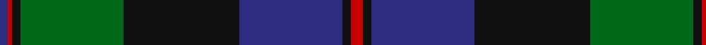

In pattern [BRKGKBKR](/patterns/brkgkbkr/).

This was sourced from house-of-tartan.  It is a [8 stripes tartan](/stripes/stripes8/).

Original link http://www.house-of-tartan.scotland.net/house/TartanViewjs.asp?colr=Def&tnam=554

## Thread count
DB/4 R2 K4 G50 K56 DB50 K4 R/6

## Palette
Each colour and its ΔE from the base-6 reference it is a variant of.

| Colour | Shade | Base | ΔE (OKLab) |
|---|---|---|---|
| DB | <code style="background-color:#2C2C80;">#2C2C80</code> `#2C2C80` | B <code style="background-color:#2A418A;">#2A418A</code> | 0.06 |
| G | <code style="background-color:#006818;">#006818</code> `#006818` | G <code style="background-color:#006100;">#006100</code> | 0.02 |
| K | <code style="background-color:#101010;">#101010</code> `#101010` | K <code style="background-color:#000000;">#000000</code> | 0.17 |
| R | <code style="background-color:#C80000;">#C80000</code> `#C80000` | R <code style="background-color:#CC0000;">#CC0000</code> | 0.01 |

# Sample pattern

## Nearest tartans

The nearest existing variants by ΔTartan distance.

1. [Ogilvie of Inverarity - 1842 (V.S.)](/setts/s8/b28y1b2k26g24k1g2r3x2~b2c2c80-g006818-k101010-rc80000-ye8c000/) — ΔT 0.88
1. [Pitceathley Chamberlain (Personal)](/setts/s10/b2k3g5k9b21k2b5k2g20w1x2~b2c2c80-g006818-k101010-we0e0e0/) — ΔT 0.90
1. [Hebridean Old.. District Tartan Tartan Number: 249. Earliest known date: pre 2003 Alternative count on 1990 See products available Copyright © Blair Urquhart, Comrie, 2015](/setts/s9/b2k2b18ba1k13ba1g16b3k2x2~b2c2c80-ba2888c4-g006818-k101010/) — ΔT 0.93
1. [Baird (Old) Clan Tartan Tartan Number: 273. Earliest known date: c.1906 This tartan is first recorded in Johnston's work of 1906, and the sample from the Highland Society of London probably dates from the same period. In both these early references the triple stripes are rendered in red. Today, however, they are generally woven in purple. The name originates from 'bard' meaning poet. The Bairds owned estates in Aberdeenshire which were later purchased by the Gordons. See products available Copyright © Blair Urquhart, Comrie, 2015](/setts/s8/r7g3r2g33k31b31k3b3~b2c2c80-g006818-k101010-ra00048/) — ΔT 0.94
1. [MacTaggart](/setts/s7/g30b4g2k20b18r1b4x2~b2c2c80-g285800-k101010-rc80000/) — ΔT 0.95
1. [Dundas Clan Tartan Tartan Number: 1041. Earliest known date: 1842 The Dundas tartan originated in the Vestiarium Scoticum (1842). The design has the traditional green, black, blue background of the Highland military tartans with twin red stripes on the green. Dundas's played an important role in restoring the Highland way of life after the penalties imposed as a result of the '45 rebellion. It was Henry Dundas, who in 1784, introduced the bill to parliament restoring estates forfieted to the Crown after the uprising, following the repeal on the wearing of tartan in 1782. The Chief today is Sir David Dundas of Dundas, Bart. Appears in Edgars 'Old and Rare' See products available Copyright © Blair Urquhart, Comrie, 2015](/setts/s7/k4b16k12g24r1g2k2x2~b2c2c80-g006818-k101010-rc80000/) — ΔT 0.96
1. [Thomas of Craigie (Personal)](/setts/s8/y2k4y1g16k14b23k4r1x2~b202060-g285800-k101010-rc80000-ye8c000/) — ΔT 1.00
1. [Jedforest](/setts/s12/k4b2g24r1g2r1g2k20b24k1b2k4x2~b1c0070-g006818-k101010-rc80000/) — ΔT 1.05
1. [Maine Acadia (Fashion)](/setts/s9/g5k1y2k1g19k15y2b20g3x2~b003c64-g006038-k101010-ye8c000/) — ΔT 1.07
1. [Johnstone/Johnston](/setts/s8/k3b3k3b22g26k2b1y3x2~b2c4084-g005020-k101010-ye8c000/) — ΔT 1.08

## Neighbour map

Every grey dot is one of 15726 variants placed by the first two principal components of the ΔTartan feature space (44% of its variance). Red is this tartan; blue dots are its nearest — click one to open its page.

<svg viewBox="0 0 640 380" role="img" style="max-width:100%;height:auto;border:1px solid #e0e0e0;border-radius:4px;display:block" xmlns="http://www.w3.org/2000/svg"><image href="/nn/cloud.v1.png" width="640" height="380"/><a href="/setts/s8/b28y1b2k26g24k1g2r3x2~b2c2c80-g006818-k101010-rc80000-ye8c000/"><circle cx="242.3" cy="143.2" r="4" fill="#3465a4"><title>Ogilvie of Inverarity - 1842 (V.S.)</title></circle></a><a href="/setts/s10/b2k3g5k9b21k2b5k2g20w1x2~b2c2c80-g006818-k101010-we0e0e0/"><circle cx="270.9" cy="167.8" r="4" fill="#3465a4"><title>Pitceathley Chamberlain (Personal)</title></circle></a><a href="/setts/s9/b2k2b18ba1k13ba1g16b3k2x2~b2c2c80-ba2888c4-g006818-k101010/"><circle cx="268.8" cy="179.1" r="4" fill="#3465a4"><title>Hebridean Old.. District Tartan Tartan Number: 249. Earliest known date: pre 2003 Alternative count on 1990 See products available Copyright © Blair Urquhart, Comrie, 2015</title></circle></a><a href="/setts/s8/r7g3r2g33k31b31k3b3~b2c2c80-g006818-k101010-ra00048/"><circle cx="223.5" cy="186.0" r="4" fill="#3465a4"><title>Baird (Old) Clan Tartan Tartan Number: 273. Earliest known date: c.1906 This tartan is first recorded in Johnston's work of 1906, and the sample from the Highland Society of London probably dates from the same period. In both these early references the triple stripes are rendered in red. Today, however, they are generally woven in purple. The name originates from 'bard' meaning poet. The Bairds owned estates in Aberdeenshire which were later purchased by the Gordons. See products available Copyright © Blair Urquhart, Comrie, 2015</title></circle></a><a href="/setts/s7/g30b4g2k20b18r1b4x2~b2c2c80-g285800-k101010-rc80000/"><circle cx="308.5" cy="185.0" r="4" fill="#3465a4"><title>MacTaggart</title></circle></a><a href="/setts/s7/k4b16k12g24r1g2k2x2~b2c2c80-g006818-k101010-rc80000/"><circle cx="289.0" cy="185.6" r="4" fill="#3465a4"><title>Dundas Clan Tartan Tartan Number: 1041. Earliest known date: 1842 The Dundas tartan originated in the Vestiarium Scoticum (1842). The design has the traditional green, black, blue background of the Highland military tartans with twin red stripes on the green. Dundas's played an important role in restoring the Highland way of life after the penalties imposed as a result of the '45 rebellion. It was Henry Dundas, who in 1784, introduced the bill to parliament restoring estates forfieted to the Crown after the uprising, following the repeal on the wearing of tartan in 1782. The Chief today is Sir David Dundas of Dundas, Bart. Appears in Edgars 'Old and Rare' See products available Copyright © Blair Urquhart, Comrie, 2015</title></circle></a><a href="/setts/s8/y2k4y1g16k14b23k4r1x2~b202060-g285800-k101010-rc80000-ye8c000/"><circle cx="232.0" cy="159.7" r="4" fill="#3465a4"><title>Thomas of Craigie (Personal)</title></circle></a><a href="/setts/s12/k4b2g24r1g2r1g2k20b24k1b2k4x2~b1c0070-g006818-k101010-rc80000/"><circle cx="258.3" cy="141.4" r="4" fill="#3465a4"><title>Jedforest</title></circle></a><a href="/setts/s9/g5k1y2k1g19k15y2b20g3x2~b003c64-g006038-k101010-ye8c000/"><circle cx="259.7" cy="175.5" r="4" fill="#3465a4"><title>Maine Acadia (Fashion)</title></circle></a><a href="/setts/s8/k3b3k3b22g26k2b1y3x2~b2c4084-g005020-k101010-ye8c000/"><circle cx="318.0" cy="164.3" r="4" fill="#3465a4"><title>Johnstone/Johnston</title></circle></a><circle cx="270.4" cy="162.8" r="5" fill="#c00000"/></svg>

ID: /setts/s8/r3k2b25k28g25k2r1b2x2~b2c2c80-g006818-k101010-rc80000/
