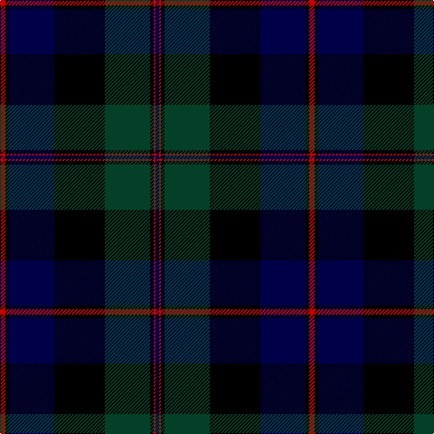

In pattern [BRKGKBKR](/stripes/brkgkbkr/).

This was sourced from register-of-tartans.  It is a [8 stripe tartan](/stripes/stripes8/).

Original link https://www.tartanregister.gov.uk/tartanDetails.aspx?ref=720

## Attestations

This cloth appears in 2 source records; the oldest owns this page.

- 01/01/1819 — Common Kilt (register-of-tartans, [record](https://www.tartanregister.gov.uk/tartanDetails.aspx?ref=720))
- 1819? — Common Kilt (Fashion) (tartans-authority, [record](http://www.tartansauthority.com/tartan-ferret/display/554/))

## Register references

External register numbers recorded for this tartan.

- Scottish Register of Tartans: [720](https://www.tartanregister.gov.uk/tartanDetails.aspx?ref=720)
- Scottish Tartans Authority (ITI): 554
- Scottish Tartans World Register: 554

## Thread count
R/6 K4 DB50 K56 DG50 K4 R2 DB/4

## Palette
Each colour and the base-6 reference it is a variant of.

| Colour | Shade | Base |
|---|---|---|
| DB | <code style="background-color:#000048;">#000048</code> `oklch(18.2% 0.126 264.1)` <small>#000048</small> | B <code style="background-color:#2A418A;">#2A418A</code> |
| DG | <code style="background-color:#044028;">#044028</code> `oklch(32.9% 0.072 160.0)` <small>#044028</small> | G <code style="background-color:#006100;">#006100</code> |
| K | <code style="background-color:#000000;">#000000</code> `oklch(0.0% 0.000 0.0)` <small>#000000</small> | K <code style="background-color:#000000;">#000000</code> |
| R | <code style="background-color:#C80000;">#C80000</code> `oklch(52.3% 0.215 29.2)` <small>#C80000</small> | R <code style="background-color:#CC0000;">#CC0000</code> |

# Sample pattern

## Nearest tartans

The nearest existing variants by ΔTartan distance, with this tartan at the top so the swatches line up against it.

ΔTartan

Tartan

Sett

—

<a href="/ttd/edit/#slug=r3k2db25k28dg25k2r1db2~x2">Common Kilt</a> <a class="nn-out" href="/setts/s8/r3k2db25k28dg25k2r1db2~x2/" title="open its dictionary page">↗</a>

1.13

<a href="/ttd/edit/#slug=dg1dg1r2dg21k11db21r2db1db1~x2">MacThomas</a> <a class="nn-out" href="/setts/s9/dg1dg1r2dg21k11db21r2db1db1~x2/" title="open its dictionary page">↗</a>

1.19

<a href="/ttd/edit/#slug=r3k2dg25k28db25k2r3~x2">Coarse Kilt</a> <a class="nn-out" href="/setts/s7/r3k2dg25k28db25k2r3~x2/" title="open its dictionary page">↗</a>

1.21

<a href="/ttd/edit/#slug=db28ly1db2k16dg24k1dg2r3~x2">Ogilvy VS</a> <a class="nn-out" href="/setts/s8/db28ly1db2k16dg24k1dg2r3~x2/" title="open its dictionary page">↗</a>

1.23

<a href="/ttd/edit/#slug=k10r4dg34db34k1lo3~x2">Singh, Gopal (Personal)</a> <a class="nn-out" href="/setts/s6/k10r4dg34db34k1lo3~x2/" title="open its dictionary page">↗</a>

1.23

<a href="/ttd/edit/#slug=k4db16k12dg24r1dg2k2~x2">Dundas</a> <a class="nn-out" href="/setts/s7/k4db16k12dg24r1dg2k2~x2/" title="open its dictionary page">↗</a>

1.28

<a href="/ttd/edit/#slug=db10k1db3k1db20k25dg40k3~x2">Black Watch RHR</a> <a class="nn-out" href="/setts/s8/db10k1db3k1db20k25dg40k3~x2/" title="open its dictionary page">↗</a>

1.29

<a href="/ttd/edit/#slug=dg20k1dg2k1dg3k14db28k1db2k4~x2">Kerr Hunting</a> <a class="nn-out" href="/setts/s10/dg20k1dg2k1dg3k14db28k1db2k4~x2/" title="open its dictionary page">↗</a>

1.32

<a href="/ttd/edit/#slug=db4k2db16lr1k8dg24r4~x2">Colqhoun VS</a> <a class="nn-out" href="/setts/s7/db4k2db16lr1k8dg24r4~x2/" title="open its dictionary page">↗</a>

1.38

<a href="/ttd/edit/#slug=dg16b2dg1k12db12k1~x2">Graham of Menteith</a> <a class="nn-out" href="/setts/s6/dg16b2dg1k12db12k1~x2/" title="open its dictionary page">↗</a>

1.41

<a href="/ttd/edit/#slug=db24k8dg8r2dg8k1ly2~x2">MacLaren</a> <a class="nn-out" href="/setts/s7/db24k8dg8r2dg8k1ly2~x2/" title="open its dictionary page">↗</a>

## Neighbour map

Every grey dot is one of 14299 variants placed by the first two principal components of the ΔTartan feature space (44% of its variance). Red is this tartan; blue dots are its nearest — click one to open its page.

<svg viewBox="0 0 640 380" role="img" style="max-width:100%;height:auto;border:1px solid #e0e0e0;border-radius:4px;display:block" xmlns="http://www.w3.org/2000/svg"><image href="/nn/cloud.v1.png" width="640" height="380"/><a href="/setts/s9/dg1dg1r2dg21k11db21r2db1db1~x2/"><circle cx="259.3" cy="160.3" r="4" fill="#3465a4"><title>MacThomas</title></circle></a><a href="/setts/s7/r3k2dg25k28db25k2r3~x2/"><circle cx="231.1" cy="208.5" r="4" fill="#3465a4"><title>Coarse Kilt</title></circle></a><a href="/setts/s8/db28ly1db2k16dg24k1dg2r3~x2/"><circle cx="250.2" cy="147.2" r="4" fill="#3465a4"><title>Ogilvy VS</title></circle></a><a href="/setts/s6/k10r4dg34db34k1lo3~x2/"><circle cx="282.0" cy="168.7" r="4" fill="#3465a4"><title>Singh, Gopal (Personal)</title></circle></a><a href="/setts/s7/k4db16k12dg24r1dg2k2~x2/"><circle cx="275.4" cy="187.7" r="4" fill="#3465a4"><title>Dundas</title></circle></a><a href="/setts/s8/db10k1db3k1db20k25dg40k3~x2/"><circle cx="314.2" cy="179.7" r="4" fill="#3465a4"><title>Black Watch RHR</title></circle></a><a href="/setts/s10/dg20k1dg2k1dg3k14db28k1db2k4~x2/"><circle cx="307.6" cy="171.1" r="4" fill="#3465a4"><title>Kerr Hunting</title></circle></a><a href="/setts/s7/db4k2db16lr1k8dg24r4~x2/"><circle cx="248.6" cy="171.1" r="4" fill="#3465a4"><title>Colqhoun VS</title></circle></a><a href="/setts/s6/dg16b2dg1k12db12k1~x2/"><circle cx="243.0" cy="220.0" r="4" fill="#3465a4"><title>Graham of Menteith</title></circle></a><a href="/setts/s7/db24k8dg8r2dg8k1ly2~x2/"><circle cx="267.5" cy="169.2" r="4" fill="#3465a4"><title>MacLaren</title></circle></a><circle cx="274.3" cy="175.1" r="5" fill="#c00000"/></svg>

ID: /setts/s8/r3k2db25k28dg25k2r1db2~x2/
