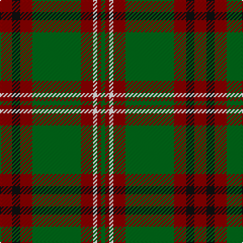

**Bands:** [RKRGRWRG](/stripes/rkrgrwrg/) · **Stripes:** [R K R G R W R G](/stripes/stripes8/) R K R G R W R G

This was sourced from register-of-tartans.  It is a [8 band tartan](/bands/bands8/).

Original link https://www.tartanregister.gov.uk/tartanDetails.aspx?ref=2305

## Register references

External register numbers recorded for this tartan.

- Scottish Register of Tartans: [2305](https://www.tartanregister.gov.uk/tartanDetails.aspx?ref=2305)
- Scottish Tartans Authority (ITI): 2238
- Scottish Tartans World Register: 2238

## Thread count
DR/12 K8 DR12 G48 DR12 W4 DR4 G/4

## Palette
Each colour and its ΔE from the base-6 reference it is a variant of.

| Colour | Shade | Base | ΔE (OKLab) |
|---|---|---|---|
| DR | <code style="background-color:#880000;">#880000</code> `#880000` | R <code style="background-color:#CC0000;">#CC0000</code> | 0.15 |
| G | <code style="background-color:#006818;">#006818</code> `#006818` | G <code style="background-color:#006100;">#006100</code> | 0.02 |
| K | <code style="background-color:#101010;">#101010</code> `#101010` | K <code style="background-color:#000000;">#000000</code> | 0.17 |
| W | <code style="background-color:#FFFFFF;">#FFFFFF</code> `#FFFFFF` | W <code style="background-color:#F7F7F7;">#F7F7F7</code> | 0.02 |

# Sample pattern

## Nearest tartans

The nearest existing variants by ΔTartan distance.

1. [Invertere Corporate Tartan Tartan Number: 1882. Earliest known date: 1988 Overstripes are yellow in warp See products available Copyright © Blair Urquhart, Comrie, 2015](/setts/s8/ly5dg14dy4db4dy27dg3dy4ly5/) — ΔT 0.72
1. [Midpac Tissue (non woven)](/setts/s8/r5k2dg1k2r5k2dg18lo3~x2/) — ΔT 0.87
1. [Invertere](/setts/s8/ly5dg14o4db4o27dg3o4ly5~x2/) — ΔT 1.01
1. [MacKillen](/setts/s9/k4lo15dg5k3dg7k3dg30r20dg3~x2/) — ΔT 1.01
1. [Unidentified Plaid 6](/setts/s10/r4t3r32db30r4g32r3g32r3g3~x2/) — ΔT 1.05
1. [Georgia, State of](/setts/s8/g36k2g2k2g3k12t10r20~x2/) — ΔT 1.13
1. [MacHardy (Clans Originaux)](/setts/s8/g4r4k12w2k12g32r4k3~x2/) — ΔT 1.13
1. [McInery (Personal)](/setts/s8/r8g2r12k6r3db3g24k2~x2/) — ΔT 1.15
1. [Manitoba Red](/setts/s8/t2dg1t1dg12r2dg1r6ly2~x2/) — ΔT 1.16
1. [Invertere (Daks #2) (Fashion)](/setts/s8/ly5g14dy4db4dy27g3dy4ly5~x2/) — ΔT 1.18

## Neighbour map

Every grey dot is one of 14299 variants placed by the first two principal components of the ΔTartan feature space (44% of its variance). Red is this tartan; blue dots are its nearest — click one to open its page.

<svg viewBox="0 0 640 380" role="img" style="max-width:100%;height:auto;border:1px solid #e0e0e0;border-radius:4px;display:block" xmlns="http://www.w3.org/2000/svg"><image href="/nn/cloud.v1.png" width="640" height="380"/><a href="/setts/s8/ly5dg14dy4db4dy27dg3dy4ly5/"><circle cx="289.4" cy="201.7" r="4" fill="#3465a4"><title>Invertere Corporate Tartan Tartan Number: 1882. Earliest known date: 1988 Overstripes are yellow in warp See products available Copyright © Blair Urquhart, Comrie, 2015</title></circle></a><a href="/setts/s8/r5k2dg1k2r5k2dg18lo3~x2/"><circle cx="309.2" cy="163.9" r="4" fill="#3465a4"><title>Midpac Tissue (non woven)</title></circle></a><a href="/setts/s8/ly5dg14o4db4o27dg3o4ly5~x2/"><circle cx="271.1" cy="188.9" r="4" fill="#3465a4"><title>Invertere</title></circle></a><a href="/setts/s9/k4lo15dg5k3dg7k3dg30r20dg3~x2/"><circle cx="269.2" cy="196.4" r="4" fill="#3465a4"><title>MacKillen</title></circle></a><a href="/setts/s10/r4t3r32db30r4g32r3g32r3g3~x2/"><circle cx="261.3" cy="183.0" r="4" fill="#3465a4"><title>Unidentified Plaid 6</title></circle></a><a href="/setts/s8/g36k2g2k2g3k12t10r20~x2/"><circle cx="273.7" cy="165.5" r="4" fill="#3465a4"><title>Georgia, State of</title></circle></a><a href="/setts/s8/g4r4k12w2k12g32r4k3~x2/"><circle cx="296.8" cy="176.4" r="4" fill="#3465a4"><title>MacHardy (Clans Originaux)</title></circle></a><a href="/setts/s8/r8g2r12k6r3db3g24k2~x2/"><circle cx="281.4" cy="201.2" r="4" fill="#3465a4"><title>McInery (Personal)</title></circle></a><a href="/setts/s8/t2dg1t1dg12r2dg1r6ly2~x2/"><circle cx="274.2" cy="164.0" r="4" fill="#3465a4"><title>Manitoba Red</title></circle></a><a href="/setts/s8/ly5g14dy4db4dy27g3dy4ly5~x2/"><circle cx="278.5" cy="194.4" r="4" fill="#3465a4"><title>Invertere (Daks #2) (Fashion)</title></circle></a><circle cx="307.8" cy="182.7" r="5" fill="#c00000"/></svg>

ID: /setts/s8/r3k2r3g12r3w1r1g1~x4/
