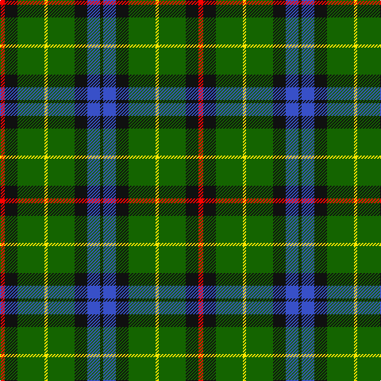

In pattern [KBKGYGKR](/stripes/kbkgygkr/).

This was sourced from register-of-tartans.  It is a [8 stripe tartan](/stripes/stripes8/).

Original link https://www.tartanregister.gov.uk/tartanDetails.aspx?ref=11516

## Register references

External register numbers recorded for this tartan.

- Scottish Register of Tartans: [11516](https://www.tartanregister.gov.uk/tartanDetails.aspx?ref=11516)

## Thread count
R/6 K16 G34 Y4 G34 K16 B16 K/4

## Palette
Each colour and the base-6 reference it is a variant of.

| Colour | Shade | Base |
|---|---|---|
| B | <code style="background-color:#3850C8;">#3850C8</code> `oklch(48.8% 0.188 269.4)` <small>#3850C8</small> | B <code style="background-color:#2A418A;">#2A418A</code> |
| G | <code style="background-color:#146400;">#146400</code> `oklch(43.9% 0.144 140.9)` <small>#146400</small> | G <code style="background-color:#006100;">#006100</code> |
| K | <code style="background-color:#101010;">#101010</code> `oklch(17.3% 0.000 89.9)` <small>#101010</small> | K <code style="background-color:#000000;">#000000</code> |
| R | <code style="background-color:#FF0000;">#FF0000</code> `oklch(62.8% 0.258 29.2)` <small>#FF0000</small> | R <code style="background-color:#CC0000;">#CC0000</code> |
| Y | <code style="background-color:#FFE600;">#FFE600</code> `oklch(91.7% 0.192 101.4)` <small>#FFE600</small> | Y <code style="background-color:#F2BF00;">#F2BF00</code> |

# Sample pattern

## Nearest tartans

The nearest existing variants by ΔTartan distance, with this tartan at the top so the swatches line up against it.

ΔTartan

Tartan

Sett

—

<a href="/ttd/edit/#slug=r3k8g17ly2g17k8b8k2~x2">Aztec, New Mexico</a> <a class="nn-out" href="/setts/s8/r3k8g17ly2g17k8b8k2~x2/" title="open its dictionary page">↗</a>

1.00

<a href="/ttd/edit/#slug=w3r3k4r6g22r4k18g24ly3~x2">Brown, George</a> <a class="nn-out" href="/setts/s9/w3r3k4r6g22r4k18g24ly3~x2/" title="open its dictionary page">↗</a>

1.03

<a href="/ttd/edit/#slug=k4g21w3g21db21r4~x2">Duncan</a> <a class="nn-out" href="/setts/s6/k4g21w3g21db21r4~x2/" title="open its dictionary page">↗</a>

1.09

<a href="/ttd/edit/#slug=dg14w2db3lg7dg2lg7db3w2dg14t2~x4">Manx Ellan Vannin</a> <a class="nn-out" href="/setts/s10/dg14w2db3lg7dg2lg7db3w2dg14t2~x4/" title="open its dictionary page">↗</a>

1.09

<a href="/ttd/edit/#slug=g8k2g13r4g12db22g5ly3~x2">Taylor</a> <a class="nn-out" href="/setts/s8/g8k2g13r4g12db22g5ly3~x2/" title="open its dictionary page">↗</a>

1.12

<a href="/ttd/edit/#slug=g23r3k9r3db18r3k9r3g23ly3~x2">Royal College of Physicians Corporate Tartan Tartan Number: 2350. Earliest known date: September 1996 Full name is Royal College of Physicians, Edinburgh. Designed for the Royal College of Physicians (founded in 1681 for post graduate students), by Donald Fraser Weavers as a corporate tartan. Woven by Lochcarron, May 1997. Silk sample in STA Johnston Collection. See products available Copyright © Blair Urquhart, Comrie, 2015</a> <a class="nn-out" href="/setts/s10/g23r3k9r3db18r3k9r3g23ly3~x2/" title="open its dictionary page">↗</a>

1.12

<a href="/ttd/edit/#slug=g4lo1dt1lo1dt2g9r1dt6w1~x4">Casey of West Virginia (Personal)</a> <a class="nn-out" href="/setts/s9/g4lo1dt1lo1dt2g9r1dt6w1~x4/" title="open its dictionary page">↗</a>

1.13

<a href="/ttd/edit/#slug=k22g21k5g12t12o3w4~x2">Disciples of Christ Motorcycle Ministry (Switzerland)</a> <a class="nn-out" href="/setts/s7/k22g21k5g12t12o3w4~x2/" title="open its dictionary page">↗</a>

1.14

<a href="/ttd/edit/#slug=r3g10r3g14db16g3ly2~x2">Cameron of Lochiel (Hunting)</a> <a class="nn-out" href="/setts/s7/r3g10r3g14db16g3ly2~x2/" title="open its dictionary page">↗</a>

1.15

<a href="/ttd/edit/#slug=g5ly1g3ly2g8k8db1k8g1~x4">Fitzpatrick Hunting</a> <a class="nn-out" href="/setts/s9/g5ly1g3ly2g8k8db1k8g1~x4/" title="open its dictionary page">↗</a>

1.15

<a href="/ttd/edit/#slug=g26db3g12k10dp15w2~x2">Lossiemouth/Hersbruck</a> <a class="nn-out" href="/setts/s6/g26db3g12k10dp15w2~x2/" title="open its dictionary page">↗</a>

## Neighbour map

Every grey dot is one of 14299 variants placed by the first two principal components of the ΔTartan feature space (44% of its variance). Red is this tartan; blue dots are its nearest — click one to open its page.

<svg viewBox="0 0 640 380" role="img" style="max-width:100%;height:auto;border:1px solid #e0e0e0;border-radius:4px;display:block" xmlns="http://www.w3.org/2000/svg"><image href="/nn/cloud.v1.png" width="640" height="380"/><a href="/setts/s9/w3r3k4r6g22r4k18g24ly3~x2/"><circle cx="230.5" cy="181.9" r="4" fill="#3465a4"><title>Brown, George</title></circle></a><a href="/setts/s6/k4g21w3g21db21r4~x2/"><circle cx="264.9" cy="234.8" r="4" fill="#3465a4"><title>Duncan</title></circle></a><a href="/setts/s10/dg14w2db3lg7dg2lg7db3w2dg14t2~x4/"><circle cx="210.1" cy="184.4" r="4" fill="#3465a4"><title>Manx Ellan Vannin</title></circle></a><a href="/setts/s8/g8k2g13r4g12db22g5ly3~x2/"><circle cx="266.1" cy="199.5" r="4" fill="#3465a4"><title>Taylor</title></circle></a><a href="/setts/s10/g23r3k9r3db18r3k9r3g23ly3~x2/"><circle cx="201.2" cy="191.0" r="4" fill="#3465a4"><title>Royal College of Physicians Corporate Tartan Tartan Number: 2350. Earliest known date: September 1996 Full name is Royal College of Physicians, Edinburgh. Designed for the Royal College of Physicians (founded in 1681 for post graduate students), by Donald Fraser Weavers as a corporate tartan. Woven by Lochcarron, May 1997. Silk sample in STA Johnston Collection. See products available Copyright © Blair Urquhart, Comrie, 2015</title></circle></a><a href="/setts/s9/g4lo1dt1lo1dt2g9r1dt6w1~x4/"><circle cx="240.5" cy="180.4" r="4" fill="#3465a4"><title>Casey of West Virginia (Personal)</title></circle></a><a href="/setts/s7/k22g21k5g12t12o3w4~x2/"><circle cx="156.2" cy="221.1" r="4" fill="#3465a4"><title>Disciples of Christ Motorcycle Ministry (Switzerland)</title></circle></a><a href="/setts/s7/r3g10r3g14db16g3ly2~x2/"><circle cx="260.0" cy="224.9" r="4" fill="#3465a4"><title>Cameron of Lochiel (Hunting)</title></circle></a><a href="/setts/s9/g5ly1g3ly2g8k8db1k8g1~x4/"><circle cx="232.3" cy="220.8" r="4" fill="#3465a4"><title>Fitzpatrick Hunting</title></circle></a><a href="/setts/s6/g26db3g12k10dp15w2~x2/"><circle cx="275.6" cy="207.4" r="4" fill="#3465a4"><title>Lossiemouth/Hersbruck</title></circle></a><circle cx="222.9" cy="207.6" r="5" fill="#c00000"/></svg>

ID: /setts/s8/r3k8g17ly2g17k8b8k2~x2/
