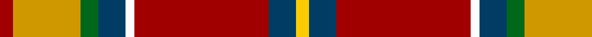
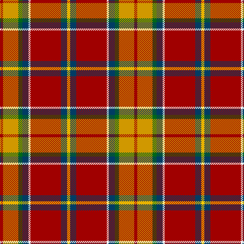

This page is one **sett** — a single exact thread-count. It belongs to the [tartan](/tartans/r3lo15g4dt6w2r30dt6ly3/)
(the same proportion at any scale), whose colour order is pattern [RYGBWRBY](/stripes/rygbwrby/).

Sourced from tartans-authority.  It is a [8 stripe tartan](/stripes/stripes8/).

Original link http://www.tartansauthority.com/tartan-ferret/display/10876/

## Thread count
DR/6 DY30 G8 DB12 W4 DR60 DB12 Y/6

## Palette

Palette: <strong>Tartan Register</strong> <small style="color:#888">(5 of 6 colours)</small>
<table><thead><tr><th>Colour</th><th>Threads</th><th>Shade</th><th>Base</th><th>OKLCh</th></tr></thead><tbody><tr><td>DR/</td><td style="text-align:right;font-variant-numeric:tabular-nums">6</td><td><code style="background-color:#A00000;">#A00000</code> <small style="color:#888">#A00000</small></td><td>R <code style="background-color:#CC0000;">#CC0000</code></td><td><small style="color:#888">oklch(44.3% 0.182 29.2)</small></td></tr><tr><td>DY</td><td style="text-align:right;font-variant-numeric:tabular-nums">30</td><td><code style="background-color:#D09800;">#D09800</code> <small style="color:#888">#D09800</small></td><td>Y <code style="background-color:#F2BF00;">#F2BF00</code></td><td><small style="color:#888">oklch(71.4% 0.147 82.1)</small></td></tr><tr><td>G</td><td style="text-align:right;font-variant-numeric:tabular-nums">8</td><td><code style="background-color:#006818;">#006818</code> <small style="color:#888">#006818</small></td><td>G <code style="background-color:#006100;">#006100</code></td><td><small style="color:#888">oklch(45.0% 0.142 145.0)</small></td></tr><tr><td>DB</td><td style="text-align:right;font-variant-numeric:tabular-nums">12</td><td><code style="background-color:#003C64;">#003C64</code> <small style="color:#888">#003C64</small></td><td>B <code style="background-color:#2A418A;">#2A418A</code></td><td><small style="color:#888">oklch(34.5% 0.089 246.0)</small></td></tr><tr><td>W</td><td style="text-align:right;font-variant-numeric:tabular-nums">4</td><td><code style="background-color:#FCFCFC;">#FCFCFC</code> <small style="color:#888">#FCFCFC</small></td><td>W <code style="background-color:#F7F7F7;">#F7F7F7</code></td><td><small style="color:#888">oklch(99.1% 0.000 89.9)</small></td></tr><tr><td>DR</td><td style="text-align:right;font-variant-numeric:tabular-nums">60</td><td><code style="background-color:#A00000;">#A00000</code> <small style="color:#888">#A00000</small></td><td>R <code style="background-color:#CC0000;">#CC0000</code></td><td><small style="color:#888">oklch(44.3% 0.182 29.2)</small></td></tr><tr><td>DB</td><td style="text-align:right;font-variant-numeric:tabular-nums">12</td><td><code style="background-color:#003C64;">#003C64</code> <small style="color:#888">#003C64</small></td><td>B <code style="background-color:#2A418A;">#2A418A</code></td><td><small style="color:#888">oklch(34.5% 0.089 246.0)</small></td></tr><tr><td>Y/</td><td style="text-align:right;font-variant-numeric:tabular-nums">6</td><td><code style="background-color:#FCCC00;">#FCCC00</code> <small style="color:#888">#FCCC00</small></td><td>Y <code style="background-color:#F2BF00;">#F2BF00</code></td><td><small style="color:#888">oklch(86.2% 0.176 91.5)</small></td></tr></tbody></table>

# Sample pattern

## Nearest tartans

The nearest existing variants by ΔTartan distance, with this tartan at the top so the swatches line up against it.

ΔTartan

Tartan

Sett

—

<a href="/ttd/edit/#slug=r3lo15g4dt6w2r30dt6ly3~x2">Round Table Sweden</a> <a class="nn-out" href="/setts/s8/r3lo15g4dt6w2r30dt6ly3~x2/" title="open its dictionary page">↗</a>

0.67

<a href="/ttd/edit/#slug=r3lo15g4t6w2r30t6ly3~x2">Round Table Sweden</a> <a class="nn-out" href="/setts/s8/r3lo15g4t6w2r30t6ly3~x2/" title="open its dictionary page">↗</a>

0.69

<a href="/ttd/edit/#slug=r30db12k3g12ly2g3w2~x2">Hewitt (Name)</a> <a class="nn-out" href="/setts/s7/r30db12k3g12ly2g3w2~x2/" title="open its dictionary page">↗</a>

0.71

<a href="/ttd/edit/#slug=t4g3t9dt14ly8dt2r35r2r3~x2">Hogeboom (Personal)</a> <a class="nn-out" href="/setts/s9/t4g3t9dt14ly8dt2r35r2r3~x2/" title="open its dictionary page">↗</a>

0.82

<a href="/ttd/edit/#slug=r30db12k6dg12ly2dg3w2~x2">Hewitt</a> <a class="nn-out" href="/setts/s7/r30db12k6dg12ly2dg3w2~x2/" title="open its dictionary page">↗</a>

0.84

<a href="/ttd/edit/#slug=r48b16lo5g17w8dy3~x2">Scottish American Soc. of Michigan</a> <a class="nn-out" href="/setts/s6/r48b16lo5g17w8dy3~x2/" title="open its dictionary page">↗</a>

0.93

<a href="/ttd/edit/#slug=r63w4k4dp18ly4dg50~x2">Gordon of Abergeldie (Portrait)</a> <a class="nn-out" href="/setts/s6/r63w4k4dp18ly4dg50~x2/" title="open its dictionary page">↗</a>

0.94

<a href="/ttd/edit/#slug=k2t6w1r14k1r14w1k6g10lo1g2lo2~x2">Ogg of Tarragann (Personal)</a> <a class="nn-out" href="/setts/s12/k2t6w1r14k1r14w1k6g10lo1g2lo2~x2/" title="open its dictionary page">↗</a>

1.02

<a href="/ttd/edit/#slug=r13y1k3ly1dg4r1k2y1w1~x4">Gillespie</a> <a class="nn-out" href="/setts/s9/r13y1k3ly1dg4r1k2y1w1~x4/" title="open its dictionary page">↗</a>

1.03

<a href="/ttd/edit/#slug=k2t6w1r14k1r14w1k6dg10lo1dg2lo2~x2">Ogg of Tarragann</a> <a class="nn-out" href="/setts/s12/k2t6w1r14k1r14w1k6dg10lo1dg2lo2~x2/" title="open its dictionary page">↗</a>

1.03

<a href="/ttd/edit/#slug=r48t16lo5dg17w8k3~x2">Scottish American Society of Michigan (Official)</a> <a class="nn-out" href="/setts/s6/r48t16lo5dg17w8k3~x2/" title="open its dictionary page">↗</a>

## Neighbour map

Every grey dot is one of 14299 variants placed by the first two principal components of the ΔTartan feature space (44% of its variance). Red is this tartan; blue dots are its nearest — click one to open its page.

<svg viewBox="0 0 640 380" role="img" style="max-width:100%;height:auto;border:1px solid #e0e0e0;border-radius:4px;display:block" xmlns="http://www.w3.org/2000/svg"><image href="/nn/cloud.v1.png" width="640" height="380"/><a href="/setts/s8/r3lo15g4t6w2r30t6ly3~x2/"><circle cx="216.9" cy="115.1" r="4" fill="#3465a4"><title>Round Table Sweden</title></circle></a><a href="/setts/s7/r30db12k3g12ly2g3w2~x2/"><circle cx="231.0" cy="129.6" r="4" fill="#3465a4"><title>Hewitt (Name)</title></circle></a><a href="/setts/s9/t4g3t9dt14ly8dt2r35r2r3~x2/"><circle cx="236.6" cy="104.0" r="4" fill="#3465a4"><title>Hogeboom (Personal)</title></circle></a><a href="/setts/s7/r30db12k6dg12ly2dg3w2~x2/"><circle cx="207.8" cy="131.2" r="4" fill="#3465a4"><title>Hewitt</title></circle></a><a href="/setts/s6/r48b16lo5g17w8dy3~x2/"><circle cx="243.6" cy="140.3" r="4" fill="#3465a4"><title>Scottish American Soc. of Michigan</title></circle></a><a href="/setts/s6/r63w4k4dp18ly4dg50~x2/"><circle cx="242.5" cy="141.0" r="4" fill="#3465a4"><title>Gordon of Abergeldie (Portrait)</title></circle></a><a href="/setts/s12/k2t6w1r14k1r14w1k6g10lo1g2lo2~x2/"><circle cx="203.3" cy="112.6" r="4" fill="#3465a4"><title>Ogg of Tarragann (Personal)</title></circle></a><a href="/setts/s9/r13y1k3ly1dg4r1k2y1w1~x4/"><circle cx="247.7" cy="104.9" r="4" fill="#3465a4"><title>Gillespie</title></circle></a><a href="/setts/s12/k2t6w1r14k1r14w1k6dg10lo1dg2lo2~x2/"><circle cx="201.9" cy="113.0" r="4" fill="#3465a4"><title>Ogg of Tarragann</title></circle></a><a href="/setts/s6/r48t16lo5dg17w8k3~x2/"><circle cx="232.2" cy="134.7" r="4" fill="#3465a4"><title>Scottish American Society of Michigan (Official)</title></circle></a><circle cx="230.2" cy="120.1" r="5" fill="#c00000"/></svg>

ID: /setts/s8/r3lo15g4dt6w2r30dt6ly3~x2/
