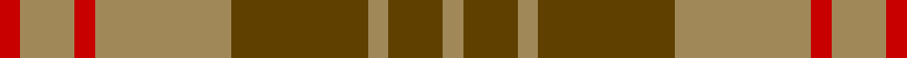
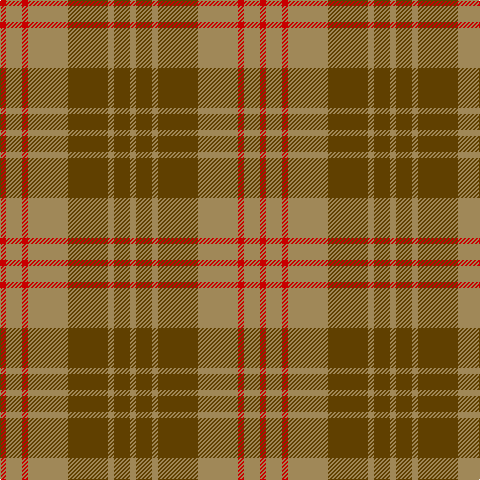

In pattern [RYRYGYGY](/stripes/ryrygygy/).

This was sourced from register-of-tartans.  It is a [8 stripe tartan](/stripes/stripes8/).

Original link https://www.tartanregister.gov.uk/tartanDetails.aspx?ref=2970

## Attestations

This cloth appears in 2 source records; the oldest owns this page.

- 01/01/1998 — Miyuki #4 (register-of-tartans, [record](https://www.tartanregister.gov.uk/tartanDetails.aspx?ref=2970))
- 1998 — Miyuki #4 (Fashion) (tartans-authority, [record](http://www.tartansauthority.com/tartan-ferret/display/2605/))

## Register references

External register numbers recorded for this tartan.

- Scottish Register of Tartans: [2970](https://www.tartanregister.gov.uk/tartanDetails.aspx?ref=2970)
- Scottish Tartans Authority (ITI): 2605
- Scottish Tartans World Register: 2605

## Thread count
R/6 LT16 R6 LT40 T40 LT6 T16 LT/6

## Palette
Each colour and the base-6 reference it is a variant of.

| Colour | Shade | Base |
|---|---|---|
| LT | <code style="background-color:#A08858;">#A08858</code> `oklch(63.7% 0.071 84.0)` <small>#A08858</small> | Y <code style="background-color:#F2BF00;">#F2BF00</code> |
| R | <code style="background-color:#C80000;">#C80000</code> `oklch(52.3% 0.215 29.2)` <small>#C80000</small> | R <code style="background-color:#CC0000;">#CC0000</code> |
| T | <code style="background-color:#604000;">#604000</code> `oklch(39.8% 0.083 76.8)` <small>#604000</small> | G <code style="background-color:#006100;">#006100</code> |

# Sample pattern

## Nearest tartans

The nearest existing variants by ΔTartan distance.

1. [Burnett of Powis (Personal)](/setts/s8/r3y19ly3y19r3y3r21t3~x2/) — ΔT 1.18
1. [Crossnor School](/setts/s7/dg4r2dg13lb2r13dg2r4~x2/) — ΔT 1.28
1. [Hubbard (2016)](/setts/s9/dt5r19dt2y8r3y18dt2y9dt2~x2/) — ΔT 1.47
1. [Lister (Name)](/setts/s7/dy8o29dy8ly3dy8o8ly3~x2/) — ΔT 1.49
1. [Prince David #1 (Royal)](/setts/s7/dy3lo2dy18lo21lo2dy3lo2~x2/) — ΔT 1.51
1. [Daks-Simpson (Muted Skye)](/setts/s8/db5o15dy4o4dy24o4dy4db5/) — ΔT 1.54
1. [Glen Esk (1993)](/setts/s7/dg2r1dg8r5y5r1y2~x4/) — ΔT 1.55
1. [Scottish Piping Soc. of London (Corp](/setts/s7/r30y3db5y21r3y21db2~x2/) — ΔT 1.65
1. [Dewar](/setts/s10/dy1r7dy4g7dy1g1~x4/) — ΔT 1.66
1. [Chindecella Gorse (Kemete Heil)](/setts/s8/o9do4o4do4o24dy19do19dy4~x2/) — ΔT 1.68

## Neighbour map

Every grey dot is one of 14299 variants placed by the first two principal components of the ΔTartan feature space (44% of its variance). Red is this tartan; blue dots are its nearest — click one to open its page.

<svg viewBox="0 0 640 380" role="img" style="max-width:100%;height:auto;border:1px solid #e0e0e0;border-radius:4px;display:block" xmlns="http://www.w3.org/2000/svg"><image href="/nn/cloud.v1.png" width="640" height="380"/><a href="/setts/s8/r3y19ly3y19r3y3r21t3~x2/"><circle cx="352.2" cy="225.5" r="4" fill="#3465a4"><title>Burnett of Powis (Personal)</title></circle></a><a href="/setts/s7/dg4r2dg13lb2r13dg2r4~x2/"><circle cx="327.1" cy="250.2" r="4" fill="#3465a4"><title>Crossnor School</title></circle></a><a href="/setts/s9/dt5r19dt2y8r3y18dt2y9dt2~x2/"><circle cx="317.4" cy="212.5" r="4" fill="#3465a4"><title>Hubbard (2016)</title></circle></a><a href="/setts/s7/dy8o29dy8ly3dy8o8ly3~x2/"><circle cx="362.0" cy="233.6" r="4" fill="#3465a4"><title>Lister (Name)</title></circle></a><a href="/setts/s7/dy3lo2dy18lo21lo2dy3lo2~x2/"><circle cx="363.9" cy="212.4" r="4" fill="#3465a4"><title>Prince David #1 (Royal)</title></circle></a><a href="/setts/s8/db5o15dy4o4dy24o4dy4db5/"><circle cx="315.5" cy="253.8" r="4" fill="#3465a4"><title>Daks-Simpson (Muted Skye)</title></circle></a><a href="/setts/s7/dg2r1dg8r5y5r1y2~x4/"><circle cx="271.1" cy="257.8" r="4" fill="#3465a4"><title>Glen Esk (1993)</title></circle></a><a href="/setts/s7/r30y3db5y21r3y21db2~x2/"><circle cx="390.2" cy="219.0" r="4" fill="#3465a4"><title>Scottish Piping Soc. of London (Corp</title></circle></a><a href="/setts/s10/dy1r7dy4g7dy1g1~x4/"><circle cx="252.8" cy="254.3" r="4" fill="#3465a4"><title>Dewar</title></circle></a><a href="/setts/s8/o9do4o4do4o24dy19do19dy4~x2/"><circle cx="281.3" cy="273.8" r="4" fill="#3465a4"><title>Chindecella Gorse (Kemete Heil)</title></circle></a><circle cx="350.9" cy="255.8" r="5" fill="#c00000"/></svg>

ID: /setts/s8/r3lo8r3lo20dy20lo3dy8lo3~x2/
