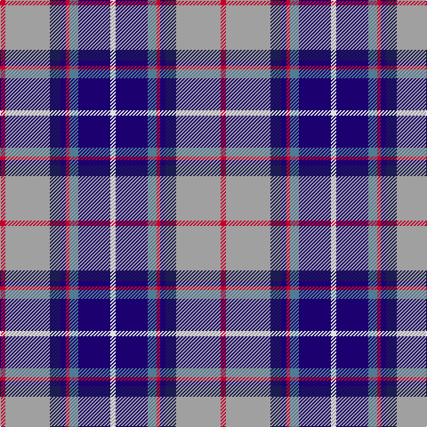

This page is one **sett** — a single exact thread-count. It belongs to the [tartan](/tartans/r3lr25dbi6db3r2t5db18w3/)
(the same proportion at any scale), whose colour order is pattern [RYBBRBBW](/stripes/rybbrbbw/).

Sourced from register-of-tartans.  It is a [8 stripe tartan](/stripes/stripes8/).

Original link https://www.tartanregister.gov.uk/tartanDetails.aspx?ref=1287

2 attestations — the source records this cloth was collapsed from (oldest owns this page)

<ul>
<li>01/01/2006 — Fulbright Foundation (register-of-tartans, <a href="https://www.tartanregister.gov.uk/tartanDetails.aspx?ref=1287">record</a>)</li>
<li>pre 2006 — Fulbright Foundation (Corporate) (tartans-authority, <a href="http://www.tartansauthority.com/tartan-ferret/display/7031/">record</a>)</li>
</ul>

## Register references

External register numbers recorded for this tartan.

- Scottish Register of Tartans: [1287](https://www.tartanregister.gov.uk/tartanDetails.aspx?ref=1287)
- Scottish Tartans Authority (ITI): 7031

## Thread count
R/6 N50 DB12 DBa6 R4 B10 DBa36 LN/6

## Palette

Palette: <strong>Tartan Register</strong> <small style="color:#888">(5 of 6 colours)</small>
<table><thead><tr><th>Colour</th><th>Threads</th><th>Shade</th><th>Base</th><th>OKLCh</th></tr></thead><tbody><tr><td>R/</td><td style="text-align:right;font-variant-numeric:tabular-nums">6</td><td><code style="background-color:#C8002C;">#C8002C</code> <small style="color:#888">#C8002C</small></td><td>R <code style="background-color:#CC0000;">#CC0000</code></td><td><small style="color:#888">oklch(52.6% 0.212 22.0)</small></td></tr><tr><td>N</td><td style="text-align:right;font-variant-numeric:tabular-nums">50</td><td><code style="background-color:#A0A0A0;">#A0A0A0</code> <small style="color:#888">#A0A0A0</small></td><td>Y <code style="background-color:#F2BF00;">#F2BF00</code></td><td><small style="color:#888">oklch(70.6% 0.000 89.9)</small></td></tr><tr><td>DB</td><td style="text-align:right;font-variant-numeric:tabular-nums">12</td><td><code style="background-color:#1C1C50;">#1C1C50</code> <small style="color:#888">#1C1C50</small></td><td>B <code style="background-color:#2A418A;">#2A418A</code></td><td><small style="color:#888">oklch(26.2% 0.093 277.9)</small></td></tr><tr><td>DBa</td><td style="text-align:right;font-variant-numeric:tabular-nums">6</td><td><code style="background-color:#1C0070;">#1C0070</code> <small style="color:#888">#1C0070</small></td><td>B <code style="background-color:#2A418A;">#2A418A</code></td><td><small style="color:#888">oklch(26.3% 0.162 277.1)</small></td></tr><tr><td>R</td><td style="text-align:right;font-variant-numeric:tabular-nums">4</td><td><code style="background-color:#C8002C;">#C8002C</code> <small style="color:#888">#C8002C</small></td><td>R <code style="background-color:#CC0000;">#CC0000</code></td><td><small style="color:#888">oklch(52.6% 0.212 22.0)</small></td></tr><tr><td>B</td><td style="text-align:right;font-variant-numeric:tabular-nums">10</td><td><code style="background-color:#507C94;">#507C94</code> <small style="color:#888">#507C94</small></td><td>B <code style="background-color:#2A418A;">#2A418A</code></td><td><small style="color:#888">oklch(56.4% 0.061 233.2)</small></td></tr><tr><td>DBa</td><td style="text-align:right;font-variant-numeric:tabular-nums">36</td><td><code style="background-color:#1C0070;">#1C0070</code> <small style="color:#888">#1C0070</small></td><td>B <code style="background-color:#2A418A;">#2A418A</code></td><td><small style="color:#888">oklch(26.3% 0.162 277.1)</small></td></tr><tr><td>LN/</td><td style="text-align:right;font-variant-numeric:tabular-nums">6</td><td><code style="background-color:#E0E0E0;">#E0E0E0</code> <small style="color:#888">#E0E0E0</small></td><td>W <code style="background-color:#F7F7F7;">#F7F7F7</code></td><td><small style="color:#888">oklch(90.7% 0.000 89.9)</small></td></tr></tbody></table>

# Sample pattern

## Nearest tartans

The nearest existing variants by ΔTartan distance, with this tartan at the top so the swatches line up against it.

ΔTartan

Tartan

Sett

—

<a href="/ttd/edit/#slug=r3lr25dbi6db3r2t5db18w3~x2">Fulbright Foundation</a> <a class="nn-out" href="/setts/s8/r3lr25dbi6db3r2t5db18w3~x2/" title="open its dictionary page">↗</a>

0.67

<a href="/ttd/edit/#slug=g5m2g2m9k9lr9db30w5~x2">Alexander of Menstry</a> <a class="nn-out" href="/setts/s8/g5m2g2m9k9lr9db30w5~x2/" title="open its dictionary page">↗</a>

0.71

<a href="/ttd/edit/#slug=db28r3w3r3w3r3db14k12t38ly8">GYL (Personal)</a> <a class="nn-out" href="/setts/s10/db28r3w3r3w3r3db14k12t38ly8/" title="open its dictionary page">↗</a>

0.84

<a href="/ttd/edit/#slug=db4ly3db22r6w2k6w2db6o20k3o4~x2">Asman Hunting (Name)</a> <a class="nn-out" href="/setts/s11/db4ly3db22r6w2k6w2db6o20k3o4~x2/" title="open its dictionary page">↗</a>

0.87

<a href="/ttd/edit/#slug=db4w3db17lb10k1dp5k1lb6dg3~x2">Queen Margaret University</a> <a class="nn-out" href="/setts/s9/db4w3db17lb10k1dp5k1lb6dg3~x2/" title="open its dictionary page">↗</a>

0.93

<a href="/ttd/edit/#slug=db16w6r8db3ly1g1t3db1g9~x2">Ohio District Tartan Tartan Number: 651. Earliest known date: 1984 Design is based on the colours of Ohio's flag and state seal. The widths of the stripes in each colour are based on the date Ohio was admitted to the Union. The tartan first went on display at the Ohio Scottish Games in June 1983. See products available Copyright © Blair Urquhart, Comrie, 2015</a> <a class="nn-out" href="/setts/s9/db16w6r8db3ly1g1t3db1g9~x2/" title="open its dictionary page">↗</a>

0.93

<a href="/ttd/edit/#slug=db46ly4db4ly4db6k16o66w11r6">Scottish Association for N.S. (Corp)</a> <a class="nn-out" href="/setts/s9/db46ly4db4ly4db6k16o66w11r6/" title="open its dictionary page">↗</a>

0.94

<a href="/ttd/edit/#slug=k16w6k4b64m19k8g42ly6">Unidentified (Woven sample)</a> <a class="nn-out" href="/setts/s8/k16w6k4b64m19k8g42ly6/" title="open its dictionary page">↗</a>

0.97

<a href="/ttd/edit/#slug=db16w6r8db3lo1g1lg3db1g10~x4">Ogilvie of Inverquharity or Ohio</a> <a class="nn-out" href="/setts/s9/db16w6r8db3lo1g1lg3db1g10~x4/" title="open its dictionary page">↗</a>

1.01

<a href="/ttd/edit/#slug=lo4r2b32k10dp4lb21dp2~x2">Dignan School of Dancing</a> <a class="nn-out" href="/setts/s7/lo4r2b32k10dp4lb21dp2~x2/" title="open its dictionary page">↗</a>

1.05

<a href="/ttd/edit/#slug=db1w2t12k2db2k2dp15db2ly1~x2">Hek (Name)</a> <a class="nn-out" href="/setts/s9/db1w2t12k2db2k2dp15db2ly1~x2/" title="open its dictionary page">↗</a>

## Neighbour map

Every grey dot is one of 14359 variants placed by the first two principal components of the ΔTartan feature space (44% of its variance). Red is this tartan; blue dots are its nearest — click one to open its page.

<svg viewBox="0 0 640 380" role="img" style="max-width:100%;height:auto;border:1px solid #e0e0e0;border-radius:4px;display:block" xmlns="http://www.w3.org/2000/svg"><image href="/nn/cloud.v1.png" width="640" height="380"/><a href="/setts/s8/g5m2g2m9k9lr9db30w5~x2/"><circle cx="163.7" cy="135.9" r="4" fill="#3465a4"><title>Alexander of Menstry</title></circle></a><a href="/setts/s10/db28r3w3r3w3r3db14k12t38ly8/"><circle cx="144.0" cy="128.6" r="4" fill="#3465a4"><title>GYL (Personal)</title></circle></a><a href="/setts/s11/db4ly3db22r6w2k6w2db6o20k3o4~x2/"><circle cx="156.4" cy="131.4" r="4" fill="#3465a4"><title>Asman Hunting (Name)</title></circle></a><a href="/setts/s9/db4w3db17lb10k1dp5k1lb6dg3~x2/"><circle cx="169.2" cy="128.3" r="4" fill="#3465a4"><title>Queen Margaret University</title></circle></a><a href="/setts/s9/db16w6r8db3ly1g1t3db1g9~x2/"><circle cx="160.4" cy="129.3" r="4" fill="#3465a4"><title>Ohio District Tartan Tartan Number: 651. Earliest known date: 1984 Design is based on the colours of Ohio's flag and state seal. The widths of the stripes in each colour are based on the date Ohio was admitted to the Union. The tartan first went on display at the Ohio Scottish Games in June 1983. See products available Copyright © Blair Urquhart, Comrie, 2015</title></circle></a><a href="/setts/s9/db46ly4db4ly4db6k16o66w11r6/"><circle cx="194.0" cy="111.7" r="4" fill="#3465a4"><title>Scottish Association for N.S. (Corp)</title></circle></a><a href="/setts/s8/k16w6k4b64m19k8g42ly6/"><circle cx="161.5" cy="136.4" r="4" fill="#3465a4"><title>Unidentified (Woven sample)</title></circle></a><a href="/setts/s9/db16w6r8db3lo1g1lg3db1g10~x4/"><circle cx="147.6" cy="126.4" r="4" fill="#3465a4"><title>Ogilvie of Inverquharity or Ohio</title></circle></a><a href="/setts/s7/lo4r2b32k10dp4lb21dp2~x2/"><circle cx="177.7" cy="129.3" r="4" fill="#3465a4"><title>Dignan School of Dancing</title></circle></a><a href="/setts/s9/db1w2t12k2db2k2dp15db2ly1~x2/"><circle cx="186.2" cy="118.4" r="4" fill="#3465a4"><title>Hek (Name)</title></circle></a><circle cx="152.7" cy="134.4" r="5" fill="#c00000"/></svg>

ID: /setts/s8/r3lr25dbi6db3r2t5db18w3~x2/
