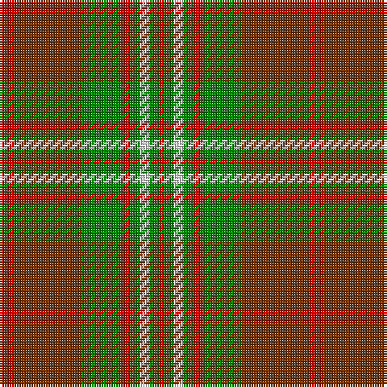

This page is one **sett** — a single exact thread-count. It belongs to the [tartan](/tartans/r3o14g8r2g2w2g2r1/)
(the same proportion at any scale), whose colour order is pattern [RGWGRGRR](/stripes/rgwgrgrr/).

Sourced from weddslist.  It is a [8 stripe tartan](/stripes/stripes8/).

Original link http://www.weddslist.com/cgi-bin/tartans/pg.pl?source=sts

## Thread count
R/6 T28 G16 R4 G4 LN4 G4 R/2

## Palette

Palette: <strong>Tartan Dictionary</strong> <small style="color:#888">(1 of 4 colours)</small>
<table><thead><tr><th>Colour</th><th>Threads</th><th>Shade</th><th>Base</th><th>OKLCh</th></tr></thead><tbody><tr><td>R/</td><td style="text-align:right;font-variant-numeric:tabular-nums">6</td><td><code style="background-color:#C00000;">#C00000</code> <small style="color:#888">#C00000</small></td><td>R <code style="background-color:#CC0000;">#CC0000</code></td><td><small style="color:#888">oklch(50.7% 0.208 29.2)</small></td></tr><tr><td>T</td><td style="text-align:right;font-variant-numeric:tabular-nums">28</td><td><code style="background-color:#703000;">#703000</code> <small style="color:#888">#703000</small></td><td>R <code style="background-color:#CC0000;">#CC0000</code></td><td><small style="color:#888">oklch(39.1% 0.105 49.1)</small></td></tr><tr><td>G</td><td style="text-align:right;font-variant-numeric:tabular-nums">16</td><td><code style="background-color:#008000;">#008000</code> <small style="color:#888">#008000</small></td><td>G <code style="background-color:#006100;">#006100</code></td><td><small style="color:#888">oklch(52.0% 0.177 142.5)</small></td></tr><tr><td>R</td><td style="text-align:right;font-variant-numeric:tabular-nums">4</td><td><code style="background-color:#C00000;">#C00000</code> <small style="color:#888">#C00000</small></td><td>R <code style="background-color:#CC0000;">#CC0000</code></td><td><small style="color:#888">oklch(50.7% 0.208 29.2)</small></td></tr><tr><td>G</td><td style="text-align:right;font-variant-numeric:tabular-nums">4</td><td><code style="background-color:#008000;">#008000</code> <small style="color:#888">#008000</small></td><td>G <code style="background-color:#006100;">#006100</code></td><td><small style="color:#888">oklch(52.0% 0.177 142.5)</small></td></tr><tr><td>LN</td><td style="text-align:right;font-variant-numeric:tabular-nums">4</td><td><code style="background-color:#E0E0E0;">#E0E0E0</code> <small style="color:#888">#E0E0E0</small></td><td>W <code style="background-color:#F7F7F7;">#F7F7F7</code></td><td><small style="color:#888">oklch(90.7% 0.000 89.9)</small></td></tr><tr><td>G</td><td style="text-align:right;font-variant-numeric:tabular-nums">4</td><td><code style="background-color:#008000;">#008000</code> <small style="color:#888">#008000</small></td><td>G <code style="background-color:#006100;">#006100</code></td><td><small style="color:#888">oklch(52.0% 0.177 142.5)</small></td></tr><tr><td>R/</td><td style="text-align:right;font-variant-numeric:tabular-nums">2</td><td><code style="background-color:#C00000;">#C00000</code> <small style="color:#888">#C00000</small></td><td>R <code style="background-color:#CC0000;">#CC0000</code></td><td><small style="color:#888">oklch(50.7% 0.208 29.2)</small></td></tr></tbody></table>

# Sample pattern

## Nearest tartans

The nearest existing variants by ΔTartan distance, with this tartan at the top so the swatches line up against it.

ΔTartan

Tartan

Sett

—

<a href="/ttd/edit/#slug=r3o14g8r2g2w2g2r1~x2">Scott, hunting</a> <a class="nn-out" href="/setts/s8/r3o14g8r2g2w2g2r1~x2/" title="open its dictionary page">↗</a>

0.91

<a href="/ttd/edit/#slug=r30db3r2db3r6db14gi26g6">Cranston, dress</a> <a class="nn-out" href="/setts/s8/r30db3r2db3r6db14gi26g6/" title="open its dictionary page">↗</a>

0.99

<a href="/ttd/edit/#slug=g12t6g6r15k1r1k2~x4">McCook/Cook (Name)</a> <a class="nn-out" href="/setts/s7/g12t6g6r15k1r1k2~x4/" title="open its dictionary page">↗</a>

1.00

<a href="/ttd/edit/#slug=r2ri1r10ri2g10w1g2~x2">Lennox</a> <a class="nn-out" href="/setts/s7/r2ri1r10ri2g10w1g2~x2/" title="open its dictionary page">↗</a>

1.03

<a href="/ttd/edit/#slug=r16k3r16g44k3g8k3ly20k4~x2">MacMillan Society of Glasgow</a> <a class="nn-out" href="/setts/s9/r16k3r16g44k3g8k3ly20k4~x2/" title="open its dictionary page">↗</a>

1.08

<a href="/ttd/edit/#slug=r10g44o5dg40o62r5o10">Ballintrae</a> <a class="nn-out" href="/setts/s7/r10g44o5dg40o62r5o10/" title="open its dictionary page">↗</a>

1.09

<a href="/ttd/edit/#slug=r5k2dg1k2r5k2dg18lo3~x2">Midpac Tissue (non woven)</a> <a class="nn-out" href="/setts/s8/r5k2dg1k2r5k2dg18lo3~x2/" title="open its dictionary page">↗</a>

1.10

<a href="/ttd/edit/#slug=db1r5g18r4db9r10w1~x4">MacKintosh, Geddes</a> <a class="nn-out" href="/setts/s7/db1r5g18r4db9r10w1~x4/" title="open its dictionary page">↗</a>

1.10

<a href="/ttd/edit/#slug=r2ri1r10ri2g10lr1g2~x4">Lennox</a> <a class="nn-out" href="/setts/s7/r2ri1r10ri2g10lr1g2~x4/" title="open its dictionary page">↗</a>

1.11

<a href="/ttd/edit/#slug=r4t3r32db30r4g32r3g32r3g3~x2">Unidentified Plaid 6</a> <a class="nn-out" href="/setts/s10/r4t3r32db30r4g32r3g32r3g3~x2/" title="open its dictionary page">↗</a>

1.11

<a href="/ttd/edit/#slug=r3dr14g8r2g2w2g2r1~x2">Scott Hunting Clan Tartan Tartan Number: 1546. Earliest known date: 1906 Also known as Green Scott, this tartan is generally available today. The Chief of the Scotts is His Grace the 9th Duke of Buccleuch and 10th of Queensberry who lives in Selkirk in the borders region of Scotland. See products available Copyright © Blair Urquhart, Comrie, 2015</a> <a class="nn-out" href="/setts/s8/r3dr14g8r2g2w2g2r1~x2/" title="open its dictionary page">↗</a>

## Neighbour map

Every grey dot is one of 14359 variants placed by the first two principal components of the ΔTartan feature space (44% of its variance). Red is this tartan; blue dots are its nearest — click one to open its page.

<svg viewBox="0 0 640 380" role="img" style="max-width:100%;height:auto;border:1px solid #e0e0e0;border-radius:4px;display:block" xmlns="http://www.w3.org/2000/svg"><image href="/nn/cloud.v1.png" width="640" height="380"/><a href="/setts/s8/r30db3r2db3r6db14gi26g6/"><circle cx="242.0" cy="170.7" r="4" fill="#3465a4"><title>Cranston, dress</title></circle></a><a href="/setts/s7/g12t6g6r15k1r1k2~x4/"><circle cx="248.7" cy="189.5" r="4" fill="#3465a4"><title>McCook/Cook (Name)</title></circle></a><a href="/setts/s7/r2ri1r10ri2g10w1g2~x2/"><circle cx="269.2" cy="192.0" r="4" fill="#3465a4"><title>Lennox</title></circle></a><a href="/setts/s9/r16k3r16g44k3g8k3ly20k4~x2/"><circle cx="236.8" cy="160.4" r="4" fill="#3465a4"><title>MacMillan Society of Glasgow</title></circle></a><a href="/setts/s7/r10g44o5dg40o62r5o10/"><circle cx="253.9" cy="207.8" r="4" fill="#3465a4"><title>Ballintrae</title></circle></a><a href="/setts/s8/r5k2dg1k2r5k2dg18lo3~x2/"><circle cx="308.5" cy="164.4" r="4" fill="#3465a4"><title>Midpac Tissue (non woven)</title></circle></a><a href="/setts/s7/db1r5g18r4db9r10w1~x4/"><circle cx="248.6" cy="182.9" r="4" fill="#3465a4"><title>MacKintosh, Geddes</title></circle></a><a href="/setts/s7/r2ri1r10ri2g10lr1g2~x4/"><circle cx="284.3" cy="198.8" r="4" fill="#3465a4"><title>Lennox</title></circle></a><a href="/setts/s10/r4t3r32db30r4g32r3g32r3g3~x2/"><circle cx="260.7" cy="183.7" r="4" fill="#3465a4"><title>Unidentified Plaid 6</title></circle></a><a href="/setts/s8/r3dr14g8r2g2w2g2r1~x2/"><circle cx="245.5" cy="171.8" r="4" fill="#3465a4"><title>Scott Hunting Clan Tartan Tartan Number: 1546. Earliest known date: 1906 Also known as Green Scott, this tartan is generally available today. The Chief of the Scotts is His Grace the 9th Duke of Buccleuch and 10th of Queensberry who lives in Selkirk in the borders region of Scotland. See products available Copyright © Blair Urquhart, Comrie, 2015</title></circle></a><circle cx="261.6" cy="179.0" r="5" fill="#c00000"/></svg>

ID: /setts/s8/r3o14g8r2g2w2g2r1~x2/
