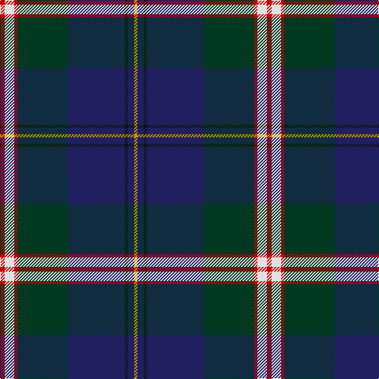

This page is one **sett** — a single exact thread-count. It belongs to the [tartan](/tartans/r3w6r2dg32db36k2db4lo2/)
(the same proportion at any scale), whose colour order is pattern [RWRGBKBY](/stripes/rwrgbkby/).

Sourced from register-of-tartans.  It is a [8 stripe tartan](/stripes/stripes8/).

Original link https://www.tartanregister.gov.uk/tartanDetails.aspx?ref=543

2 attestations — the source records this cloth was collapsed from (oldest owns this page)

<ul>
<li>01/01/1966 — Canadian Centennial (register-of-tartans, <a href="https://www.tartanregister.gov.uk/tartanDetails.aspx?ref=543">record</a>)</li>
<li>1966 — Canadian Centennial (Commemorative) (tartans-authority, <a href="http://www.tartansauthority.com/tartan-ferret/display/1704/">record</a>)</li>
</ul>

## Register references

External register numbers recorded for this tartan.

- Scottish Register of Tartans: [543](https://www.tartanregister.gov.uk/tartanDetails.aspx?ref=543)
- Scottish Tartans Authority (ITI): 1704
- Scottish Tartans World Register: 1704

## Thread count
R/6 LN12 R4 DG64 DB72 K4 DB8 DY/4

## Palette

Palette: <strong>Tartan Register</strong> <small style="color:#888">(5 of 6 colours)</small>
<table><thead><tr><th>Colour</th><th>Threads</th><th>Shade</th><th>Base</th><th>OKLCh</th></tr></thead><tbody><tr><td>R/</td><td style="text-align:right;font-variant-numeric:tabular-nums">6</td><td><code style="background-color:#C80000;">#C80000</code> <small style="color:#888">#C80000</small></td><td>R <code style="background-color:#CC0000;">#CC0000</code></td><td><small style="color:#888">oklch(52.3% 0.215 29.2)</small></td></tr><tr><td>LN</td><td style="text-align:right;font-variant-numeric:tabular-nums">12</td><td><code style="background-color:#E0E0E0;">#E0E0E0</code> <small style="color:#888">#E0E0E0</small></td><td>W <code style="background-color:#F7F7F7;">#F7F7F7</code></td><td><small style="color:#888">oklch(90.7% 0.000 89.9)</small></td></tr><tr><td>R</td><td style="text-align:right;font-variant-numeric:tabular-nums">4</td><td><code style="background-color:#C80000;">#C80000</code> <small style="color:#888">#C80000</small></td><td>R <code style="background-color:#CC0000;">#CC0000</code></td><td><small style="color:#888">oklch(52.3% 0.215 29.2)</small></td></tr><tr><td>DG</td><td style="text-align:right;font-variant-numeric:tabular-nums">64</td><td><code style="background-color:#003820;">#003820</code> <small style="color:#888">#003820</small></td><td>G <code style="background-color:#006100;">#006100</code></td><td><small style="color:#888">oklch(30.0% 0.070 158.3)</small></td></tr><tr><td>DB</td><td style="text-align:right;font-variant-numeric:tabular-nums">72</td><td><code style="background-color:#202060;">#202060</code> <small style="color:#888">#202060</small></td><td>B <code style="background-color:#2A418A;">#2A418A</code></td><td><small style="color:#888">oklch(28.9% 0.111 276.9)</small></td></tr><tr><td>K</td><td style="text-align:right;font-variant-numeric:tabular-nums">4</td><td><code style="background-color:#101010;">#101010</code> <small style="color:#888">#101010</small></td><td>K <code style="background-color:#000000;">#000000</code></td><td><small style="color:#888">oklch(17.3% 0.000 89.9)</small></td></tr><tr><td>DB</td><td style="text-align:right;font-variant-numeric:tabular-nums">8</td><td><code style="background-color:#202060;">#202060</code> <small style="color:#888">#202060</small></td><td>B <code style="background-color:#2A418A;">#2A418A</code></td><td><small style="color:#888">oklch(28.9% 0.111 276.9)</small></td></tr><tr><td>DY/</td><td style="text-align:right;font-variant-numeric:tabular-nums">4</td><td><code style="background-color:#D09800;">#D09800</code> <small style="color:#888">#D09800</small></td><td>Y <code style="background-color:#F2BF00;">#F2BF00</code></td><td><small style="color:#888">oklch(71.4% 0.147 82.1)</small></td></tr></tbody></table>

# Sample pattern

## Nearest tartans

The nearest existing variants by ΔTartan distance, with this tartan at the top so the swatches line up against it.

ΔTartan

Tartan

Sett

—

<a href="/ttd/edit/#slug=r3w6r2dg32db36k2db4lo2~x2">Canadian Centennial</a> <a class="nn-out" href="/setts/s8/r3w6r2dg32db36k2db4lo2~x2/" title="open its dictionary page">↗</a>

0.76

<a href="/ttd/edit/#slug=lo2dg20db8dp3db2dp2db16w1lg2~x2">Scotland’s Golf Coast</a> <a class="nn-out" href="/setts/s9/lo2dg20db8dp3db2dp2db16w1lg2~x2/" title="open its dictionary page">↗</a>

0.85

<a href="/ttd/edit/#slug=db60lo3db5lo5db9do20lo4g32lb4~x2">State Seal of Ohio (Fashion)</a> <a class="nn-out" href="/setts/s9/db60lo3db5lo5db9do20lo4g32lb4~x2/" title="open its dictionary page">↗</a>

0.92

<a href="/ttd/edit/#slug=w2db20dg2dg2dg2dg5dg8ly2r1~x2">Unidentified (ex Tony Murray)</a> <a class="nn-out" href="/setts/s9/w2db20dg2dg2dg2dg5dg8ly2r1~x2/" title="open its dictionary page">↗</a>

0.92

<a href="/ttd/edit/#slug=db38w2db2k10g2ly2g22k3r3k3r3~x2">Hunnisett/Edinchip (Name)</a> <a class="nn-out" href="/setts/s11/db38w2db2k10g2ly2g22k3r3k3r3~x2/" title="open its dictionary page">↗</a>

0.93

<a href="/ttd/edit/#slug=m5y2k30y26y2y2k4~x2">Milne-Murtagh (2009)</a> <a class="nn-out" href="/setts/s7/m5y2k30y26y2y2k4~x2/" title="open its dictionary page">↗</a>

0.93

<a href="/ttd/edit/#slug=db46ly4db4ly4db6k16n66lb11r6">Scottish Association for Neurological Sciences</a> <a class="nn-out" href="/setts/s9/db46ly4db4ly4db6k16n66lb11r6/" title="open its dictionary page">↗</a>

0.96

<a href="/ttd/edit/#slug=r3w2g5k35db40ly3~x2">Italian National</a> <a class="nn-out" href="/setts/s6/r3w2g5k35db40ly3~x2/" title="open its dictionary page">↗</a>

0.96

<a href="/ttd/edit/#slug=k4lo2k34db10lr4db4dp4db23w3~x2">Heirloom Dark Alba (Fashion)</a> <a class="nn-out" href="/setts/s9/k4lo2k34db10lr4db4dp4db23w3~x2/" title="open its dictionary page">↗</a>

0.97

<a href="/ttd/edit/#slug=w4dt54k53dp4b8lo4">Pipers' Trail, The</a> <a class="nn-out" href="/setts/s6/w4dt54k53dp4b8lo4/" title="open its dictionary page">↗</a>

0.99

<a href="/ttd/edit/#slug=r5t2k30n26ly2n2db4~x2">Milne-Murtaugh (Personal)</a> <a class="nn-out" href="/setts/s7/r5t2k30n26ly2n2db4~x2/" title="open its dictionary page">↗</a>

## Neighbour map

Every grey dot is one of 14299 variants placed by the first two principal components of the ΔTartan feature space (44% of its variance). Red is this tartan; blue dots are its nearest — click one to open its page.

<svg viewBox="0 0 640 380" role="img" style="max-width:100%;height:auto;border:1px solid #e0e0e0;border-radius:4px;display:block" xmlns="http://www.w3.org/2000/svg"><image href="/nn/cloud.v1.png" width="640" height="380"/><a href="/setts/s9/lo2dg20db8dp3db2dp2db16w1lg2~x2/"><circle cx="258.8" cy="135.7" r="4" fill="#3465a4"><title>Scotland’s Golf Coast</title></circle></a><a href="/setts/s9/db60lo3db5lo5db9do20lo4g32lb4~x2/"><circle cx="286.0" cy="131.7" r="4" fill="#3465a4"><title>State Seal of Ohio (Fashion)</title></circle></a><a href="/setts/s9/w2db20dg2dg2dg2dg5dg8ly2r1~x2/"><circle cx="237.6" cy="123.7" r="4" fill="#3465a4"><title>Unidentified (ex Tony Murray)</title></circle></a><a href="/setts/s11/db38w2db2k10g2ly2g22k3r3k3r3~x2/"><circle cx="240.9" cy="109.2" r="4" fill="#3465a4"><title>Hunnisett/Edinchip (Name)</title></circle></a><a href="/setts/s7/m5y2k30y26y2y2k4~x2/"><circle cx="243.5" cy="148.3" r="4" fill="#3465a4"><title>Milne-Murtagh (2009)</title></circle></a><a href="/setts/s9/db46ly4db4ly4db6k16n66lb11r6/"><circle cx="216.1" cy="127.9" r="4" fill="#3465a4"><title>Scottish Association for Neurological Sciences</title></circle></a><a href="/setts/s6/r3w2g5k35db40ly3~x2/"><circle cx="260.7" cy="143.3" r="4" fill="#3465a4"><title>Italian National</title></circle></a><a href="/setts/s9/k4lo2k34db10lr4db4dp4db23w3~x2/"><circle cx="258.0" cy="145.9" r="4" fill="#3465a4"><title>Heirloom Dark Alba (Fashion)</title></circle></a><a href="/setts/s6/w4dt54k53dp4b8lo4/"><circle cx="245.8" cy="170.1" r="4" fill="#3465a4"><title>Pipers' Trail, The</title></circle></a><a href="/setts/s7/r5t2k30n26ly2n2db4~x2/"><circle cx="235.4" cy="144.2" r="4" fill="#3465a4"><title>Milne-Murtaugh (Personal)</title></circle></a><circle cx="263.7" cy="132.6" r="5" fill="#c00000"/></svg>

ID: /setts/s8/r3w6r2dg32db36k2db4lo2~x2/
