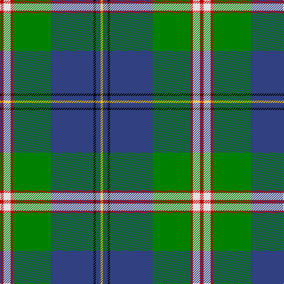

This page is one **sett** — a single exact thread-count. It belongs to the [tartan](/tartans/r3w6r2g32db36k2db4ly2/)
(the same proportion at any scale), whose colour order is pattern [RWRGBKBY](/stripes/rwrgbkby/).

Sourced from weddslist.  It is a [8 stripe tartan](/stripes/stripes8/).

Original link http://www.weddslist.com/cgi-bin/tartans/pg.pl?source=sts

2 attestations — the source records this cloth was collapsed from (oldest owns this page)

<ul>
<li>undated — Canadian Centennial (weddslist, <a href="http://www.weddslist.com/cgi-bin/tartans/pg.pl?source=sts">record</a>)</li>
<li>undated — Canadian Centennial District Tartan Tartan Number: 1704. Earliest known date: 1966 This tartan was approved by the Centennial Commission. The six colours represent the wealth of Canada in her people and her natural resources. See products available Copyright © Blair Urquhart, Comrie, 2015 (house-of-tartan, <a href="http://www.house-of-tartan.scotland.net/house/TartanViewjs.asp?colr=Def&tnam=1704">record</a>)</li>
</ul>

## Thread count
R/6 LN12 R4 G64 B72 K4 B8 Y/4

## Palette

Palette: <strong>Tartan Register</strong> <small style="color:#888">(2 of 6 colours)</small>
<table><thead><tr><th>Colour</th><th>Threads</th><th>Shade</th><th>Base</th><th>OKLCh</th></tr></thead><tbody><tr><td>R/</td><td style="text-align:right;font-variant-numeric:tabular-nums">6</td><td><code style="background-color:#C00000;">#C00000</code> <small style="color:#888">#C00000</small></td><td>R <code style="background-color:#CC0000;">#CC0000</code></td><td><small style="color:#888">oklch(50.7% 0.208 29.2)</small></td></tr><tr><td>LN</td><td style="text-align:right;font-variant-numeric:tabular-nums">12</td><td><code style="background-color:#E0E0E0;">#E0E0E0</code> <small style="color:#888">#E0E0E0</small></td><td>W <code style="background-color:#F7F7F7;">#F7F7F7</code></td><td><small style="color:#888">oklch(90.7% 0.000 89.9)</small></td></tr><tr><td>R</td><td style="text-align:right;font-variant-numeric:tabular-nums">4</td><td><code style="background-color:#C00000;">#C00000</code> <small style="color:#888">#C00000</small></td><td>R <code style="background-color:#CC0000;">#CC0000</code></td><td><small style="color:#888">oklch(50.7% 0.208 29.2)</small></td></tr><tr><td>G</td><td style="text-align:right;font-variant-numeric:tabular-nums">64</td><td><code style="background-color:#008000;">#008000</code> <small style="color:#888">#008000</small></td><td>G <code style="background-color:#006100;">#006100</code></td><td><small style="color:#888">oklch(52.0% 0.177 142.5)</small></td></tr><tr><td>B</td><td style="text-align:right;font-variant-numeric:tabular-nums">72</td><td><code style="background-color:#304080;">#304080</code> <small style="color:#888">#304080</small></td><td>B <code style="background-color:#2A418A;">#2A418A</code></td><td><small style="color:#888">oklch(39.4% 0.109 270.2)</small></td></tr><tr><td>K</td><td style="text-align:right;font-variant-numeric:tabular-nums">4</td><td><code style="background-color:#000000;">#000000</code> <small style="color:#888">#000000</small></td><td>K <code style="background-color:#000000;">#000000</code></td><td><small style="color:#888">oklch(0.0% 0.000 0.0)</small></td></tr><tr><td>B</td><td style="text-align:right;font-variant-numeric:tabular-nums">8</td><td><code style="background-color:#304080;">#304080</code> <small style="color:#888">#304080</small></td><td>B <code style="background-color:#2A418A;">#2A418A</code></td><td><small style="color:#888">oklch(39.4% 0.109 270.2)</small></td></tr><tr><td>Y/</td><td style="text-align:right;font-variant-numeric:tabular-nums">4</td><td><code style="background-color:#F0C000;">#F0C000</code> <small style="color:#888">#F0C000</small></td><td>Y <code style="background-color:#F2BF00;">#F2BF00</code></td><td><small style="color:#888">oklch(82.7% 0.169 90.5)</small></td></tr></tbody></table>

# Sample pattern

## Nearest tartans

The nearest existing variants by ΔTartan distance, with this tartan at the top so the swatches line up against it.

ΔTartan

Tartan

Sett

—

<a href="/ttd/edit/#slug=r3w6r2g32db36k2db4ly2~x2">Canadian Centennial</a> <a class="nn-out" href="/setts/s8/r3w6r2g32db36k2db4ly2~x2/" title="open its dictionary page">↗</a>

0.64

<a href="/ttd/edit/#slug=w2db20dg2g2dg2g4dg8ly2r1~x2">Nova Scotia</a> <a class="nn-out" href="/setts/s9/w2db20dg2g2dg2g4dg8ly2r1~x2/" title="open its dictionary page">↗</a>

0.64

<a href="/ttd/edit/#slug=w2db20gi2g2gi2g4gi8ly2r1~x2">Nova Scotia (Province)</a> <a class="nn-out" href="/setts/s9/w2db20gi2g2gi2g4gi8ly2r1~x2/" title="open its dictionary page">↗</a>

0.67

<a href="/ttd/edit/#slug=y4ly2y39dt10o4dt4r4dt25w3~x2">Blue Blas Alba</a> <a class="nn-out" href="/setts/s9/y4ly2y39dt10o4dt4r4dt25w3~x2/" title="open its dictionary page">↗</a>

0.79

<a href="/ttd/edit/#slug=w1db16ly1r3ly1gi6g2gi6w1~x2">Kleto, Susan (Personal)</a> <a class="nn-out" href="/setts/s9/w1db16ly1r3ly1gi6g2gi6w1~x2/" title="open its dictionary page">↗</a>

0.92

<a href="/ttd/edit/#slug=r4g14k3lp3g12db36w4~x2">Vipont</a> <a class="nn-out" href="/setts/s7/r4g14k3lp3g12db36w4~x2/" title="open its dictionary page">↗</a>

1.00

<a href="/ttd/edit/#slug=ly2r2k2b27k6g13k1lb2~x2">German MacLeod</a> <a class="nn-out" href="/setts/s8/ly2r2k2b27k6g13k1lb2~x2/" title="open its dictionary page">↗</a>

1.01

<a href="/ttd/edit/#slug=k2dbi2g16db2ly1db13w2~x2">Wishart Hunting Family Tartan Tartan Number: 2104. Earliest known date: 1990 The Wisharts of Pittarrow and Logie Wishart were a lowland family dating from around the 12th Century. The family's origins are unknown, but the name Guiscard, Wiscard, Wishart, meaning 'cunning' is Norman-French. We have also sought to associate the Wishart tartan with that of another family by virtue of the marriage of a Sir John Wishart to Jean, daughter of William Douglas, 9th Earl of Angus in the 16th Century. The Wishart tartan combines the Wallace and Douglas tartans, in an original new sett which was designed by Dr David Wishart with the assistance of the Scottish College of Textiles in Galashiels. (D. Wishart, 1990) See products available Copyright © Blair Urquhart, Comrie, 2015</a> <a class="nn-out" href="/setts/s7/k2dbi2g16db2ly1db13w2~x2/" title="open its dictionary page">↗</a>

1.06

<a href="/ttd/edit/#slug=o2t14k1g11k2lr2gi2k1~x4">Mission</a> <a class="nn-out" href="/setts/s8/o2t14k1g11k2lr2gi2k1~x4/" title="open its dictionary page">↗</a>

1.06

<a href="/ttd/edit/#slug=ly3db1k2g26db28w1db1r2~x2">Johnston, Diana Hunting (Personal)</a> <a class="nn-out" href="/setts/s8/ly3db1k2g26db28w1db1r2~x2/" title="open its dictionary page">↗</a>

1.08

<a href="/ttd/edit/#slug=r6db27t2g2t2g30w4~x2">MX-5 Owners' Club</a> <a class="nn-out" href="/setts/s7/r6db27t2g2t2g30w4~x2/" title="open its dictionary page">↗</a>

## Neighbour map

Every grey dot is one of 14359 variants placed by the first two principal components of the ΔTartan feature space (44% of its variance). Red is this tartan; blue dots are its nearest — click one to open its page.

<svg viewBox="0 0 640 380" role="img" style="max-width:100%;height:auto;border:1px solid #e0e0e0;border-radius:4px;display:block" xmlns="http://www.w3.org/2000/svg"><image href="/nn/cloud.v1.png" width="640" height="380"/><a href="/setts/s9/w2db20dg2g2dg2g4dg8ly2r1~x2/"><circle cx="231.2" cy="115.7" r="4" fill="#3465a4"><title>Nova Scotia</title></circle></a><a href="/setts/s9/w2db20gi2g2gi2g4gi8ly2r1~x2/"><circle cx="230.4" cy="114.5" r="4" fill="#3465a4"><title>Nova Scotia (Province)</title></circle></a><a href="/setts/s9/y4ly2y39dt10o4dt4r4dt25w3~x2/"><circle cx="245.8" cy="115.4" r="4" fill="#3465a4"><title>Blue Blas Alba</title></circle></a><a href="/setts/s9/w1db16ly1r3ly1gi6g2gi6w1~x2/"><circle cx="198.2" cy="121.5" r="4" fill="#3465a4"><title>Kleto, Susan (Personal)</title></circle></a><a href="/setts/s7/r4g14k3lp3g12db36w4~x2/"><circle cx="220.7" cy="154.8" r="4" fill="#3465a4"><title>Vipont</title></circle></a><a href="/setts/s8/ly2r2k2b27k6g13k1lb2~x2/"><circle cx="263.1" cy="112.8" r="4" fill="#3465a4"><title>German MacLeod</title></circle></a><a href="/setts/s7/k2dbi2g16db2ly1db13w2~x2/"><circle cx="223.7" cy="150.6" r="4" fill="#3465a4"><title>Wishart Hunting Family Tartan Tartan Number: 2104. Earliest known date: 1990 The Wisharts of Pittarrow and Logie Wishart were a lowland family dating from around the 12th Century. The family's origins are unknown, but the name Guiscard, Wiscard, Wishart, meaning 'cunning' is Norman-French. We have also sought to associate the Wishart tartan with that of another family by virtue of the marriage of a Sir John Wishart to Jean, daughter of William Douglas, 9th Earl of Angus in the 16th Century. The Wishart tartan combines the Wallace and Douglas tartans, in an original new sett which was designed by Dr David Wishart with the assistance of the Scottish College of Textiles in Galashiels. (D. Wishart, 1990) See products available Copyright © Blair Urquhart, Comrie, 2015</title></circle></a><a href="/setts/s8/o2t14k1g11k2lr2gi2k1~x4/"><circle cx="174.2" cy="136.0" r="4" fill="#3465a4"><title>Mission</title></circle></a><a href="/setts/s8/ly3db1k2g26db28w1db1r2~x2/"><circle cx="293.0" cy="107.2" r="4" fill="#3465a4"><title>Johnston, Diana Hunting (Personal)</title></circle></a><a href="/setts/s7/r6db27t2g2t2g30w4~x2/"><circle cx="242.5" cy="159.2" r="4" fill="#3465a4"><title>MX-5 Owners' Club</title></circle></a><circle cx="242.8" cy="121.0" r="5" fill="#c00000"/></svg>

ID: /setts/s8/r3w6r2g32db36k2db4ly2~x2/
