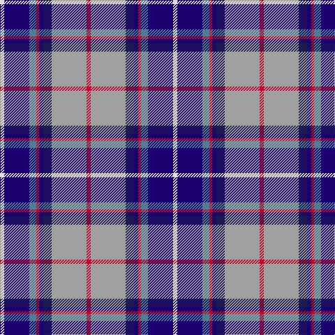

In pattern [RYBBRBBW](/patterns/rybbrbbw/).

This was sourced from register-of-tartans.  It is a [8 stripes tartan](/stripes/stripes8/).

Original link https://www.tartanregister.gov.uk/tartanDetails.aspx?ref=1287

## Attestations

This cloth appears in 2 source records; the oldest owns this page.

- 01/01/2006 — Fulbright Foundation (register-of-tartans, [record](https://www.tartanregister.gov.uk/tartanDetails.aspx?ref=1287))
- pre 2006 — Fulbright Foundation (Corporate) (tartans-authority, [record](http://www.tartansauthority.com/tartan-ferret/display/7031/))

## Register references

External register numbers recorded for this tartan.

- Scottish Register of Tartans: [1287](https://www.tartanregister.gov.uk/tartanDetails.aspx?ref=1287)
- Scottish Tartans Authority (ITI): 7031

## Thread count
LN/6 DBa36 B10 R4 DBa6 DB12 N50 R/6

## Palette
Each colour and its ΔE from the base-6 reference it is a variant of.

| Colour | Shade | Base | ΔE (OKLab) |
|---|---|---|---|
| B | <code style="background-color:#507C94;">#507C94</code> `#507C94` | B <code style="background-color:#2A418A;">#2A418A</code> | 0.18 |
| DB | <code style="background-color:#1C1C50;">#1C1C50</code> `#1C1C50` | B <code style="background-color:#2A418A;">#2A418A</code> | 0.14 |
| DBa | <code style="background-color:#1C0070;">#1C0070</code> `#1C0070` | B <code style="background-color:#2A418A;">#2A418A</code> | 0.14 |
| LN | <code style="background-color:#E0E0E0;">#E0E0E0</code> `#E0E0E0` | W <code style="background-color:#F7F7F7;">#F7F7F7</code> | 0.07 |
| N | <code style="background-color:#A0A0A0;">#A0A0A0</code> `#A0A0A0` | Y <code style="background-color:#F2BF00;">#F2BF00</code> | 0.21 |
| R | <code style="background-color:#C8002C;">#C8002C</code> `#C8002C` | R <code style="background-color:#CC0000;">#CC0000</code> | 0.03 |

# Sample pattern

## Nearest tartans

The nearest existing variants by ΔTartan distance.

1. [Alexander of Menstry](/setts/s8/g5r2g2r9k9y9b30w5~b2c2c80-g006818-k101010-r9c68a4-wf8f8f8-ya0a0a0~x2/) — ΔT 0.67
1. [GYL (Personal)](/setts/s10/b28r3w3r3w3r3b14k12ba38y8~b2c2c80-ba2888c4-k101010-rc80000-we0e0e0-ye8c000/) — ΔT 0.71
1. [Asman Hunting (Name)](/setts/s11/b4y3b22r6w2k6w2b6ra20k3ra4~b2c2c80-k101010-rc80000-ra888888-wfcfcfc-ye8c000~x2/) — ΔT 0.84
1. [Queen Margaret University](/setts/s9/b4w3b17wa10k1ba5k1wa6g3~b2c4084-ba5a008c-g005020-k101010-we0e0e0-wac0c0c0~x2/) — ΔT 0.87
1. [Ohio District Tartan Tartan Number: 651. Earliest known date: 1984 Design is based on the colours of Ohio's flag and state seal. The widths of the stripes in each colour are based on the date Ohio was admitted to the Union. The tartan first went on display at the Ohio Scottish Games in June 1983. See products available Copyright © Blair Urquhart, Comrie, 2015](/setts/s9/b16w6r8b3y1g1ba3b1g9~b2c2c80-ba2888c4-g006818-rc80000-we0e0e0-ye8c000~x2/) — ΔT 0.93
1. [Scottish Association for N.S. (Corp)](/setts/s9/b46y4b4y4b6k16r66w11ra6~b2c2c80-k101010-r888888-rac80000-we0e0e0-ye8c000/) — ΔT 0.93
1. [Unidentified (Woven sample)](/setts/s8/k16w6k4b64r19k8g42y6~b3850c8-g006818-k101010-r981c70-wf8f8f8-ye8c000/) — ΔT 0.94
1. [Ogilvie of Inverquharity or Ohio](/setts/s9/b16w6r8b3y1g1ya3b1g10~b1c0070-g006818-rc80000-we0e0e0-yd09800-ya48a4c0~x4/) — ΔT 0.97
1. [Dignan School of Dancing](/setts/s7/y4r2b32k10ba4w21ba2~b2474e8-ba6c0070-k101010-r880000-wc0c0c0-yd09800~x2/) — ΔT 1.01
1. [Hek (Name)](/setts/s9/b1w2ba12k2b2k2bb15b2y1~b2c2c80-ba5c8ca8-bb780078-k101010-we0e0e0-yfccc00~x2/) — ΔT 1.05

## Neighbour map

Every grey dot is one of 15726 variants placed by the first two principal components of the ΔTartan feature space (44% of its variance). Red is this tartan; blue dots are its nearest — click one to open its page.

<svg viewBox="0 0 640 380" role="img" style="max-width:100%;height:auto;border:1px solid #e0e0e0;border-radius:4px;display:block" xmlns="http://www.w3.org/2000/svg"><image href="/nn/cloud.v1.png" width="640" height="380"/><a href="/setts/s8/g5r2g2r9k9y9b30w5~b2c2c80-g006818-k101010-r9c68a4-wf8f8f8-ya0a0a0~x2/"><circle cx="160.9" cy="133.0" r="4" fill="#3465a4"><title>Alexander of Menstry</title></circle></a><a href="/setts/s10/b28r3w3r3w3r3b14k12ba38y8~b2c2c80-ba2888c4-k101010-rc80000-we0e0e0-ye8c000/"><circle cx="140.8" cy="125.1" r="4" fill="#3465a4"><title>GYL (Personal)</title></circle></a><a href="/setts/s11/b4y3b22r6w2k6w2b6ra20k3ra4~b2c2c80-k101010-rc80000-ra888888-wfcfcfc-ye8c000~x2/"><circle cx="154.0" cy="129.1" r="4" fill="#3465a4"><title>Asman Hunting (Name)</title></circle></a><a href="/setts/s9/b4w3b17wa10k1ba5k1wa6g3~b2c4084-ba5a008c-g005020-k101010-we0e0e0-wac0c0c0~x2/"><circle cx="166.6" cy="126.5" r="4" fill="#3465a4"><title>Queen Margaret University</title></circle></a><a href="/setts/s9/b16w6r8b3y1g1ba3b1g9~b2c2c80-ba2888c4-g006818-rc80000-we0e0e0-ye8c000~x2/"><circle cx="158.1" cy="127.2" r="4" fill="#3465a4"><title>Ohio District Tartan Tartan Number: 651. Earliest known date: 1984 Design is based on the colours of Ohio's flag and state seal. The widths of the stripes in each colour are based on the date Ohio was admitted to the Union. The tartan first went on display at the Ohio Scottish Games in June 1983. See products available Copyright © Blair Urquhart, Comrie, 2015</title></circle></a><a href="/setts/s9/b46y4b4y4b6k16r66w11ra6~b2c2c80-k101010-r888888-rac80000-we0e0e0-ye8c000/"><circle cx="191.8" cy="109.6" r="4" fill="#3465a4"><title>Scottish Association for N.S. (Corp)</title></circle></a><a href="/setts/s8/k16w6k4b64r19k8g42y6~b3850c8-g006818-k101010-r981c70-wf8f8f8-ye8c000/"><circle cx="158.3" cy="132.7" r="4" fill="#3465a4"><title>Unidentified (Woven sample)</title></circle></a><a href="/setts/s9/b16w6r8b3y1g1ya3b1g10~b1c0070-g006818-rc80000-we0e0e0-yd09800-ya48a4c0~x4/"><circle cx="145.0" cy="125.2" r="4" fill="#3465a4"><title>Ogilvie of Inverquharity or Ohio</title></circle></a><a href="/setts/s7/y4r2b32k10ba4w21ba2~b2474e8-ba6c0070-k101010-r880000-wc0c0c0-yd09800~x2/"><circle cx="175.0" cy="127.8" r="4" fill="#3465a4"><title>Dignan School of Dancing</title></circle></a><a href="/setts/s9/b1w2ba12k2b2k2bb15b2y1~b2c2c80-ba5c8ca8-bb780078-k101010-we0e0e0-yfccc00~x2/"><circle cx="184.1" cy="115.2" r="4" fill="#3465a4"><title>Hek (Name)</title></circle></a><circle cx="150.1" cy="132.5" r="5" fill="#c00000"/></svg>

ID: /setts/s8/r3y25b6ba3r2bb5ba18w3~b1c1c50-ba1c0070-bb507c94-rc8002c-we0e0e0-ya0a0a0~x2/
