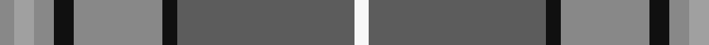

In pattern [RYRKRKBW](/patterns/ryrkrkbw/).

This was sourced from tartans-authority.  It is a [8 stripes tartan](/stripes/stripes8/).

Original link http://www.tartansauthority.com/tartan-ferret/display/6821/

## Thread count
Nb/6 N8 Nb8 K8 Nb36 K6 Na72 W/6

## Palette
Each colour and its ΔE from the base-6 reference it is a variant of.

| Colour | Shade | Base | ΔE (OKLab) |
|---|---|---|---|
| K | <code style="background-color:#101010;">#101010</code> `#101010` | K <code style="background-color:#000000;">#000000</code> | 0.17 |
| N | <code style="background-color:#A0A0A0;">#A0A0A0</code> `#A0A0A0` | Y <code style="background-color:#F2BF00;">#F2BF00</code> | 0.21 |
| Na | <code style="background-color:#5C5C5C;">#5C5C5C</code> `#5C5C5C` | B <code style="background-color:#2A418A;">#2A418A</code> | 0.15 |
| Nb | <code style="background-color:#888888;">#888888</code> `#888888` | R <code style="background-color:#CC0000;">#CC0000</code> | 0.24 |
| W | <code style="background-color:#F8F8F8;">#F8F8F8</code> `#F8F8F8` | W <code style="background-color:#F7F7F7;">#F7F7F7</code> | 0.00 |

# Sample pattern

## Nearest tartans

The nearest existing variants by ΔTartan distance.

1. [Hebridean Granite Fashion Tartan Tartan Number: 6821. Earliest known date: 2005 For a new House of Edgar collection. Intended to emulate the gray morning suit perhaps. See products available Copyright © Blair Urquhart, Comrie, 2015](/setts/s8/r3y4r4b4r18b3ba36w3~b383838-ba484848-r888888-we0e0e0-yb0b0b0~x2/) — ΔT 0.40
1. [Tasmanian](/setts/s11/r2y1g12ga1g1ga1g3ga4r3ga4ya2~g405040-ga808080-r802040-ye0a0a0-yaffe000~x4/) — ΔT 1.03
1. [Hawaii (District)](/setts/s8/b4r1y1b12ba4g10y1r3~b5c8ca8-ba4c3428-g406054-rc80000-ye8c000~x4/) — ΔT 1.10
1. [Bressuire (District)](/setts/s7/r1g4y1g3r4b15w1~b506878-g006818-r880000-we0e0e0-ybc8c00~x4/) — ΔT 1.11
1. [Hilton Hotel Hong Kong (Corporate)](/setts/s10/r4g10r2g2r24g2r2g16r2g1~g006818-rb468ac~x2/) — ΔT 1.20
1. [Graeme Heckenberg Hunting](/setts/s7/b3g13y1r3y1b10ya1~b1f3d7a-g4d7326-r761a1a-y8397a7-yafaa706~x2/) — ΔT 1.20
1. [Hebridean Granite](/setts/s14/y4r4k4r18k3b36w3b36k3r18k4r4y4r3~b5c5c5c-k101010-r888888-wf8f8f8-ya0a0a0~x2/) — ΔT 1.23
1. [Un-named Dutch](/setts/s7/b2r10b10ra3r2y24w2~b5c5c5c-r880000-ra888888-wf8f8f8-ya0a0a0~x2/) — ΔT 1.23
1. [Gammell (Personal)](/setts/s8/b32r3b3r3b3r10g24ra3~b5c8ca8-g006818-rb03000-ra901c38~x2/) — ΔT 1.24
1. [Speyside Blue (Fashion)](/setts/s8/b32k3b3k3ba5k8r21k4~b5c5c5c-ba1474b4-k101010-r888888~x2/) — ΔT 1.27

## Neighbour map

Every grey dot is one of 15726 variants placed by the first two principal components of the ΔTartan feature space (44% of its variance). Red is this tartan; blue dots are its nearest — click one to open its page.

<svg viewBox="0 0 640 380" role="img" style="max-width:100%;height:auto;border:1px solid #e0e0e0;border-radius:4px;display:block" xmlns="http://www.w3.org/2000/svg"><image href="/nn/cloud.v1.png" width="640" height="380"/><a href="/setts/s8/r3y4r4b4r18b3ba36w3~b383838-ba484848-r888888-we0e0e0-yb0b0b0~x2/"><circle cx="301.3" cy="167.1" r="4" fill="#3465a4"><title>Hebridean Granite Fashion Tartan Tartan Number: 6821. Earliest known date: 2005 For a new House of Edgar collection. Intended to emulate the gray morning suit perhaps. See products available Copyright © Blair Urquhart, Comrie, 2015</title></circle></a><a href="/setts/s11/r2y1g12ga1g1ga1g3ga4r3ga4ya2~g405040-ga808080-r802040-ye0a0a0-yaffe000~x4/"><circle cx="266.8" cy="162.4" r="4" fill="#3465a4"><title>Tasmanian</title></circle></a><a href="/setts/s8/b4r1y1b12ba4g10y1r3~b5c8ca8-ba4c3428-g406054-rc80000-ye8c000~x4/"><circle cx="248.0" cy="183.9" r="4" fill="#3465a4"><title>Hawaii (District)</title></circle></a><a href="/setts/s7/r1g4y1g3r4b15w1~b506878-g006818-r880000-we0e0e0-ybc8c00~x4/"><circle cx="331.2" cy="176.1" r="4" fill="#3465a4"><title>Bressuire (District)</title></circle></a><a href="/setts/s10/r4g10r2g2r24g2r2g16r2g1~g006818-rb468ac~x2/"><circle cx="293.9" cy="129.3" r="4" fill="#3465a4"><title>Hilton Hotel Hong Kong (Corporate)</title></circle></a><a href="/setts/s7/b3g13y1r3y1b10ya1~b1f3d7a-g4d7326-r761a1a-y8397a7-yafaa706~x2/"><circle cx="259.2" cy="184.4" r="4" fill="#3465a4"><title>Graeme Heckenberg Hunting</title></circle></a><a href="/setts/s14/y4r4k4r18k3b36w3b36k3r18k4r4y4r3~b5c5c5c-k101010-r888888-wf8f8f8-ya0a0a0~x2/"><circle cx="298.3" cy="147.1" r="4" fill="#3465a4"><title>Hebridean Granite</title></circle></a><a href="/setts/s7/b2r10b10ra3r2y24w2~b5c5c5c-r880000-ra888888-wf8f8f8-ya0a0a0~x2/"><circle cx="250.2" cy="166.9" r="4" fill="#3465a4"><title>Un-named Dutch</title></circle></a><a href="/setts/s8/b32r3b3r3b3r10g24ra3~b5c8ca8-g006818-rb03000-ra901c38~x2/"><circle cx="302.0" cy="195.6" r="4" fill="#3465a4"><title>Gammell (Personal)</title></circle></a><a href="/setts/s8/b32k3b3k3ba5k8r21k4~b5c5c5c-ba1474b4-k101010-r888888~x2/"><circle cx="264.8" cy="193.0" r="4" fill="#3465a4"><title>Speyside Blue (Fashion)</title></circle></a><circle cx="289.8" cy="161.8" r="5" fill="#c00000"/></svg>

ID: /setts/s8/r3y4r4k4r18k3b36w3~b5c5c5c-k101010-r888888-wf8f8f8-ya0a0a0~x2/
