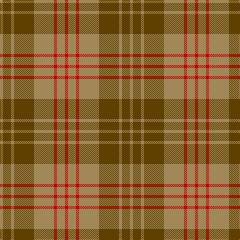

In pattern [RYRYGYGY](/patterns/ryrygygy/).

This was sourced from register-of-tartans.  It is a [8 stripes tartan](/stripes/stripes8/).

Original link https://www.tartanregister.gov.uk/tartanDetails.aspx?ref=2970

## Attestations

This cloth appears in 2 source records; the oldest owns this page.

- 01/01/1998 — Miyuki #4 (register-of-tartans, [record](https://www.tartanregister.gov.uk/tartanDetails.aspx?ref=2970))
- 1998 — Miyuki #4 (Fashion) (tartans-authority, [record](http://www.tartansauthority.com/tartan-ferret/display/2605/))

## Thread count
LT/6 T16 LT6 T40 LT40 R6 LT16 R/6

## Palette
Each colour and its ΔE from the base-6 reference it is a variant of.

| Colour | Shade | Base | ΔE (OKLab) |
|---|---|---|---|
| LT | <code style="background-color:#A08858;">#A08858</code> `#A08858` | Y <code style="background-color:#F2BF00;">#F2BF00</code> | 0.21 |
| R | <code style="background-color:#C80000;">#C80000</code> `#C80000` | R <code style="background-color:#CC0000;">#CC0000</code> | 0.01 |
| T | <code style="background-color:#604000;">#604000</code> `#604000` | G <code style="background-color:#006100;">#006100</code> | 0.14 |

# Sample pattern

## Nearest tartans

The nearest existing variants by ΔTartan distance.

1. [Burnett of Powis (Personal)](/setts/s8/b3r21g3r3g19y3g19r3~b2888c4-g5c6428-rc80000-ye8c000~x2/) — ΔT 1.18
1. [Crossnor School](/setts/s7/g4r2g13w2r13g2r4~g285800-rb03000-we8ccb8~x2/) — ΔT 1.28
1. [Hubbard (2016)](/setts/s9/b5r19ba2g8r3g18ba2g9ba2~b003c64-ba1c1c1c-g5c6428-rc80000~x2/) — ΔT 1.47
1. [Lister (Name)](/setts/s7/g8r29g8y3g8r8y3~g604000-r888888-ye8c000~x2/) — ΔT 1.49
1. [Prince David #1 (Royal)](/setts/s7/g3y2g18y21y2g3y2~g604000-yd87c00~x2/) — ΔT 1.51
1. [Daks-Simpson (Muted Skye)](/setts/s8/b5r15g4r4g24r4g4b5~b2c2c80-g604000-r888888/) — ΔT 1.54
1. [Glen Esk (1993)](/setts/s7/g2r1g8r5ga5r1ga2~g005020-ga5c6428-rdc0000~x4/) — ΔT 1.55
1. [Glen Esk (Fashion)](/setts/s7/g2r1g8r5ga5r1ga2~g004c00-ga6c6c00-rc80000~x4/) — ΔT 1.60
1. [Scottish Piping Soc. of London (Corp](/setts/s7/r30g3b5g21r3g21b2~b202060-g5c6428-rc8002c~x2/) — ΔT 1.65
1. [Dewar](/setts/s10/g1ga1g7ga4r7ga1r7ga4g7ga1~g006818-ga604000-rc80000~x4/) — ΔT 1.66

## Neighbour map

Every grey dot is one of 15726 variants placed by the first two principal components of the ΔTartan feature space (44% of its variance). Red is this tartan; blue dots are its nearest — click one to open its page.

<svg viewBox="0 0 640 380" role="img" style="max-width:100%;height:auto;border:1px solid #e0e0e0;border-radius:4px;display:block" xmlns="http://www.w3.org/2000/svg"><image href="/nn/cloud.v1.png" width="640" height="380"/><a href="/setts/s8/b3r21g3r3g19y3g19r3~b2888c4-g5c6428-rc80000-ye8c000~x2/"><circle cx="352.4" cy="222.8" r="4" fill="#3465a4"><title>Burnett of Powis (Personal)</title></circle></a><a href="/setts/s7/g4r2g13w2r13g2r4~g285800-rb03000-we8ccb8~x2/"><circle cx="326.6" cy="249.3" r="4" fill="#3465a4"><title>Crossnor School</title></circle></a><a href="/setts/s9/b5r19ba2g8r3g18ba2g9ba2~b003c64-ba1c1c1c-g5c6428-rc80000~x2/"><circle cx="317.0" cy="208.7" r="4" fill="#3465a4"><title>Hubbard (2016)</title></circle></a><a href="/setts/s7/g8r29g8y3g8r8y3~g604000-r888888-ye8c000~x2/"><circle cx="361.3" cy="231.9" r="4" fill="#3465a4"><title>Lister (Name)</title></circle></a><a href="/setts/s7/g3y2g18y21y2g3y2~g604000-yd87c00~x2/"><circle cx="364.2" cy="210.8" r="4" fill="#3465a4"><title>Prince David #1 (Royal)</title></circle></a><a href="/setts/s8/b5r15g4r4g24r4g4b5~b2c2c80-g604000-r888888/"><circle cx="314.2" cy="249.5" r="4" fill="#3465a4"><title>Daks-Simpson (Muted Skye)</title></circle></a><a href="/setts/s7/g2r1g8r5ga5r1ga2~g005020-ga5c6428-rdc0000~x4/"><circle cx="270.1" cy="253.4" r="4" fill="#3465a4"><title>Glen Esk (1993)</title></circle></a><a href="/setts/s7/g2r1g8r5ga5r1ga2~g004c00-ga6c6c00-rc80000~x4/"><circle cx="272.5" cy="255.0" r="4" fill="#3465a4"><title>Glen Esk (Fashion)</title></circle></a><a href="/setts/s7/r30g3b5g21r3g21b2~b202060-g5c6428-rc8002c~x2/"><circle cx="390.4" cy="217.1" r="4" fill="#3465a4"><title>Scottish Piping Soc. of London (Corp</title></circle></a><a href="/setts/s10/g1ga1g7ga4r7ga1r7ga4g7ga1~g006818-ga604000-rc80000~x4/"><circle cx="252.2" cy="248.5" r="4" fill="#3465a4"><title>Dewar</title></circle></a><circle cx="350.9" cy="251.2" r="5" fill="#c00000"/></svg>

ID: /setts/s8/r3y8r3y20g20y3g8y3~g604000-rc80000-ya08858~x2/
