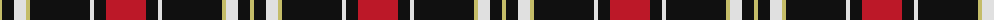
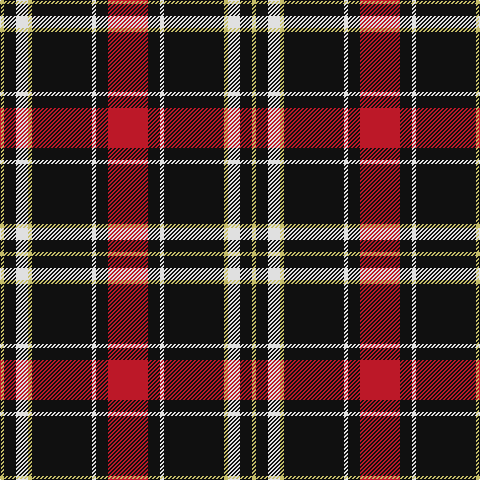

In pattern [RKWKYWKY](/patterns/rkwkywky/).

This was sourced from house-of-tartan.  It is a [8 stripes tartan](/stripes/stripes8/).

Original link http://www.house-of-tartan.scotland.net/house/TartanViewjs.asp?colr=Def&tnam=11296

## Thread count
LG/4 K12 LN12 LG4 K60 LN4 K12 R/40

## Palette
Each colour and its ΔE from the base-6 reference it is a variant of.

| Colour | Shade | Base | ΔE (OKLab) |
|---|---|---|---|
| K | <code style="background-color:#101010;">#101010</code> `#101010` | K <code style="background-color:#000000;">#000000</code> | 0.17 |
| LG | <code style="background-color:#C4BC68;">#C4BC68</code> `#C4BC68` | Y <code style="background-color:#F2BF00;">#F2BF00</code> | 0.08 |
| LN | <code style="background-color:#E0E0E0;">#E0E0E0</code> `#E0E0E0` | W <code style="background-color:#F7F7F7;">#F7F7F7</code> | 0.07 |
| R | <code style="background-color:#BC1828;">#BC1828</code> `#BC1828` | R <code style="background-color:#CC0000;">#CC0000</code> | 0.04 |

# Sample pattern

## Nearest tartans

The nearest existing variants by ΔTartan distance.

1. [Cunard o' the Clyde](/setts/s8/r40k12w4k60y4w12k12y4-k101010-rc80000-we0e0e0-yc4bc68/) — ΔT 0.16
1. [Bro-Wened](/setts/s6/k86r20w6k6w30b6-b202060-k101010-r880000-wf8e8d8/) — ΔT 0.98
1. [Braemar, or Blair Atholl](/setts/s10/r4w8k20r12k4ra20k4ra44k4ra4-k000000-r806050-ra906030-we0e0e0/) — ΔT 1.02
1. [Woodberry Forest School (Corporate)](/setts/s10/r12k6w6k6w6k68r12g10r12k10-g289c18-k101010-rb03000-wf8f8f8/) — ΔT 1.04
1. [Phantom (Corporate)](/setts/s7/w6b20k76r22b12k4w6-b6c142c-k101010-r848484-we0e0e0/) — ΔT 1.05
1. [Ikelman No 4](/setts/s7/r40k60g8k8w4k4w4-g008000-k000030-rc00000-we0e0e0/) — ΔT 1.06
1. [Barbecue, Plaid](/setts/s10/y4k4r4w16k28r2k2r2k2r2-k000000-rc00000-we0e0e0-yf0c000/) — ΔT 1.08
1. [Barbecue Plaid (Fashion)](/setts/s10/y4k4r4w16k28r2k2r2k2r2-k000000-rc80000-wfcfcfc-ye8c000/) — ΔT 1.08
1. [Barbecue Plaid Tartan Tartan Number: 1607. Earliest known date: pre 1964 From STS member, Alex Lumsden in Toronto, Canada. See products available Copyright © Blair Urquhart, Comrie, 2015](/setts/s10/y4k4r4w16k28r2k2r2k2r2-k101010-rc80000-we0e0e0-ye8c000/) — ΔT 1.08
1. [Distripress Annual Congress 2012](/setts/s8/r12k2w8k4b16r2k31b2-b666666-k101010-rff0000-wffffff/) — ΔT 1.11

## Neighbour map

Every grey dot is one of 15726 variants placed by the first two principal components of the ΔTartan feature space (44% of its variance). Red is this tartan; blue dots are its nearest — click one to open its page.

<svg viewBox="0 0 640 380" role="img" style="max-width:100%;height:auto;border:1px solid #e0e0e0;border-radius:4px;display:block" xmlns="http://www.w3.org/2000/svg"><image href="/nn/cloud.v1.png" width="640" height="380"/><a href="/setts/s8/r40k12w4k60y4w12k12y4-k101010-rc80000-we0e0e0-yc4bc68/"><circle cx="301.9" cy="153.8" r="4" fill="#3465a4"><title>Cunard o' the Clyde</title></circle></a><a href="/setts/s6/k86r20w6k6w30b6-b202060-k101010-r880000-wf8e8d8/"><circle cx="315.5" cy="163.9" r="4" fill="#3465a4"><title>Bro-Wened</title></circle></a><a href="/setts/s10/r4w8k20r12k4ra20k4ra44k4ra4-k000000-r806050-ra906030-we0e0e0/"><circle cx="268.6" cy="160.6" r="4" fill="#3465a4"><title>Braemar, or Blair Atholl</title></circle></a><a href="/setts/s10/r12k6w6k6w6k68r12g10r12k10-g289c18-k101010-rb03000-wf8f8f8/"><circle cx="323.5" cy="150.8" r="4" fill="#3465a4"><title>Woodberry Forest School (Corporate)</title></circle></a><a href="/setts/s7/w6b20k76r22b12k4w6-b6c142c-k101010-r848484-we0e0e0/"><circle cx="312.1" cy="156.2" r="4" fill="#3465a4"><title>Phantom (Corporate)</title></circle></a><a href="/setts/s7/r40k60g8k8w4k4w4-g008000-k000030-rc00000-we0e0e0/"><circle cx="315.8" cy="159.4" r="4" fill="#3465a4"><title>Ikelman No 4</title></circle></a><a href="/setts/s10/y4k4r4w16k28r2k2r2k2r2-k000000-rc00000-we0e0e0-yf0c000/"><circle cx="270.9" cy="130.9" r="4" fill="#3465a4"><title>Barbecue, Plaid</title></circle></a><a href="/setts/s10/y4k4r4w16k28r2k2r2k2r2-k000000-rc80000-wfcfcfc-ye8c000/"><circle cx="268.5" cy="129.0" r="4" fill="#3465a4"><title>Barbecue Plaid (Fashion)</title></circle></a><a href="/setts/s10/y4k4r4w16k28r2k2r2k2r2-k101010-rc80000-we0e0e0-ye8c000/"><circle cx="274.3" cy="128.1" r="4" fill="#3465a4"><title>Barbecue Plaid Tartan Tartan Number: 1607. Earliest known date: pre 1964 From STS member, Alex Lumsden in Toronto, Canada. See products available Copyright © Blair Urquhart, Comrie, 2015</title></circle></a><a href="/setts/s8/r12k2w8k4b16r2k31b2-b666666-k101010-rff0000-wffffff/"><circle cx="235.5" cy="151.6" r="4" fill="#3465a4"><title>Distripress Annual Congress 2012</title></circle></a><circle cx="302.5" cy="154.9" r="5" fill="#c00000"/></svg>

ID: /setts/s8/r40k12w4k60y4w12k12y4-k101010-rbc1828-we0e0e0-yc4bc68/
