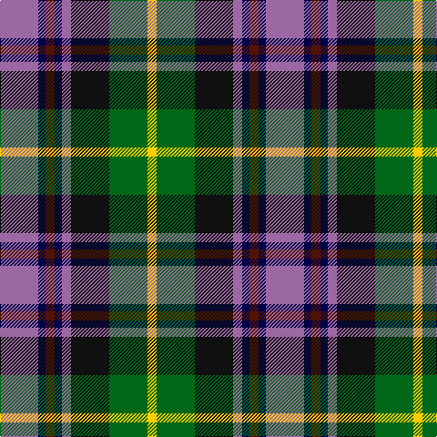

In pattern [RBBBRKGY](/patterns/rbbbrkgy/).

This was sourced from tartans-authority.  It is a [8 stripes tartan](/stripes/stripes8/).

Original link http://www.tartansauthority.com/tartan-ferret/display/11077/

## Thread count
LP/42 DB8 DR10 DB8 LP10 K42 G42 Y/10

## Palette
Each colour and its ΔE from the base-6 reference it is a variant of.

| Colour | Shade | Base | ΔE (OKLab) |
|---|---|---|---|
| DB | <code style="background-color:#000048;">#000048</code> `#000048` | B <code style="background-color:#2A418A;">#2A418A</code> | 0.22 |
| DR | <code style="background-color:#501400;">#501400</code> `#501400` | B <code style="background-color:#2A418A;">#2A418A</code> | 0.23 |
| G | <code style="background-color:#006818;">#006818</code> `#006818` | G <code style="background-color:#006100;">#006100</code> | 0.02 |
| K | <code style="background-color:#101010;">#101010</code> `#101010` | K <code style="background-color:#000000;">#000000</code> | 0.17 |
| LP | <code style="background-color:#9C68A4;">#9C68A4</code> `#9C68A4` | R <code style="background-color:#CC0000;">#CC0000</code> | 0.21 |
| Y | <code style="background-color:#FCCC00;">#FCCC00</code> `#FCCC00` | Y <code style="background-color:#F2BF00;">#F2BF00</code> | 0.04 |

# Sample pattern

## Nearest tartans

The nearest existing variants by ΔTartan distance.

1. [Caledonian Labrador Retrievers](/setts/s8/r42y8b10y8r10k42g42ya10-b441800-g00643c-k101010-r9c68a4-y86c67c-yae0a126/) — ΔT 0.43
1. [Burnfoot Check](/setts/s8/r6g4b4g6k12ba4ra20ba4-b646464-ba00008c-g004c00-k000000-r8c0000-raa0783c/) — ΔT 0.67
1. [Labrador Club of Scotland (Corporate](/setts/s8/r42y8g10y8r10k42ga42ya10-g604000-ga006818-k101010-ra478a0-y98a46c-yabc8c00/) — ΔT 0.81
1. [Jamestown Parish Church (Corporate)](/setts/s6/r6y4g24k24b28w6-b2c2c80-g006818-k101010-rc80000-we0e0e0-ye8c000/) — ΔT 0.88
1. [Cherokee](/setts/s8/g8b4g18k8g4r12ba24w4-b5c8ca8-ba1c0070-g408060-k101010-rc80000-wf8f8f8/) — ΔT 0.90
1. [Eichelberger Family, Jörg (Personal)](/setts/s7/k40r12y16b48g16r16w8-b1a2b47-g124b24-k010512-r89051b-wddd5af-yef8f06/) — ΔT 0.93
1. [Bro-Menez Are (Corporate)](/setts/s7/b16k50g26r10y10ra10r16-b1474b4-g006818-k101010-r8c2c68-ra880000-ybc8c00/) — ΔT 0.95
1. [South Africa 1994 (Fashion)](/setts/s7/k40y8b26w8g60w8r26-b2c2c80-g006818-k101010-rc80000-we0e0e0-ye8c000/) — ΔT 0.97
1. [Black Hills (Corporate)](/setts/s9/b6w4g28r28k4b14k18y4k4-b2c2c80-g408060-k101010-rc80000-we0e0e0-ye8c000/) — ΔT 0.98
1. [Black Hills](/setts/s9/b6w4g28r28k4b14k18y4k4-b2c2c80-g408060-k101010-rc80000-wffffff-ye8c000/) — ΔT 0.99

## Neighbour map

Every grey dot is one of 15726 variants placed by the first two principal components of the ΔTartan feature space (44% of its variance). Red is this tartan; blue dots are its nearest — click one to open its page.

<svg viewBox="0 0 640 380" role="img" style="max-width:100%;height:auto;border:1px solid #e0e0e0;border-radius:4px;display:block" xmlns="http://www.w3.org/2000/svg"><image href="/nn/cloud.v1.png" width="640" height="380"/><a href="/setts/s8/r42y8b10y8r10k42g42ya10-b441800-g00643c-k101010-r9c68a4-y86c67c-yae0a126/"><circle cx="60.6" cy="187.6" r="4" fill="#3465a4"><title>Caledonian Labrador Retrievers</title></circle></a><a href="/setts/s8/r6g4b4g6k12ba4ra20ba4-b646464-ba00008c-g004c00-k000000-r8c0000-raa0783c/"><circle cx="57.0" cy="191.5" r="4" fill="#3465a4"><title>Burnfoot Check</title></circle></a><a href="/setts/s8/r42y8g10y8r10k42ga42ya10-g604000-ga006818-k101010-ra478a0-y98a46c-yabc8c00/"><circle cx="66.8" cy="190.6" r="4" fill="#3465a4"><title>Labrador Club of Scotland (Corporate</title></circle></a><a href="/setts/s6/r6y4g24k24b28w6-b2c2c80-g006818-k101010-rc80000-we0e0e0-ye8c000/"><circle cx="70.8" cy="201.2" r="4" fill="#3465a4"><title>Jamestown Parish Church (Corporate)</title></circle></a><a href="/setts/s8/g8b4g18k8g4r12ba24w4-b5c8ca8-ba1c0070-g408060-k101010-rc80000-wf8f8f8/"><circle cx="86.6" cy="189.8" r="4" fill="#3465a4"><title>Cherokee</title></circle></a><a href="/setts/s7/k40r12y16b48g16r16w8-b1a2b47-g124b24-k010512-r89051b-wddd5af-yef8f06/"><circle cx="63.3" cy="202.7" r="4" fill="#3465a4"><title>Eichelberger Family, Jörg (Personal)</title></circle></a><a href="/setts/s7/b16k50g26r10y10ra10r16-b1474b4-g006818-k101010-r8c2c68-ra880000-ybc8c00/"><circle cx="94.7" cy="210.2" r="4" fill="#3465a4"><title>Bro-Menez Are (Corporate)</title></circle></a><a href="/setts/s7/k40y8b26w8g60w8r26-b2c2c80-g006818-k101010-rc80000-we0e0e0-ye8c000/"><circle cx="76.0" cy="178.8" r="4" fill="#3465a4"><title>South Africa 1994 (Fashion)</title></circle></a><a href="/setts/s9/b6w4g28r28k4b14k18y4k4-b2c2c80-g408060-k101010-rc80000-we0e0e0-ye8c000/"><circle cx="58.5" cy="163.7" r="4" fill="#3465a4"><title>Black Hills (Corporate)</title></circle></a><a href="/setts/s9/b6w4g28r28k4b14k18y4k4-b2c2c80-g408060-k101010-rc80000-wffffff-ye8c000/"><circle cx="55.4" cy="162.2" r="4" fill="#3465a4"><title>Black Hills</title></circle></a><circle cx="58.6" cy="188.5" r="5" fill="#c00000"/></svg>

ID: /setts/s8/r42b8ba10b8r10k42g42y10-b000048-ba501400-g006818-k101010-r9c68a4-yfccc00/
