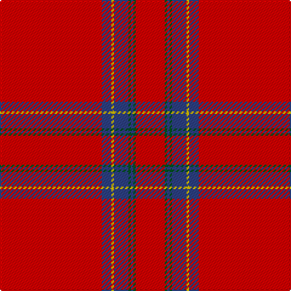

This page is one **sett** — a single exact thread-count. It belongs to the [tartan](/tartans/r42db4ly1db6dg1db1dg1r12/)
(the same proportion at any scale), whose colour order is pattern [RBYBGBGR](/stripes/rbybgbgr/).

Sourced from register-of-tartans.  It is a [8 stripe tartan](/stripes/stripes8/).

Original link https://www.tartanregister.gov.uk/tartanDetails.aspx?ref=1845

## Also known as

This cloth is also recorded under:

- Inverness Earl of...
- Inverness, Earl of

## Register references

External register numbers recorded for this tartan.

- Scottish Register of Tartans: [1845](https://www.tartanregister.gov.uk/tartanDetails.aspx?ref=1845)
- Scottish Tartans World Register: 1446

## Thread count
R/84 B8 Y2 B12 G2 B2 G2 R/24

## Palette

Palette: <strong>Tartan Register</strong>
<table><thead><tr><th>Colour</th><th>Threads</th><th>Shade</th><th>Base</th><th>OKLCh</th></tr></thead><tbody><tr><td>R/</td><td style="text-align:right;font-variant-numeric:tabular-nums">84</td><td><code style="background-color:#DC0000;">#DC0000</code> <small style="color:#888">#DC0000</small></td><td>R <code style="background-color:#CC0000;">#CC0000</code></td><td><small style="color:#888">oklch(56.2% 0.230 29.2)</small></td></tr><tr><td>B</td><td style="text-align:right;font-variant-numeric:tabular-nums">8</td><td><code style="background-color:#2C4084;">#2C4084</code> <small style="color:#888">#2C4084</small></td><td>B <code style="background-color:#2A418A;">#2A418A</code></td><td><small style="color:#888">oklch(39.4% 0.117 268.3)</small></td></tr><tr><td>Y</td><td style="text-align:right;font-variant-numeric:tabular-nums">2</td><td><code style="background-color:#E8C000;">#E8C000</code> <small style="color:#888">#E8C000</small></td><td>Y <code style="background-color:#F2BF00;">#F2BF00</code></td><td><small style="color:#888">oklch(81.9% 0.168 93.7)</small></td></tr><tr><td>B</td><td style="text-align:right;font-variant-numeric:tabular-nums">12</td><td><code style="background-color:#2C4084;">#2C4084</code> <small style="color:#888">#2C4084</small></td><td>B <code style="background-color:#2A418A;">#2A418A</code></td><td><small style="color:#888">oklch(39.4% 0.117 268.3)</small></td></tr><tr><td>G</td><td style="text-align:right;font-variant-numeric:tabular-nums">2</td><td><code style="background-color:#005020;">#005020</code> <small style="color:#888">#005020</small></td><td>G <code style="background-color:#006100;">#006100</code></td><td><small style="color:#888">oklch(37.7% 0.105 149.6)</small></td></tr><tr><td>B</td><td style="text-align:right;font-variant-numeric:tabular-nums">2</td><td><code style="background-color:#2C4084;">#2C4084</code> <small style="color:#888">#2C4084</small></td><td>B <code style="background-color:#2A418A;">#2A418A</code></td><td><small style="color:#888">oklch(39.4% 0.117 268.3)</small></td></tr><tr><td>G</td><td style="text-align:right;font-variant-numeric:tabular-nums">2</td><td><code style="background-color:#005020;">#005020</code> <small style="color:#888">#005020</small></td><td>G <code style="background-color:#006100;">#006100</code></td><td><small style="color:#888">oklch(37.7% 0.105 149.6)</small></td></tr><tr><td>R/</td><td style="text-align:right;font-variant-numeric:tabular-nums">24</td><td><code style="background-color:#DC0000;">#DC0000</code> <small style="color:#888">#DC0000</small></td><td>R <code style="background-color:#CC0000;">#CC0000</code></td><td><small style="color:#888">oklch(56.2% 0.230 29.2)</small></td></tr></tbody></table>

# Sample pattern

## Nearest tartans

The nearest existing variants by ΔTartan distance, with this tartan at the top so the swatches line up against it.

ΔTartan

Tartan

Sett

—

<a href="/ttd/edit/#slug=r42db4ly1db6dg1db1dg1r12~x2">Inverness Earl of</a> <a class="nn-out" href="/setts/s8/r42db4ly1db6dg1db1dg1r12~x2/" title="open its dictionary page">↗</a>

0.63

<a href="/ttd/edit/#slug=r42dp4ly1dp6g1dp1g1r12~x2">Earl of Inverness (Artefact)</a> <a class="nn-out" href="/setts/s8/r42dp4ly1dp6g1dp1g1r12~x2/" title="open its dictionary page">↗</a>

0.75

<a href="/ttd/edit/#slug=r42db4ly1db6g1db1g1r12~x2">Inverness, Earl of</a> <a class="nn-out" href="/setts/s8/r42db4ly1db6g1db1g1r12~x2/" title="open its dictionary page">↗</a>

0.78

<a href="/ttd/edit/#slug=r65w1r6k8g8r6k3r11~x2">Gudbrandsdalen, Rondastakken #2</a> <a class="nn-out" href="/setts/s8/r65w1r6k8g8r6k3r11~x2/" title="open its dictionary page">↗</a>

0.83

<a href="/ttd/edit/#slug=r65w2r3r4dg11r3dg3r11">Gudbrandsdalen, Rondastakken</a> <a class="nn-out" href="/setts/s8/r65w2r3r4dg11r3dg3r11/" title="open its dictionary page">↗</a>

0.85

<a href="/ttd/edit/#slug=r114g10w3g16ly3g3ly3r28~x2">Duke of Sussex (Earl of Inverness)</a> <a class="nn-out" href="/setts/s8/r114g10w3g16ly3g3ly3r28~x2/" title="open its dictionary page">↗</a>

0.94

<a href="/ttd/edit/#slug=r65w2r3r4g11r3g3r11~x2">Gudbrandsdalen, Rondastakken</a> <a class="nn-out" href="/setts/s8/r65w2r3r4g11r3g3r11~x2/" title="open its dictionary page">↗</a>

0.94

<a href="/ttd/edit/#slug=r114db10w3db16ly3k3ly3r28~x2">Inverness #2</a> <a class="nn-out" href="/setts/s8/r114db10w3db16ly3k3ly3r28~x2/" title="open its dictionary page">↗</a>

1.11

<a href="/ttd/edit/#slug=r36db3w1db6g1k1g1r9~x4">Inverness - 1829 (District)</a> <a class="nn-out" href="/setts/s8/r36db3w1db6g1k1g1r9~x4/" title="open its dictionary page">↗</a>

1.12

<a href="/ttd/edit/#slug=r52dg2r2dg2r3w3db2w2db2~x4">Prince of Denmark (Corporate)</a> <a class="nn-out" href="/setts/s9/r52dg2r2dg2r3w3db2w2db2~x4/" title="open its dictionary page">↗</a>

1.12

<a href="/ttd/edit/#slug=r36db3w1db6g1k1g1r9~x2">Inverness</a> <a class="nn-out" href="/setts/s8/r36db3w1db6g1k1g1r9~x2/" title="open its dictionary page">↗</a>

## Neighbour map

Every grey dot is one of 14299 variants placed by the first two principal components of the ΔTartan feature space (44% of its variance). Red is this tartan; blue dots are its nearest — click one to open its page.

<svg viewBox="0 0 640 380" role="img" style="max-width:100%;height:auto;border:1px solid #e0e0e0;border-radius:4px;display:block" xmlns="http://www.w3.org/2000/svg"><image href="/nn/cloud.v1.png" width="640" height="380"/><a href="/setts/s8/r42dp4ly1dp6g1dp1g1r12~x2/"><circle cx="623.4" cy="111.9" r="4" fill="#3465a4"><title>Earl of Inverness (Artefact)</title></circle></a><a href="/setts/s8/r42db4ly1db6g1db1g1r12~x2/"><circle cx="623.0" cy="116.0" r="4" fill="#3465a4"><title>Inverness, Earl of</title></circle></a><a href="/setts/s8/r65w1r6k8g8r6k3r11~x2/"><circle cx="616.9" cy="101.3" r="4" fill="#3465a4"><title>Gudbrandsdalen, Rondastakken #2</title></circle></a><a href="/setts/s8/r65w2r3r4dg11r3dg3r11/"><circle cx="613.6" cy="120.0" r="4" fill="#3465a4"><title>Gudbrandsdalen, Rondastakken</title></circle></a><a href="/setts/s8/r114g10w3g16ly3g3ly3r28~x2/"><circle cx="601.4" cy="109.6" r="4" fill="#3465a4"><title>Duke of Sussex (Earl of Inverness)</title></circle></a><a href="/setts/s8/r65w2r3r4g11r3g3r11~x2/"><circle cx="620.9" cy="122.0" r="4" fill="#3465a4"><title>Gudbrandsdalen, Rondastakken</title></circle></a><a href="/setts/s8/r114db10w3db16ly3k3ly3r28~x2/"><circle cx="571.3" cy="83.5" r="4" fill="#3465a4"><title>Inverness #2</title></circle></a><a href="/setts/s8/r36db3w1db6g1k1g1r9~x4/"><circle cx="557.0" cy="91.9" r="4" fill="#3465a4"><title>Inverness - 1829 (District)</title></circle></a><a href="/setts/s9/r52dg2r2dg2r3w3db2w2db2~x4/"><circle cx="608.6" cy="94.9" r="4" fill="#3465a4"><title>Prince of Denmark (Corporate)</title></circle></a><a href="/setts/s8/r36db3w1db6g1k1g1r9~x2/"><circle cx="563.0" cy="96.6" r="4" fill="#3465a4"><title>Inverness</title></circle></a><circle cx="607.5" cy="103.0" r="5" fill="#c00000"/></svg>

ID: /setts/s8/r42db4ly1db6dg1db1dg1r12~x2/
