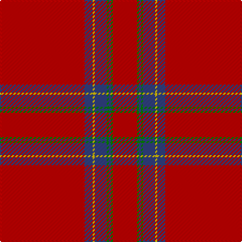

In pattern [RBYBGBGR](/stripes/rbybgbgr/).

This was sourced from weddslist.  It is a [8 stripe tartan](/stripes/stripes8/).

Original link http://www.weddslist.com/cgi-bin/tartans/pg.pl?source=sts

## Also known as

This cloth is also recorded under:

- Inverness Earl of...
- Inverness, Earl of

## Attestations

This cloth appears in 2 source records; the oldest owns this page.

- undated — Inverness, Earl of (weddslist, [record](http://www.weddslist.com/cgi-bin/tartans/pg.pl?source=sts))
- undated — Inverness Earl of... District Tartan Tartan Number: 1446. Earliest known date: 1831 The sett used by James Logan to illustrate his method of recording the threads and colours of tartan patterns. It appears in the first edition of 'The Scottish Gael' and is therefore the first published illustration of a tartan sett. The problems of printing tartan were very much apparent and the illustration showed differences in each volume produced. See products available Copyright © Blair Urquhart, Comrie, 2015 (house-of-tartan, [record](http://www.house-of-tartan.scotland.net/house/TartanViewjs.asp?colr=Def&tnam=1446))

## Thread count
R/84 B8 Y2 B12 G2 B2 G2 R/24

## Palette
Each colour and the base-6 reference it is a variant of.

| Colour | Shade | Base |
|---|---|---|
| B | <code style="background-color:#304080;">#304080</code> `oklch(39.4% 0.109 270.2)` <small>#304080</small> | B <code style="background-color:#2A418A;">#2A418A</code> |
| G | <code style="background-color:#008000;">#008000</code> `oklch(52.0% 0.177 142.5)` <small>#008000</small> | G <code style="background-color:#006100;">#006100</code> |
| R | <code style="background-color:#C00000;">#C00000</code> `oklch(50.7% 0.208 29.2)` <small>#C00000</small> | R <code style="background-color:#CC0000;">#CC0000</code> |
| Y | <code style="background-color:#F0C000;">#F0C000</code> `oklch(82.7% 0.169 90.5)` <small>#F0C000</small> | Y <code style="background-color:#F2BF00;">#F2BF00</code> |

# Sample pattern

## Nearest tartans

The nearest existing variants by ΔTartan distance, with this tartan at the top so the swatches line up against it.

ΔTartan

Tartan

Sett

—

<a href="/ttd/edit/#slug=r42db4ly1db6g1db1g1r12~x2">Inverness, Earl of</a> <a class="nn-out" href="/setts/s8/r42db4ly1db6g1db1g1r12~x2/" title="open its dictionary page">↗</a>

0.53

<a href="/ttd/edit/#slug=r42dp4ly1dp6g1dp1g1r12~x2">Earl of Inverness (Artefact)</a> <a class="nn-out" href="/setts/s8/r42dp4ly1dp6g1dp1g1r12~x2/" title="open its dictionary page">↗</a>

0.72

<a href="/ttd/edit/#slug=r65w2r3r4dg11r3dg3r11">Gudbrandsdalen, Rondastakken</a> <a class="nn-out" href="/setts/s8/r65w2r3r4dg11r3dg3r11/" title="open its dictionary page">↗</a>

0.75

<a href="/ttd/edit/#slug=r42db4ly1db6dg1db1dg1r12~x2">Inverness Earl of</a> <a class="nn-out" href="/setts/s8/r42db4ly1db6dg1db1dg1r12~x2/" title="open its dictionary page">↗</a>

0.77

<a href="/ttd/edit/#slug=r65w2r3r4g11r3g3r11~x2">Gudbrandsdalen, Rondastakken</a> <a class="nn-out" href="/setts/s8/r65w2r3r4g11r3g3r11~x2/" title="open its dictionary page">↗</a>

0.90

<a href="/ttd/edit/#slug=r114g10w3g16ly3g3ly3r28~x2">Duke of Sussex (Earl of Inverness)</a> <a class="nn-out" href="/setts/s8/r114g10w3g16ly3g3ly3r28~x2/" title="open its dictionary page">↗</a>

1.07

<a href="/ttd/edit/#slug=r65w1r6k8g8r6k3r11~x2">Gudbrandsdalen, Rondastakken #2</a> <a class="nn-out" href="/setts/s8/r65w1r6k8g8r6k3r11~x2/" title="open its dictionary page">↗</a>

1.16

<a href="/ttd/edit/#slug=r36db3w1db6g1k1g1r9~x2">Inverness</a> <a class="nn-out" href="/setts/s8/r36db3w1db6g1k1g1r9~x2/" title="open its dictionary page">↗</a>

1.27

<a href="/ttd/edit/#slug=r72k8r4g16r7o2~x2">MacAndrew Dress (Name)</a> <a class="nn-out" href="/setts/s6/r72k8r4g16r7o2~x2/" title="open its dictionary page">↗</a>

1.30

<a href="/ttd/edit/#slug=r36db3w1db6g1k1g1r9~x4">Inverness - 1829 (District)</a> <a class="nn-out" href="/setts/s8/r36db3w1db6g1k1g1r9~x4/" title="open its dictionary page">↗</a>

1.33

<a href="/ttd/edit/#slug=r80w2r5k10r6lr4r10k2lr6">Hampden-Sydney College</a> <a class="nn-out" href="/setts/s9/r80w2r5k10r6lr4r10k2lr6/" title="open its dictionary page">↗</a>

## Neighbour map

Every grey dot is one of 14299 variants placed by the first two principal components of the ΔTartan feature space (44% of its variance). Red is this tartan; blue dots are its nearest — click one to open its page.

<svg viewBox="0 0 640 380" role="img" style="max-width:100%;height:auto;border:1px solid #e0e0e0;border-radius:4px;display:block" xmlns="http://www.w3.org/2000/svg"><image href="/nn/cloud.v1.png" width="640" height="380"/><a href="/setts/s8/r42dp4ly1dp6g1dp1g1r12~x2/"><circle cx="623.4" cy="111.9" r="4" fill="#3465a4"><title>Earl of Inverness (Artefact)</title></circle></a><a href="/setts/s8/r65w2r3r4dg11r3dg3r11/"><circle cx="613.6" cy="120.0" r="4" fill="#3465a4"><title>Gudbrandsdalen, Rondastakken</title></circle></a><a href="/setts/s8/r42db4ly1db6dg1db1dg1r12~x2/"><circle cx="607.5" cy="103.0" r="4" fill="#3465a4"><title>Inverness Earl of</title></circle></a><a href="/setts/s8/r65w2r3r4g11r3g3r11~x2/"><circle cx="620.9" cy="122.0" r="4" fill="#3465a4"><title>Gudbrandsdalen, Rondastakken</title></circle></a><a href="/setts/s8/r114g10w3g16ly3g3ly3r28~x2/"><circle cx="601.4" cy="109.6" r="4" fill="#3465a4"><title>Duke of Sussex (Earl of Inverness)</title></circle></a><a href="/setts/s8/r65w1r6k8g8r6k3r11~x2/"><circle cx="616.9" cy="101.3" r="4" fill="#3465a4"><title>Gudbrandsdalen, Rondastakken #2</title></circle></a><a href="/setts/s8/r36db3w1db6g1k1g1r9~x2/"><circle cx="563.0" cy="96.6" r="4" fill="#3465a4"><title>Inverness</title></circle></a><a href="/setts/s6/r72k8r4g16r7o2~x2/"><circle cx="563.5" cy="132.8" r="4" fill="#3465a4"><title>MacAndrew Dress (Name)</title></circle></a><a href="/setts/s8/r36db3w1db6g1k1g1r9~x4/"><circle cx="557.0" cy="91.9" r="4" fill="#3465a4"><title>Inverness - 1829 (District)</title></circle></a><a href="/setts/s9/r80w2r5k10r6lr4r10k2lr6/"><circle cx="603.2" cy="97.5" r="4" fill="#3465a4"><title>Hampden-Sydney College</title></circle></a><circle cx="623.0" cy="116.0" r="5" fill="#c00000"/></svg>

ID: /setts/s8/r42db4ly1db6g1db1g1r12~x2/
